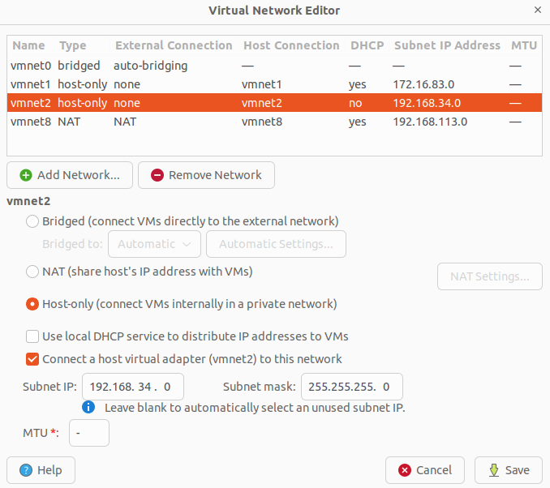
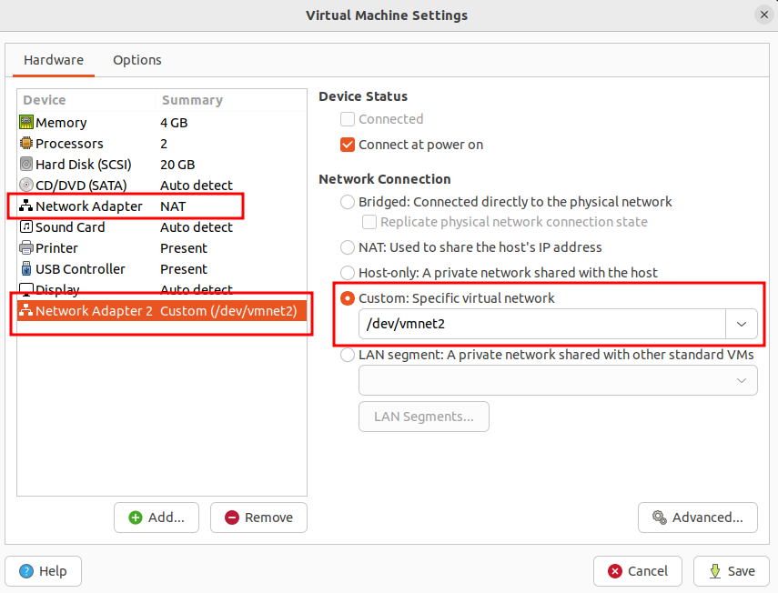

基于vmware环境，使用kubeadm+containerd运行时创建k8s集群，使用当前k8s最新版：1.25.4；虚拟机版本：ubuntu 22.04.1

## 环境准备

### 集群

|节点名|集群IP(网卡名)|外网IP(网卡名)|功能|
|-|-|-|-|
|k8s-master|192.168.34.2  (ens37)|192.168.133.136  (ens33)|主节点|
|k8s-node-01|192.168.34.3  (ens37)|192.168.133.137  (ens33)|Node节点|

集群IP用户kubernetes集群内部通信用，外网IP用于连接互联网

### 安装vmware

[https://www.tecmint.com/install-vmware-workstation-in-linux/](https://www.tecmint.com/install-vmware-workstation-in-linux/)

### 创建虚拟机

使用ubuntu系统([https://releases.ubuntu.com/22.04/](https://releases.ubuntu.com/22.04/))，64位，cpu >= 2，内存 >= 4G，磁盘 >= 30GB

### 配置网络（所有节点）

新增vmnet2 host-only类型网络，配置如下图(注意不使用dhcp)：



新建虚拟机时，新增network adapter，net adapter 1使用默认的NAT网络，用于连接互联网；net adapter 2使用上面创建的vmnet2网络，用于k8s集群内互联：



配置虚拟机网络： `sudo vi /etc/netplan/00-installer-config.yaml`，k8s-master 节点的 addresses 配置为 192.168.34.2/24 ，k8s-node-01 节点的 addresses 配置为 192.168.34.3/24

  ```yaml
  # This is the network config written by 'subiquity'
  network:
    ethernets:
      ens33:
        dhcp4: true
      ens37:
        dhcp4: false
        addresses:
          - 192.168.34.2/24
    version: 2
  ```

应用网络配置： `sudo netplan apply`

{}
ubuntu22.04 虚拟机可能在启动时会遇到问题 `A start job is running for Wait For Network to be Configured` ，大概会卡两分钟左右，解决如下：

`systemctl mask systemd-networkd-wait-online.service`
{}

这时候，你的虚拟机会有两个网络：

- 第一个网络是NAT网络并且配置了DHCP，那么会自动生成一个IP，这个网络用于访问外部(互联网)；
- 第二个为新建的host-only adapter创建的网络，我们手动分配一个192.168.34.2的IP.我们需要创建这个host-only adapter并且分配静态IP的原因是，我们可以使用这个IP作为k8s的advertise IP，并且你可以在任何地方重新部署你的虚拟机。

## 安装

### 设置主机名

主节点： `sudo hostnamectl set-hostname k8s-master`

node节点： `sudo hostnamectl set-hostname k8s-node-01`

### 初始化机器环境（所有节点）

设置hosts，这里使用集群IP： `sudo vi /etc/hosts`

  ```conf
  ...

  192.168.34.2 k8s-master
  192.168.34.3 k8s-node-01
  
  ...
  ```

设置sudo nopasswd

  ```shell
  $ sudo chmod +w /etc/sudoers

  $ sudo vi /etc/sudoers
  %sudo ALL=(ALL:ALL) NOPASSWD:ALL

  $ sudo chmod -w /etc/sudoers
  ```

关闭swap

  ```shell
  $ sudo swapoff -a

  $ sudo vi /etc/fstab
  # 删除或注释带有swap关键字的行
  ```

### 设置iptables（所有节点）

```shell
$ cat <<EOF | sudo tee /etc/modules-load.d/k8s.conf
overlay
br_netfilter
EOF

$ sudo modprobe overlay
$ sudo modprobe br_netfilter

$ cat <<EOF | sudo tee /etc/sysctl.d/k8s.conf
net.bridge.bridge-nf-call-ip6tables = 1
net.bridge.bridge-nf-call-iptables = 1
net.ipv4.ip_forward = 1
EOF

$ sudo sysctl --system
```

### 安装容器runtime（所有节点）

容器runtime提供了容器运行的环境，符合k8s CRI的实现都可以使用。常见的有containerd，CRI-O，Docker Engine，Mirantis Container Runtime。本文档中我们使用containerd作为容器runtime，ubuntu系统安装containerd使用如下指令：

  ```shell
  # 卸载旧环境
  $ sudo apt-get remove docker docker-engine docker.io containerd runc

  $ sudo apt-get update

  $ sudo apt-get install ca-certificates curl gnupg lsb-release

  $ sudo mkdir -p /etc/apt/keyrings

  $ curl -fsSL https://download.docker.com/linux/ubuntu/gpg | sudo gpg --dearmor -o /etc/apt/keyrings/docker.gpg

  $ echo "deb [arch=$(dpkg --print-architecture) signed-by=/etc/apt/keyrings/docker.gpg] https://download.docker.com/linux/ubuntu $(lsb_release -cs) stable" | sudo tee /etc/apt/sources.list.d/docker.list > /dev/null
  
  $ sudo apt-get update

  $ sudo apt-get install containerd.io
  ```

生成默认配置： `containerd config default | sudo tee /etc/containerd/config.toml`

修改配置： `sudo vi /etc/containerd/config.toml`

  ```toml
  ...
  [plugins]
    [plugins."io.containerd.grpc.v1.cri"]
      ...
      # 视网络情况，可以修改sandbox_image镜像地址为国内地址
      sandbox_image = "registry.aliyuncs.com/google_containers/pause:3.7"
      [plugins."io.containerd.grpc.v1.cri".containerd]
        [plugins."io.containerd.grpc.v1.cri".containerd.runtimes]
          [plugins."io.containerd.grpc.v1.cri".containerd.runtimes.runc]
            [plugins."io.containerd.grpc.v1.cri".containerd.runtimes.runc.options]
              # 修改SystemdCgroup为true
              SystemdCgroup = true
  ...
  ```

重启：`sudo systemctl restart containerd`

{}
[https://docs.docker.com/engine/install/#server](https://docs.docker.com/engine/install/#server)
{}

### 安装kubeadm, kubelet 和 kubectl（所有节点）

```shell
$ sudo apt-get update
$ sudo apt-get install \
    apt-transport-https \
    ca-certificates \
    curl \
    gnupg-agent \
    software-properties-common
$ cat <<EOF | sudo tee /etc/apt/sources.list.d/kubernetes.list
deb https://mirrors.aliyun.com/kubernetes/apt kubernetes-xenial main
EOF

$ curl -s https://mirrors.aliyun.com/kubernetes/apt/doc/apt-key.gpg | sudo apt-key add
$ sudo apt-get update
# 这里可以选择指定版本，能够保证几个组件版本一致。Node节点不需要安装kubeadm
$ sudo apt-get install -y kubelet=1.25.4-00 kubeadm=1.25.4-00 kubectl=1.25.4-00
$ sudo apt-mark hold kubelet kubeadm kubectl
```

{}
在 ubuntu22.04.2 上使用指令 `curl -s https://mirrors.aliyun.com/kubernetes/apt/doc/apt-key.gpg | sudo apt-key add` 添加gpg时，可能会报Warn：

`W: https://mirrors.aliyun.com/kubernetes/apt/dists/kubernetes-xenial/InRelease: Key is stored in legacy trusted.gpg keyring (/etc/apt/trusted.gpg), see the DEPRECATION section in apt-key(8) for details.`

解决：

1. `curl -s https://mirrors.aliyun.com/kubernetes/apt/doc/apt-key.gpg | sudo gpg --no-default-keyring --keyring gnupg-ring:/etc/apt/trusted.gpg.d/apt-key.gpg --import`
2. `sudo chown _apt /etc/apt/trusted.gpg.d/apt-key.gpg`
{}

### 使用kubeadm

生成kubeadm默认配置：`kubeadm config print init-defaults | sudo tee /etc/kubernetes/kubeadm.yml`

编辑配置： `sudo vi /etc/kubernetes/kubeadm.yml`

```yaml
apiVersion: kubeadm.k8s.io/v1beta3
bootstrapTokens:
- groups:
  - system:bootstrappers:kubeadm:default-node-token
  token: abcdef.0123456789abcdef
  ttl: 24h0m0s
  usages:
  - signing
  - authentication
kind: InitConfiguration
localAPIEndpoint:
  advertiseAddress: 192.168.34.2          # 修改为master节点的集群IP
  bindPort: 6443
nodeRegistration:
  criSocket: unix:///var/run/containerd/containerd.sock   # 修改为你使用的CRI
  imagePullPolicy: IfNotPresent
  name: k8s-master                        # 修改为master节点名称
  taints: null
---
apiServer:
  timeoutForControlPlane: 4m0s
apiVersion: kubeadm.k8s.io/v1beta3
certificatesDir: /etc/kubernetes/pki
clusterName: kubernetes
controllerManager: {}
dns: {}
etcd:
  local:
    dataDir: /var/lib/etcd
imageRepository: registry.aliyuncs.com/google_containers  # 加速，变更为国内地址
kind: ClusterConfiguration
kubernetesVersion: 1.25.4                 # 变更版本号，保持与安装的kubeadm版本一致
networking:
  dnsDomain: cluster.local
  serviceSubnet: 10.96.0.0/12             # 根据需求改变service子网
  podSubnet: 10.244.0.0/16                # 新增pod子网设置
scheduler: {}
```

初始化集群： `sudo kubeadm init --config=/etc/kubernetes/kubeadm.yml`

{}
记录 kubeadm init 输出的 kubeadm join 命令。 你需要此命令将一个新的node加入集群： `sudo kubeadm join 192.168.34.2:6443 --token abcdef.0123456789abcdef --discovery-token-ca-cert-hash sha256:cfb9b58dec093b4cf322e238c90cae3e433dd8f9bcdb82ba3c0c199e9219696a`

要使非 root 用户运行 kubectl，请运行以下命令， 它们也是 kubeadm init 输出的一部分：

```shell
# 在kubeadm init命令输出的最后部分
$ mkdir -p $HOME/.kube
$ sudo cp -i /etc/kubernetes/admin.conf $HOME/.kube/config
$ sudo chown $(id -u):$(id -g) $HOME/.kube/config
```

{}

初始化完成之后，pod coredns会处于pending状态，需要安装cni组件后才会变为running状态；node也会处于not ready状态，同样会在安装cni组件之后变为ready状态

```shell
$ sudo kubectl get pods -n kube-system
NAME                             READY   STATUS    RESTARTS   AGE
coredns-6d8c4cb4d-5dvtd          0/1     Pending   0          41m
coredns-6d8c4cb4d-87pp2          0/1     Pending   0          41m
etcd-ubuntu                      1/1     Running   0          7m47s
kube-apiserver-ubuntu            1/1     Running   0          8m34s
kube-controller-manager-ubuntu   1/1     Running   0          8m40s
kube-proxy-cd7fh                 1/1     Running   0          5m53s
kube-proxy-ncmvx                 1/1     Running   0          41m
kube-scheduler-ubuntu            1/1     Running   0          7m35s

$ kubectl get nodes
NAME     STATUS     ROLES                  AGE   VERSION
ubuntu   NotReady   control-plane,master   86s   v1.25.4
```

### 安装 calico cni plugin

{}
[https://docs.projectcalico.org/getting-started/kubernetes/quickstart](https://docs.projectcalico.org/getting-started/kubernetes/quickstart)
{}

如果是单节点环境（仅有master节点），那么需要设置pod可以被调度到master节点上：

```shell
kubectl taint nodes --all node-role.kubernetes.io/master-
kubectl taint nodes --all node-role.kubernetes.io/control-plane-
```

```shell
# 下载yaml资源
$ wget https://docs.projectcalico.org/manifests/tigera-operator.yaml
# 创建
$ kubectl create -f tigera-operator.yaml

$ wget https://docs.projectcalico.org/manifests/custom-resources.yaml
```

编辑custom-resources.yaml配置： `vi custom-resources.yaml`，做两处更改：

1. 保证`ipPools.cidr`的配置跟`/etc/kubernetes/kubeadm.yml`文件里`podSubnet: 10.244.0.0/16`配置的网段一致；
2. 在我们的环境中，有两块网卡，ens33和ens37,ens33是外网IP，用于与互联网通信，ens37为集群网卡，calico会默认选择第一块发现的网卡来部署k8s网络，我们不能保证节点重启的时候优先发现哪块网卡，因此可以通过配置指定使用集群网卡，详细参考：[https://projectcalico.docs.tigera.io/networking/ip-autodetection#autodetection-methods](https://projectcalico.docs.tigera.io/networking/ip-autodetection#autodetection-methods)

```yaml
apiVersion: operator.tigera.io/v1
kind: Installation
metadata:
  name: default
spec:
  # Configures Calico networking.
  calicoNetwork:
    # 新增配置，指定网卡为k8s集群网卡
    nodeAddressAutodetectionV4:
      interface: ens37
    # Note: The ipPools section cannot be modified post-install.
    ipPools:
    - blockSize: 26
      # 与初始化kubeadm时使用的podSubnet保持一致
      cidr: 10.244.0.0/16
      encapsulation: VXLANCrossSubnet
      natOutgoing: Enabled
      nodeSelector: all()

---

apiVersion: operator.tigera.io/v1
kind: APIServer 
metadata: 
  name: default 
spec: {}
```

创建： `kubectl create -f custom-resources.yaml`

检查：

```shell
#确保所有pod都在运行
$ watch kubectl get pods -n calico-system

# 这时候，coredns也会变为running状态；node也会变为ready状态
$ kubectl get pods -n kube-system
NAME                             READY   STATUS    RESTARTS   AGE
coredns-6d8c4cb4d-cjqq6          1/1     Running   0          10m
coredns-6d8c4cb4d-rb7xg          1/1     Running   0          10m
etcd-ubuntu                      1/1     Running   1          11m
kube-apiserver-ubuntu            1/1     Running   1          11m
kube-controller-manager-ubuntu   1/1     Running   0          11m
kube-proxy-llwv7                 1/1     Running   0          10m
kube-scheduler-ubuntu            1/1     Running   1          11m

$ kubectl get nodes
NAME     STATUS   ROLES                  AGE   VERSION
ubuntu   Ready    control-plane,master   10m   v1.25.4
```

### 添加新node

需要修改主机名，保证与主节点的不一样。然后运行上面`kubeadm init`输出的命令。

`kubeadm init`输出的命令添加节点有时限限制，如果超过时限，参考下面文档新增节点：[https://kubernetes.io/zh/docs/setup/production-environment/tools/kubeadm/create-cluster-kubeadm/#join-nodes](https://kubernetes.io/zh/docs/setup/production-environment/tools/kubeadm/create-cluster-kubeadm/#join-nodes)

## 清理旧环境

```shell
$ sudo kubeadm reset
# 删除残留文件
$ sudo rm -rf /etc/cni/net.d
$ sudo rm -rf /etc/kubernetes/
$ sudo rm -rf ~/.kube/
```
