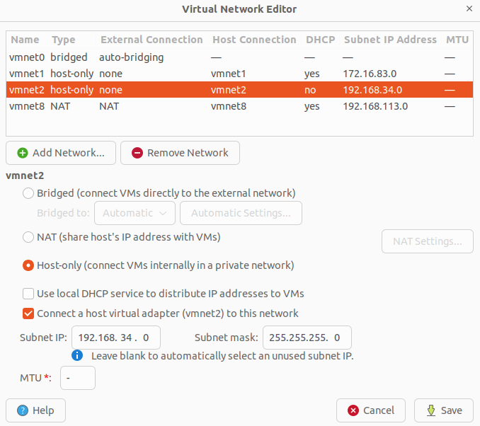
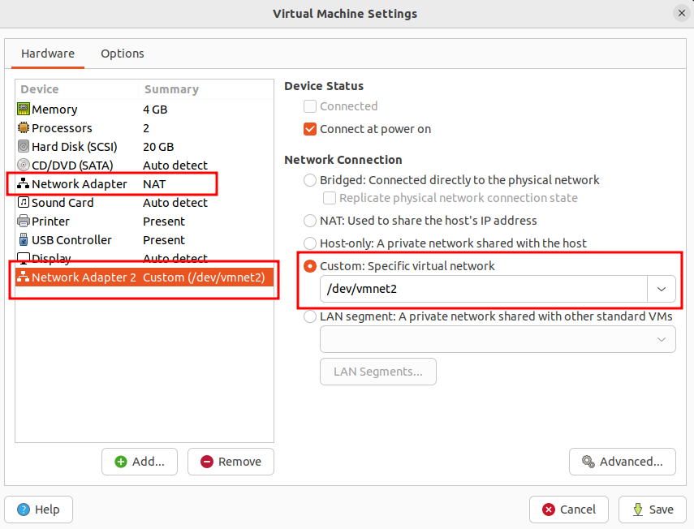

## 环境准备

### 安装vmware

[https://www.tecmint.com/install-vmware-workstation-in-linux/](https://www.tecmint.com/install-vmware-workstation-in-linux/)

### 创建虚拟机

使用ubuntu系统([https://releases.ubuntu.com/22.04/](https://releases.ubuntu.com/22.04/))，64位，cpu >= 2，内存 >= 4G，磁盘 >= 30GB

### 配置网络

新增vmnet2 host-only类型网络，配置如下图(注意不使用dhcp)：



新建虚拟机时，新增network adapter，net adapter 1使用默认的NAT网络，用于连接互联网；net adapter 2使用上面创建的vmnet2网络，用于k8s集群内互联：



配置虚拟机网络： `sudo vi /etc/netplan/00-installer-config.yaml`

  ```yaml
  # This is the network config written by 'subiquity'
  network:
    ethernets:
      ens33:
        dhcp4: true
      ens37:
        dhcp4: no
        addresses:
          - 192.168.34.2/24
    version: 2
  ```

应用网络配置： `sudo netplan apply`

这时候，你的虚拟机会有两个网络：

- 第一个网络是NAT网络并且配置了DHCP，那么会自动生成一个IP，这个网络用于访问外部(互联网)；
- 第二个为新建的host-only adapter创建的网络，我们手动分配一个192.168.34.2的IP.我们需要创建这个host-only adapter并且分配静态IP的原因是，我们可以使用这个IP作为k8s的advertise IP，并且你可以在任何地方重新部署你的虚拟机。

## 安装k8s

### 初始化机器环境

设置sudo nopasswd

  ```shell
  $ sudo chmod +w /etc/sudoers

  $ sudo vi /etc/sudoers
  %sudo ALL=(ALL:ALL) NOPASSWD:ALL

  $ sudo chmod -w /etc/sudoers
  ```

关闭swap

  ```shell
  $ sudo swapoff -a

  $ sudo vi /etc/fstab
  # 删除或注释带有swap关键字的行
  ```

### 安装容器runtime

容器runtime提供了容器运行的环境，符合k8s CRI的实现都可以使用。常见的有containerd，CRI-O，Docker Engine，Mirantis Container Runtime。本文档中我们使用docker engine作为容器runtime，ubuntu系统安装docker engine使用如下指令：

  ```shell
  $ sudo apt-get update

  $ sudo apt-get install docker.io=20.10.12-0ubuntu2~20.04.1
  
  # 开机启动
  $ sudo systemctl enable docker.service
  ```

{}
[https://docs.docker.com/engine/install/#server](https://docs.docker.com/engine/install/#server)
{}

### 设置cgroupdriver为systemd

```sh
$ sudo vi /etc/docker/daemon.json
{
  "exec-opts": ["native.cgroupdriver=systemd"]
}

$ sudo systemctl daemon-reload
$ sudo systemctl restart docker
$ sudo docker info | grep -i "Cgroup Driver"  #systemd
```

{}
docker有时会出现WARNING: No swap limit support的警告，可以使用如下方案处理：

```sh
$ sudo vi /etc/default/grub

# 在GRUB_CMDLINE_LINUX行追加："cgroup_enable=memory swapaccount=1"，追加即可，切记不可删除该行原有内容
GRUB_CMDLINE_LINUX="cgroup_enable=memory swapaccount=1"

$ sudo update-grub
$ sudo reboot
```

{}

### 设置iptables

```shell
$ cat <<EOF | sudo tee /etc/modules-load.d/k8s.conf
br_netfilter
EOF

$ cat <<EOF | sudo tee /etc/sysctl.d/k8s.conf
net.bridge.bridge-nf-call-ip6tables = 1
net.bridge.bridge-nf-call-iptables = 1
EOF

$ sudo sysctl --system
```

### 安装kubeadm, kubelet 和 kubectl

```shell
$ sudo apt-get update
$ sudo apt-get install \
    apt-transport-https \
    ca-certificates \
    curl \
    gnupg-agent \
    software-properties-common
$ cat <<EOF | sudo tee /etc/apt/sources.list.d/kubernetes.list
deb https://mirrors.aliyun.com/kubernetes/apt kubernetes-xenial main
EOF

$ curl -s https://mirrors.aliyun.com/kubernetes/apt/doc/apt-key.gpg | sudo apt-key add
$ sudo apt-get update
$ sudo apt-get install -y kubelet=1.23.6-00 kubeadm=1.23.6-00 kubectl=1.23.6-00
$ sudo apt-mark hold kubelet kubeadm kubectl
```

### 初始化kubeadm

```shell
$ sudo kubeadm init \
 --image-repository registry.aliyuncs.com/google_containers \
 --pod-network-cidr=10.96.0.0/16 \
 --kubernetes-version v1.23.6 \
 --apiserver-advertise-address=192.168.34.2
```

{}
记录 kubeadm init 输出的 kubeadm join 命令。 你需要此命令将一个新的node加入集群： `sudo kubeadm join 192.168.34.2:6443 --token e823es.24d82918o1tml3y8 --discovery-token-ca-cert-hash sha256:0938d0ef5ede3fe7fd15a9ade4e22eaa634c9c0cb151c1427f37727852470e90`

要使非 root 用户运行 kubectl，请运行以下命令， 它们也是 kubeadm init 输出的一部分：

```shell
# 在kubeadm init命令输出的最后部分
$ mkdir -p $HOME/.kube
$ sudo cp -i /etc/kubernetes/admin.conf $HOME/.kube/config
$ sudo chown $(id -u):$(id -g) $HOME/.kube/config
```

{}

初始化完成之后，pod coredns会处于pending状态，需要安装cni组件后才会变为running状态；node也会处于not ready状态，同样会在安装cni组件之后变为ready状态

```shell
$ sudo kubectl get pods -n kube-system
NAME                             READY   STATUS    RESTARTS   AGE
coredns-6d8c4cb4d-5dvtd          0/1     Pending   0          41m
coredns-6d8c4cb4d-87pp2          0/1     Pending   0          41m
etcd-ubuntu                      1/1     Running   0          7m47s
kube-apiserver-ubuntu            1/1     Running   0          8m34s
kube-controller-manager-ubuntu   1/1     Running   0          8m40s
kube-proxy-cd7fh                 1/1     Running   0          5m53s
kube-proxy-ncmvx                 1/1     Running   0          41m
kube-scheduler-ubuntu            1/1     Running   0          7m35s

$ kubectl get nodes
NAME     STATUS     ROLES                  AGE   VERSION
ubuntu   NotReady   control-plane,master   86s   v1.23.6
```

### 安装 calico cni plugin

{}
[https://docs.projectcalico.org/getting-started/kubernetes/quickstart](https://docs.projectcalico.org/getting-started/kubernetes/quickstart)
{}

```shell
$ wget https://docs.projectcalico.org/manifests/tigera-operator.yaml
$ kubectl create -f tigera-operator.yaml
$ wget https://docs.projectcalico.org/manifests/custom-resources.yaml
编辑custom-resources.yaml，需要保证跟--pod-network-cidr里配置的网段一致
$ kubectl create -f custom-resources.yaml

# 确保所有pod都在运行
$ watch kubectl get pods -n calico-system

# 这时候，coredns也会变为running状态；node也会变为ready状态
$ kubectl get pods -n kube-system
NAME                             READY   STATUS    RESTARTS   AGE
coredns-6d8c4cb4d-cjqq6          1/1     Running   0          10m
coredns-6d8c4cb4d-rb7xg          1/1     Running   0          10m
etcd-ubuntu                      1/1     Running   1          11m
kube-apiserver-ubuntu            1/1     Running   1          11m
kube-controller-manager-ubuntu   1/1     Running   0          11m
kube-proxy-llwv7                 1/1     Running   0          10m
kube-scheduler-ubuntu            1/1     Running   1          11m

$ kubectl get nodes
NAME     STATUS   ROLES                  AGE   VERSION
ubuntu   Ready    control-plane,master   10m   v1.23.6
```

### 添加新node

需要修改主机名，保证与主节点的不一样。然后运行上面`kubeadm init`输出的命令。

`kubeadm init`输出的命令添加节点有时限限制，如果超过时限，参考下面文档新增节点：[https://kubernetes.io/zh/docs/setup/production-environment/tools/kubeadm/create-cluster-kubeadm/#join-nodes](https://kubernetes.io/zh/docs/setup/production-environment/tools/kubeadm/create-cluster-kubeadm/#join-nodes)

## 清理旧环境

```shell
$ sudo kubeadm reset
# 删除残留文件
$ sudo rm -rf /etc/cni/net.d
$ sudo rm -rf /etc/kubernetes/
$ sudo rm -rf ~/.kube/
```
