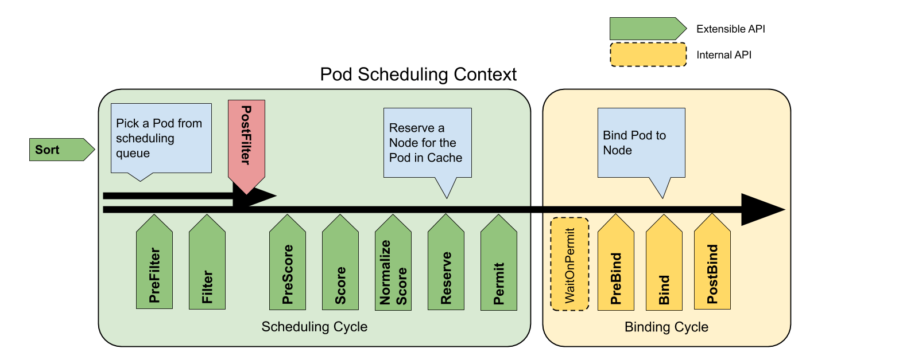

## 简介

API Server 接受客户端提交Pod对象创建请求后的操作过程中，有一个重要的步骤就是由调度器程序kube-scheduler从当前集群中选择一个可用的 Node 来接收并运行它，通常是默认的调度器 kube-scheduler 负责执行此类任务。

Pod 调度策略有以下几种实现方式：

1. [kube-scheduler](#kube-scheduler调度器) 系统默认的调度器程序
2. [nodeName](#nodename) 直接指定Node主机名
3. [nodeSelector](#nodeselector) 节点选择器，为Node打上标签，然后Pod中通过nodeSelector选择打上标签的Node
4. [nodeAffinity](#nodeaffinity) 节点亲和性
5. [podAffinity && podAntiAffinity](#podaffinity--podantiaffinity) Pod亲和性 和 Pod反亲和性
6. [taints && tolerations](#taints--tolerations) 污点 taint 与容忍度 tolerations

## kube-scheduler调度器

Kubernetes Scheduler（调度器）负责分配调度 Pod 到集群内的节点上。它通过监测 (watch) 机制监听 kube-apiserver，发现集群中新创建且尚未被调度到 Node 上的 Pod，然后根据调度策略为这些 Pod 分配节点(通过更新 Pod 的 NodeName 字段）。
{}
[https://kubernetes.io/zh/docs/concepts/scheduling-eviction/kube-scheduler/](https://kubernetes.io/zh/docs/concepts/scheduling-eviction/kube-scheduler/)
{}

### 调度过程

kube-scheduler 给一个 pod 做调度选择包含两个步骤：

1. **过滤阶段** 该阶段会将所有满足 Pod 调度需求的 Node 选出来。例如，PodFitsResources 过滤函数会检查候选 Node 的可选资源能否满足 Pod 的资源需求，过滤之后会得到一个 Node 列表，列表包含了所有满足条件的可调度节点。如果列表为空，表示该 Pod 不可调度。
2. **打分阶段** 该阶段调度器会为 Pod 从过滤阶段过滤出的满足条件的 Node 列表中，选取一个最合适的Node。根据当前启用的打分规则，调度器会给每一个可调度节点进行打分。kube-scheduler 会将Pod调度到得分最高的 Node 上，如果有多个得分最高的 Node，那么会随即选择一个进行调度。

支持以下两种方式配置调度器的过滤和打分行为：

1. [调度策略](#调度策略) 允许你配置过滤的断言(predicates)和打分的优先级(priorities)。例如，可以通过运行 `kube-scheduler --policy-config-file <filename>` 或者 `kube-scheduler --policy-configmap <ConfigMap>` 设置调度策略。
   {}
   调度策略 仅适用于Kubernetes v1.23 版本之前。从 Kubernetes v1.23 版本开始，不再支持这种调度策略。同样地也不支持相关的 policy-config-file、 policy-configmap、 policy-configmap-namespace 以及 use-legacy-policy-config 标志。 你可以通过使用 调度配置来实现类似的行为。
   {}
2. [调度配置](#调度配置) 允许你配置实现不同调度阶段的插件，包括`QueueSort`, `Filter`, `Score`, `Bind`, `Reserve`, `Permit` 等等。

#### 调度策略

kube-scheduler 根据调度策略指定的断言（predicates）和优先级（priorities） 分别对节点进行过滤和打分。**仅适用于Kubernetes v1.23 版本之前。**
{}
[https://v1-22.docs.kubernetes.io/zh/docs/reference/scheduling/policies/](https://v1-22.docs.kubernetes.io/zh/docs/reference/scheduling/policies/)
{}
**断言(predicates)** 以下断言实现了过滤接口：

- PodFitsHostPorts：检查 Pod 请求的端口（网络协议类型）在节点上是否可用。
- PodFitsHost：检查 Pod 是否通过主机名指定了 Node。
- PodFitsResources：检查节点的空闲资源（例如，CPU和内存）是否满足 Pod 的要求。
- MatchNodeSelector：检查 Pod 的节点选择算符 和节点的 标签 是否匹配。
- NoVolumeZoneConflict：给定该存储的故障区域限制， 评估 Pod 请求的卷在节点上是否可用。
- NoDiskConflict：根据 Pod 请求的卷是否在节点上已经挂载，评估 Pod 和节点是否匹配。
- MaxCSIVolumeCount：决定附加 CSI 卷的数量，判断是否超过配置的限制。
- CheckNodeMemoryPressure：如果节点正上报内存压力，并且没有异常配置，则不会把 Pod 调度到此节点上。
- CheckNodePIDPressure：如果节点正上报进程 ID 稀缺，并且没有异常配置，则不会把 Pod 调度到此节点上。
- CheckNodeDiskPressure：如果节点正上报存储压力（文件系统已满或几乎已满），并且没有异常配置，则不会把 Pod 调度到此节点上。
- CheckNodeCondition：节点可用上报自己的文件系统已满，网络不可用或者 kubelet 尚未准备好运行 Pod。 如果节点上设置了这样的状况，并且没有异常配置，则不会把 Pod 调度到此节点上。
- PodToleratesNodeTaints：检查 Pod 的容忍 是否能容忍节点的污点。
- CheckVolumeBinding：基于 Pod 的卷请求，评估 Pod 是否适合节点，这里的卷包括绑定的和未绑定的 PVCs 都适用。

**优先级(priorities)** 以下优先级实现了打分接口：

- SelectorSpreadPriority：属于同一 Service、 StatefulSet 或 ReplicaSet 的 Pod，跨主机部署。
- InterPodAffinityPriority：实现了 Pod 间亲和性与反亲和性的优先级。
- LeastRequestedPriority：偏向最少请求资源的节点。 换句话说，节点上的 Pod 越多，使用的资源就越多，此策略给出的排名就越低。
- MostRequestedPriority：支持最多请求资源的节点。 该策略将 Pod 调度到整体工作负载所需的最少的一组节点上。
- RequestedToCapacityRatioPriority：使用默认的打分方法模型，创建基于 ResourceAllocationPriority 的 requestedToCapacity。
- BalancedResourceAllocation：偏向平衡资源使用的节点。
- NodePreferAvoidPodsPriority：根据节点的注解 scheduler.alpha.kubernetes.io/preferAvoidPods 对节点进行优先级排序。 你可以使用它来暗示两个不同的 Pod 不应在同一节点上运行。
- NodeAffinityPriority：根据节点亲和中 PreferredDuringSchedulingIgnoredDuringExecution 字段对节点进行优先级排序。 你可以在将 Pod 分配给节点中了解更多。
- TaintTolerationPriority：根据节点上无法忍受的污点数量，给所有节点进行优先级排序。 此策略会根据排序结果调整节点的等级。
- ImageLocalityPriority：偏向已在本地缓存 Pod 所需容器镜像的节点。
- ServiceSpreadingPriority：对于给定的 Service，此策略旨在确保该 Service 关联的 Pod 在不同的节点上运行。 它偏向把 Pod 调度到没有该服务的节点。 整体来看，Service 对于单个节点故障变得更具弹性。
- EqualPriority：给予所有节点相等的权重。
- EvenPodsSpreadPriority：实现了 Pod 拓扑扩展约束的优先级排序。

#### 调度配置

k8s提供了一种面向调度器的名为[调度框架](https://kubernetes.io/zh-cn/docs/concepts/scheduling-eviction/scheduling-framework/)的插件架构，它为现有的调度器添加了一组新的"插件"API。插件会被编译到调度器中。这些API允许大多数调度功能以插件的形式实现，同时使调度核心保持简单可维护。

调度框架定义了一些扩展点。调度器插件注册后在一个或多个扩展点处被调用。 这些插件中的一些可以改变调度决策，而另一些仅用于提供信息。

每次调度一个 Pod 的尝试都分为两个阶段，**调度周期** 和 **绑定周期** 。调度周期为 Pod 选择一个节点，绑定周期将该决策应用于集群。 调度周期和绑定周期一起被称为 **调度上下文**。调度周期是串行运行的，而绑定周期可能是同时运行的。如果确定 Pod 不可调度或者存在内部错误，则可以终止调度周期或绑定周期，Pod 将返回队列并重试。下图显示了一个Pod的调度上下文以及调度框架公开的扩展点。在此图片中，"过滤器相当于"断言"，"评分"相当于"优先级函数"。



你可以通过编写配置文件，并将其路径传给 kube-scheduler 的命令行参数，定制 kube-scheduler 的行为。配置文件允许你配置 kube-scheduler 中的不同调度阶段。每个阶段都暴露于某个扩展点中。插件通过实现一个或多个扩展点来提供调度行为。

{}
调度器配置： [https://kubernetes.io/zh/docs/reference/scheduling/config/](https://kubernetes.io/zh/docs/reference/scheduling/config/)

调度框架： [https://kubernetes.io/zh-cn/docs/concepts/scheduling-eviction/scheduling-framework/](https://kubernetes.io/zh-cn/docs/concepts/scheduling-eviction/scheduling-framework/)
{}

配置示例：

```yaml
apiVersion: kubescheduler.config.k8s.io/v1beta2
kind: KubeSchedulerConfiguration
profiles:
  - plugins:
      score:
        disabled:
        - name: PodTopologySpread
        enabled:
        - name: MyCustomPluginA
          weight: 2
        - name: MyCustomPluginB
          weight: 1
```

**扩展点** 调度行为发生在一系列阶段中，这些阶段是通过以下扩展点公开的：

调度周期：

1. queueSort：这些插件对调度队列中的悬决的 Pod 排序。 一次只能启用一个队列排序插件。
2. preFilter：这些插件用于在过滤之前预处理或检查 Pod 或集群的信息。 它们可以将 Pod 标记为不可调度。
3. filter：这些插件相当于调度策略中的断言（Predicates），用于过滤不能运行 Pod 的节点。 过滤器的调用顺序是可配置的。 如果没有一个节点通过所有过滤器的筛选，Pod 将会被标记为不可调度。
4. postFilter：当无法为 Pod 找到可用节点时，按照这些插件的配置顺序调用他们。 如果任何 postFilter 插件将 Pod 标记为“可调度”，则不会调用其余插件。
5. preScore：这是一个信息扩展点，可用于预打分工作。
6. score：这些插件给通过筛选阶段的节点打分。调度器会选择得分最高的节点。
7. reserve：这是一个信息扩展点，当资源已经预留给 Pod 时，会通知插件。 这些插件还实现了 Unreserve 接口，在 Reserve 期间或之后出现故障时调用。
8. permit：这些插件可以阻止或延迟 Pod 绑定。

绑定周期：

1. preBind：这些插件在 Pod 绑定节点之前执行。
2. bind：这个插件将 Pod 与节点绑定。绑定插件是按顺序调用的，只要有一个插件完成了绑定，其余插件都会跳过。绑定插件至少需要一个。
3. postBind：这是一个信息扩展点，在 Pod 绑定了节点之后调用。
4. multiPoint：这是一个仅配置字段，允许同时为所有适用的扩展点启用或禁用插件。

**调度插件** 下面默认启用的插件实现了一个或多个扩展点：

- ImageLocality：选择已经存在 Pod 运行所需容器镜像的节点。实现的扩展点：`score`
- TaintToleration：实现了污点和容忍。实现的扩展点：`filter`，`prescore`，`score`
- NodeName：检查 Pod 指定的节点名称与当前节点是否匹配。实现的扩展点：`filter`
- NodePorts：检查 Pod 请求的端口在节点上是否可用。实现的扩展点：`preFilter`，`filter`
- NodeAffinity：实现了节点选择器 和节点亲和性。实现的扩展点：`filter`，`score`
- PodTopologySpread：实现了 Pod 拓扑分布。实现的扩展点：`preFilter`，`filter`，`preScore`，`score`
- NodeUnschedulable：过滤 .spec.unschedulable 值为 true 的节点。实现的扩展点：`filter`
- NodeResourcesFit：检查节点是否拥有 Pod 请求的所有资源。 得分可以使用以下三种策略之一：LeastAllocated（默认）、MostAllocated 和RequestedToCapacityRatio。实现的扩展点：`preFilter`，`filter`，`score`
- NodeResourcesBalancedAllocation：调度 Pod 时，选择资源使用更为均衡的节点。实现的扩展点：`score`
- VolumeBinding：检查节点是否有请求的卷，或是否可以绑定请求的卷。 实现的扩展点: `preFilter`、`filter`、`reserve`、`preBind` 和 `score`
- VolumeRestrictions：检查挂载到节点上的卷是否满足卷提供程序的限制。实现的扩展点：`filter`
- VolumeZone：检查请求的卷是否在任何区域都满足。实现的扩展点：`filter`
- NodeVolumeLimits：检查该节点是否满足 CSI 卷限制。实现的扩展点：`filter`
- EBSLimits：检查节点是否满足 AWS EBS 卷限制。实现的扩展点：`filter`
- GCEPDLimits：检查该节点是否满足 GCP-PD 卷限制。实现的扩展点：`filter`
- AzureDiskLimits：检查该节点是否满足 Azure 卷限制。实现的扩展点：`filter`
- InterPodAffinity：实现 Pod 间亲和性与反亲和性。实现的扩展点：`preFilter`，`filter`，`preScore`，`score`
- PrioritySort：提供默认的基于优先级的排序。实现的扩展点：`queueSort`
- DefaultBinder：提供默认的绑定机制。实现的扩展点：`bind`
- DefaultPreemption：提供默认的抢占机制。实现的扩展点：`postFilter`

你也可以通过组件配置 API 启用以下插件（默认不启用）:

- SelectorSpread：偏向把属于 Services， ReplicaSets 和 StatefulSets 的 Pod 跨节点分布。实现的扩展点：`preScore`，`score`
- CinderLimits：检查是否可以满足节点的 OpenStack Cinder 卷限制

### 配置多个调度器

kube-scheduler调度器是kubernetes的默认调度器，可以通过`schedulerName: default-scheduler`字段配置。如果默认调度器不适合你的需求，你可以实现自己的调度器，而且，你甚至可以和默认调度器一起同时运行多个调度器，并告诉 Kubernetes 为每个 Pod 使用哪个调度器。参考：[https://kubernetes.io/zh/docs/tasks/extend-kubernetes/configure-multiple-schedulers/](https://kubernetes.io/zh/docs/tasks/extend-kubernetes/configure-multiple-schedulers/)

什么情况下需要多个调度器：

1. 例如一个批处理的作业，需要三个并发的pod一起去调度，它们要彼此配合，但凡有一个pod失败，这个作业都跑不下去。它们三个要么都成功，要么都失败，这种调度在原生的kube-scheduler里是没有的。
2. 再例如batch scheduler等等。典型的有华为调度器：[https://bbs.huaweicloud.com/blogs/334434](https://bbs.huaweicloud.com/blogs/334434)

### 生产经验

1. 100个node，并发创建8000个pod的最大调度耗时大概是2分钟左右，发生过node删除后，scheduler cache还有信息的情况，导致pod调度失败。
2. 当一个node出现问题所以load较小时，通常用户的pod都会优先调度到该node上，导致用户所有创建的新pod都失败。
3. 存在危险的用户pod(比如fork bomb)，在调度到某个node上以后，会因为打开文件句柄过多导致node down机，pod会被evict到其他节点，再对其他节点造成伤害，依次循环会导致整个cluster所有节点不可用。

## nodeName

直接使用 `spec.nodeName` 指定即可

### 示例(nodeName)

1. `vim nodeName-pod.yaml`

   ```yaml
   apiVersion: v1
   kind: Pod
   metadata:
     name: nodename-pod
   spec:
   # 指定该Pod运行在k8s-node-01节点上
     nodeName: k8s-node-01
     containers:
     - image: busybox:latest
       name: nodename-containers
       command: [ "/bin/sh", "-c", "tail -f /etc/passwd" ]
   ```

2. 验证

   ```bash
   # 创建资源
   $ kubectl apply -f nodeName-pod.yaml
   # 验证运行在k8s-node-01上
   $ kubectl get pods -o wide | grep nodename-pod
   nodename-pod   1/1     Running   0          87s   192.168.154.193   k8s-node-01   <none>           <none>
   ```

## nodeSelector

nodeSelector 用于将 Pod 调度到匹配 Label 的 Node上。
{}
[https://kubernetes.io/zh/docs/concepts/scheduling-eviction/assign-pod-node/#nodeselector](https://kubernetes.io/zh/docs/concepts/scheduling-eviction/assign-pod-node/#nodeselector)
{}

### 示例(nodeSelector)

1. 首先给 node 打上标签： `kubectl label nodes k8s-node-01 disktype=ssd`
2. 验证标签是否添加成功： `kubectl get nodes --show-labels`
3. `vim nodeSelector-pod.yaml`，在 yaml 中指定 nodeSeletor 为 disktype=ssd

   ```yaml
   apiVersion: v1
   kind: Pod
   metadata:
     name: nodeselector-pod
     labels:
       env: test
   spec:
     containers:
     - name: nginx
       image: nginx
       imagePullPolicy: IfNotPresent
     nodeSelector:
       disktype: ssd
   ```

4. 验证：

   ```bash
   # 创建 Pod
   $ kubectl create -f nodeSelector-pod.yaml

   $ kubectl get pods -owide | grep nodeselector-pod
   nodeselector-pod   1/1     Running   0          15s   192.168.154.194   k8s-node-01   <none>           <none>
   ```

## nodeAffinity

nodeAffinity（节点亲和性）概念上类似于 nodeSelector， 它使你可以根据节点上的标签来约束 Pod 可以调度到哪些节点上。nodeAffinity有两种：

- requiredDuringSchedulingIgnoredDuringExecution 硬亲和性，调度器只有在规则被满足的时候才能执行调度。此功能类似于 nodeSelector， 但其语法表达能力更强。
- preferredDuringSchedulingIgnoredDuringExecution 软亲和性，调度器会尝试寻找满足对应规则的节点。如果找不到匹配的节点，调度器仍然会调度该 Pod。

{}
在上述类型中，`IgnoredDuringExecution` 意味着如果节点标签在 Kubernetes 调度 Pod 时发生了变更，Pod 仍将继续运行。
{}

你可以使用 Pod 规约中的 `.spec.affinity.nodeAffinity` 字段来设置节点亲和性。使用 `operator` 字段来为 Kubernetes 设置在解释规则时要使用的逻辑操作符。 你可以使用 `In`、`NotIn`、`Exists`、`DoesNotExist`、`Gt` 和 `Lt` 之一作为操作符。其中，`NotIn` 和 `DoesNotExist` 可用来实现节点反亲和性行为。

相比于 nodeSelector，nodeAffinity 的优势在于：

- 亲和性、反亲和性语言的表达能力更强。nodeSelector 只能选择拥有所有指定标签的节点。 亲和性、反亲和性为你提供对选择逻辑的更强控制能力。
- 你可以标明某规则是“软需求”或者“偏好”，这样调度器在无法找到匹配节点时仍然调度该 Pod。
- 你可以使用节点上（或其他拓扑域中）运行的其他 Pod 的标签来实施调度约束， 而不是只能使用节点本身的标签。这个能力让你能够定义规则允许哪些 Pod 可以被放置在一起。

### 示例(nodeAffinity)

1. 首先给 node 打上标签： `kubectl label nodes k8s-node-01 kubernetes.io/os=linux`
2. 验证标签是否添加成功： `kubectl get nodes --show-labels`
3. 设置亲和性规则，下例里的规则设置为：
   - 节点必须包含键名为 kubernetes.io/os 的标签，并且其取值为 linux。
   - 节点 最好 具有键名为 another-node-label-key 且取值为 another-node-label-value 的标签。
4. `vim pod-with-node-affinity.yaml`

   ```yaml
   apiVersion: v1
   kind: Pod
   metadata:
     name: nodeaffinity-pod
   spec:
     affinity:
       nodeAffinity:
         requiredDuringSchedulingIgnoredDuringExecution:
           nodeSelectorTerms:
           - matchExpressions:
             - key: kubernetes.io/os
               operator: In
               values:
               - linux
         preferredDuringSchedulingIgnoredDuringExecution:
         - weight: 1
           preference:
             matchExpressions:
             - key: another-node-label-key
               operator: In
               values:
               - another-node-label-value
     containers:
     - name: nginx
       image: nginx
       imagePullPolicy: IfNotPresent
   ```

5. 验证：

   ```bash
   # 创建 Pod
   $ kubectl create -f pod-with-node-affinity.yaml

   $ kubectl get pods -owide | grep nodeaffinity-pod
   nodeaffinity-pod   1/1     Running   0          2m16s   192.168.154.196   k8s-node-01   <none>           <none>
   ```

{}
如果你同时指定了 nodeSelector 和 nodeAffinity，两者 必须都要满足， 才能将 Pod 调度到候选节点上。

如果你指定了多个与 nodeAffinity 类型关联的 nodeSelectorTerms， 只要其中一个 nodeSelectorTerms 满足的话，Pod 就可以被调度到节点上。

如果你指定了多个与同一 nodeSelectorTerms 关联的 matchExpressions， 则只有当所有 matchExpressions 都满足时 Pod 才可以被调度到节点上。
{}

## podAffinity && podAntiAffinity

podAffinity(pod间亲和性)与podAntiAffinity(pod间反亲和性)使你可以基于已经在节点上运行的 Pod 的标签来约束 Pod 可以调度到的节点，而不是基于节点上的标签。与nodeAffinity类似，podAffinity && podAntiAffinity同样也有两种类型：

- `requiredDuringSchedulingIgnoredDuringExecution` 硬亲和性，调度器只有在规则被满足的时候才能执行调度。
- `preferredDuringSchedulingIgnoredDuringExecution` 软亲和性，调度器会尝试寻找满足对应规则的节点。如果找不到匹配的节点，调度器仍然会调度该 Pod。

要使用 Pod 间亲和性，可以使用 Pod 规约中的 `.affinity.podAffinity` 字段。 对于 Pod 间反亲和性，可以使用 Pod 规约中的 `.affinity.podAntiAffinity` 字段。你可以针对 Pod 间亲和性与反亲和性为其 operator 字段使用 `In`、`NotIn`、`Exists`、 `DoesNotExist` 等值。

用户也可以使用 namespaceSelector 选择匹配的名字空间，namespaceSelector 是对名字空间集合进行标签查询的机制。 亲和性条件会应用到 `namespaceSelector` 所选择的名字空间和 `namespaces` 字段中 所列举的名字空间之上。 注意，空的 namespaceSelector（{}）会匹配所有名字空间，而 null 或者空的 namespaces 列表以及 null 值 namespaceSelector 意味着“当前 Pod 的名字空间”。

原则上，topologyKey 可以是任何合法的标签键。出于性能和安全原因，topologyKey 有一些限制：

1. 对于 Pod 亲和性而言，在 requiredDuringSchedulingIgnoredDuringExecution 和 preferredDuringSchedulingIgnoredDuringExecution 中，topologyKey 不允许为空。
2. 对于 requiredDuringSchedulingIgnoredDuringExecution 要求的 Pod 反亲和性， 准入控制器 LimitPodHardAntiAffinityTopology 要求 topologyKey 只能是 kubernetes.io/hostname。如果你希望使用其他定制拓扑逻辑， 你可以更改准入控制器或者禁用之。
3. 除了 labelSelector 和 topologyKey，你也可以指定 labelSelector 要匹配的命名空间列表，方法是在 labelSelector 和 topologyKey 所在层同一层次上设置 namespaces。 如果 namespaces 被忽略或者为空，则默认为 Pod 亲和性/反亲和性的定义所在的命名空间。

{}
Pod 间亲和性和反亲和性都需要相当的计算量，因此会在大规模集群中显著降低调度速度。 我们不建议在包含数百个节点的集群中使用这类设置。

Pod 反亲和性需要节点上存在一致性的标签。换言之， 集群中每个节点都必须拥有与 topologyKey 匹配的标签。 如果某些或者所有节点上不存在所指定的 topologyKey 标签，调度行为可能与预期的不同。
{}

### 示例(podAffinity && podAntiAffinity)

1. 首先给 pod 打上标签，同时给 node 打上 topologyKey：

   ```bash
   $ kubectl label pod kube-proxy-llwv7 -n kube-system security=S1
   $ kubectl label nodes ubuntu topology.kubernetes.io/zone=zone1
   # 检查添加是否成功
   $ kubectl get pod kube-proxy-llwv7 -n kube-system --show-labels
   $ kubectl get nodes --show-labels
   ```

2. 设置亲和性和反亲和性规则，下例里的规则设置为：
   - 亲和性规则表示，调度器必须将 Pod 调度到标签的键名为 topology.kubernetes.io/zone 的节点上；同时集群中至少有一个位于该可用区的节点上运行着带有 security=S1 标签的 Pod。
   - 反亲和性规则表示，如果同一可用区中存在其他运行着带有 security=S2 标签的 Pod 节点， 并且节点的标签的键值为 topology.kubernetes.io/zone，那么Pod 不能被调度到该节点上。
3. `vim pod-with-pod-affinity.yaml`

   ```yaml
   apiVersion: v1
   kind: Pod
   metadata:
     name: podaffinity-pod
   spec:
     affinity:
       podAffinity:
         requiredDuringSchedulingIgnoredDuringExecution:
         - labelSelector:
             matchExpressions:
             - key: security
               operator: In
               values:
               - S1
           topologyKey: topology.kubernetes.io/zone
           namespaceSelector: {}
       podAntiAffinity:
         preferredDuringSchedulingIgnoredDuringExecution:
         - weight: 100
           podAffinityTerm:
             labelSelector:
               matchExpressions:
               - key: security
                 operator: In
                 values:
                 - S2
             topologyKey: topology.kubernetes.io/zone
     containers:
     - name: nginx
       image: nginx
       imagePullPolicy: IfNotPresent
   ```

4. 验证：

   ```bash
   # 创建 Pod
   $ kubectl create -f pod-with-pod-affinity.yaml

   $ kubectl get pods -owide | grep podaffinity-pod
   podaffinity-pod 1/1 Running 0 34s 192.168.243.206 ubuntu <none> <none> <none>
   ```

## taints && tolerations

taints(污点) 使节点排斥一类特定的 pod；tolerations（容忍度）应用于 Pod 上的，允许（但并不要求）Pod 调度到带有与之匹配的污点的节点上。

你可以使用`kubectl taint nodes node1 key1=value1:NoSchedule`给一个节点新增一个taint；使用`kubectl taint nodes node1 key1=value1:NoSchedule-`移除污点。

tolerations示例：

  ```yaml
  tolerations:
  - key: "key1"
    operator: "Equal"
    value: "value1"
    effect: "NoSchedule"
  ```

`operator`的默认值是 Equal。有两个可选值：

- 如果 operator 是 Exists （此时容忍度不能指定 value）,表示只要存在键值为key的taint就可以容忍
- 如果 operator 是 Equal ，则它们的 value 应该相等
  
{}
存在两种特殊情况：

如果一个容忍度的 key 为空且 operator 为 Exists， 表示这个容忍度与任意的 key 、value 和 effect 都匹配，即这个容忍度能容忍任意 taint。

如果 effect 为空，则可以与所有键名 key1 的效果相匹配。
{}

`effect`有三个可选值：

- `NoSchedule`： 新的 pod 不调度到该 Node 上，不影响正在运行的 pod。
- `PreferNoSchedule`： soft版的NoSchedule,尽量不调度到该 Node 上。
- `NoExecute`： 新的 pod 不调度到该 Node 上，并且删除已在运行的 pod。但设置时 pod 可以增加一个等待时间（`tolerationSeconds`），表示在给节点添加了 `NoExecute` 类型的污点之后， Pod 还能继续在节点上运行的时间，到达这个时间 pod 才会被删除。如果在这个时间之前这个污点被删除了，则 pod 不会被删除。

应用场景：

- 专用节点：如果需要把某些节点分配给特定的一组用户使用，那么可以给这些节点添加一个taint，然后给这组用户的 pod 添加一个对应的 toleration，这个工作可以通过编写自定义Admission Controllers（准入控制器），使用webhook的方式进行。这时候 pod 就可以运行在这些专用节点和集群中的其他节点上。如果同时希望这些 pod 只分配到专用节点上，那么还需要增加节点亲和性的配置，给这些节点打一些标签，然后在上述自定义Admission Controllers（准入控制器）同时配置 pod 的节点亲和性。
- 配置了特殊配置的节点：例如有些配置了GPU的节点
- [基于污点的驱逐](#基于节点的驱逐)：`effect` 字段为 `NoExecute`时，可以驱逐节点上运行的 Pod。

### 基于节点的驱逐

`effect` 字段为 `NoExecute`时，会影响节点上运行的 Pod。

- 如果 Pod 不能忍受 effect 值为 NoExecute 的污点，那么 Pod 将马上被驱逐
- 如果 Pod 能够忍受 effect 值为 NoExecute 的污点，但是在容忍度定义中没有指定 tolerationSeconds，则 Pod 还会一直在这个节点上运行。
- 如果 Pod 能够忍受 effect 值为 NoExecute 的污点，而且指定了 tolerationSeconds， 则 Pod 还能在这个节点上继续运行这个指定的时间长度。

那么利用这个功能，在节点因为一些原因(例如节点不可达，节点资源不足等等)而被驱逐时，节点控制器或者 kubelet 会添加带有 NoExecute 效应的相关污点。 如果异常状态恢复正常，kubelet 或节点控制器能够移除相关的污点。使用这个功能特性，结合 tolerationSeconds，Pod 就可以指定当节点出现一个 或全部上述问题时还将在这个节点上运行多长的时间。当前内置的污点包括：

- node.kubernetes.io/not-ready：节点未准备好。这相当于节点状态 Ready 的值为 "False"。
- node.kubernetes.io/unreachable：节点控制器访问不到节点. 这相当于节点状态 Ready 的值为 "Unknown"。
- node.kubernetes.io/memory-pressure：节点存在内存压力。
- node.kubernetes.io/disk-pressure：节点存在磁盘压力。
- node.kubernetes.io/pid-pressure: 节点的 PID 压力。
- node.kubernetes.io/network-unavailable：节点网络不可用。
- node.kubernetes.io/unschedulable: 节点不可调度。
- node.cloudprovider.kubernetes.io/uninitialized：如果 kubelet 启动时指定了一个 "外部" 云平台驱动， 它将给当前节点添加一个污点将其标志为不可用。在 cloud-controller-manager 的一个控制器初始化这个节点后，kubelet 将删除这个污点。

{}
DaemonSet 中的 Pod 被创建时， 针对以下污点自动添加的 NoExecute 的容忍度将不会指定 tolerationSeconds：

- node.kubernetes.io/unreachable
- node.kubernetes.io/not-ready

这保证了出现上述问题时 DaemonSet 中的 Pod 永远不会被驱逐。
{}

### 示例(taints && tolerations)

1. 首先给所有节点打上taint：

   ```bash
   # 打taint
   $ kubectl taint nodes ubuntu key1=value1:NoSchedule
   $ kubectl taint nodes k8s-node-01  key2=value2:NoSchedule
   ```

2. 查看 taint 是否成功： `kubectl describe nodes k8s-node-01 | grep -i taints`
3. 设置容忍度： `vim pod-with-toleration.yaml`

   ```yaml
   apiVersion: v1
   kind: Pod
   metadata:
     name: with-toleration-pod
     labels:
       env: test
   spec:
     containers:
     - name: nginx
       image: nginx
       imagePullPolicy: IfNotPresent
     tolerations:
     - key: "key1"
       operator: "Exists"
       effect: "NoSchedule"
   ```

4. 验证：

   ```bash
   # 创建 Pod
   $ kubectl create -f pod-with-toleration.yaml

   $ kubectl get pods -owide | grep with-toleration-pod
   with-toleration-pod 1/1 Running 0 118s 192.168.243.209 ubuntu <none> <none>
   ```
