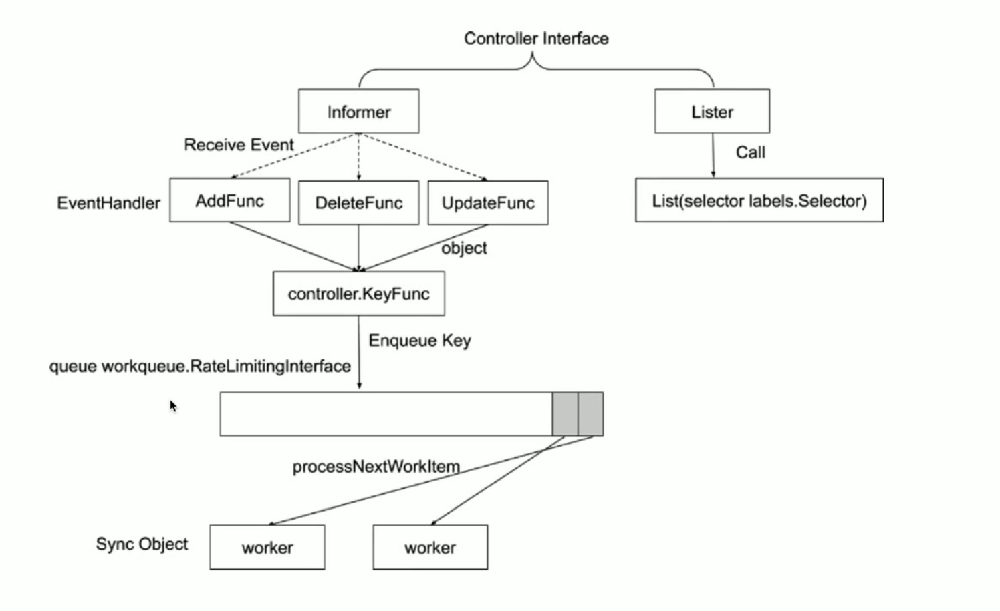
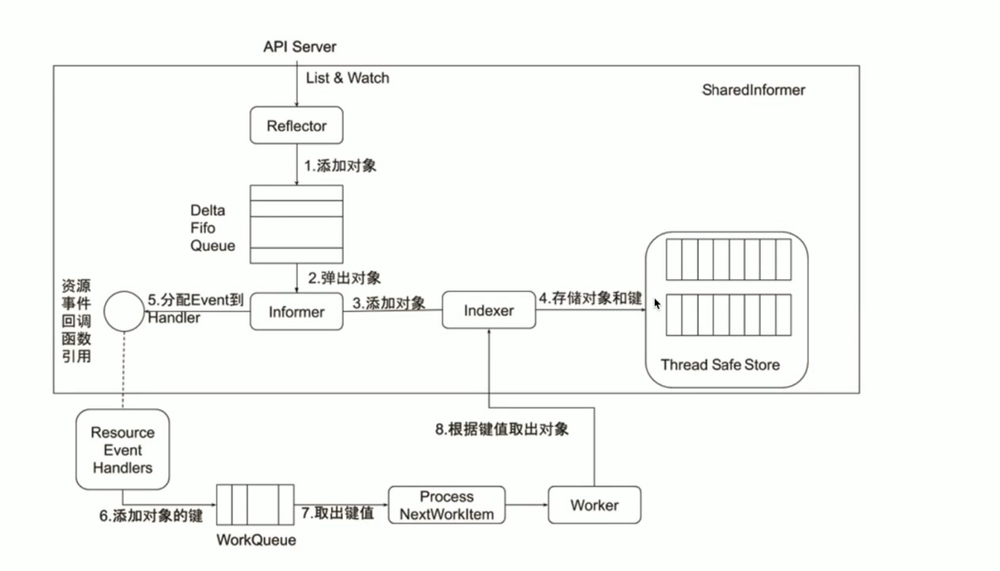
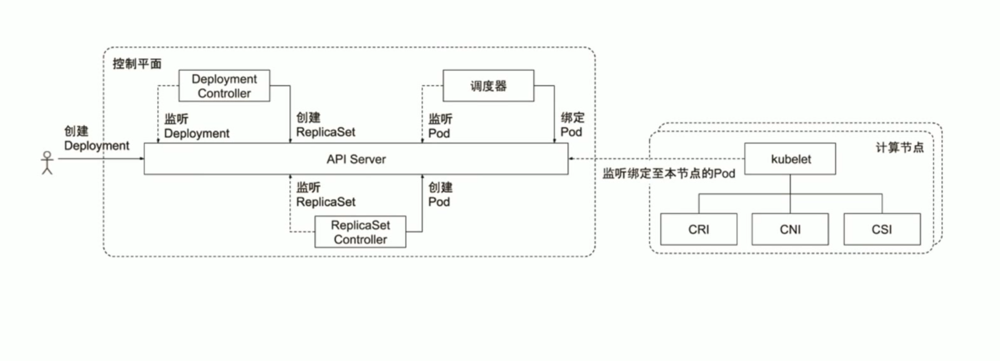

## 什么是控制器

以智能空调为例，当你设置了温度26度的时候，那么就是告诉空调，我的期望温度是26度，这称为**期望状态**(Desired State)。房间当前的温度为**当前状态**(Current State)。通过对空调设备的开关控制，当温度高于期望温度时自动开启空调，温度低于期望温度时自动关闭空调，以使当前温度总是接近于期望温度，也就是让当前状态接近期望状态。

那么在k8s中，控制器就是这样一种角色，它通过监控集群的公共状态(当前状态)，并致力于将当前状态转为期望状态。一个控制器至少追踪一种类型的 Kubernetes 资源。这些 对象 有一个代表期望状态的 `spec 字段`。 该资源的控制器负责确保其当前状态接近期望状态。

## 什么是kube-controller-manager

Kubernetes 内置一组控制器，运行在 kube-controller-manager 内。 这些内置的控制器提供了重要的核心功能。

内置控制器

- Job Controller： 处理job
- Pod AutoScaler： 处理pod的自动缩容/扩容
- ReplicaSet： 依据Replicaset Spec创建pod
- Service Controller： 为LoadBalancer type的service创建LB VIP
- ServiceAccount Controller： 确保serviceaccount在当前namespace存在
- StatefulSet Controller： 处理statefulset中的pod
- Volume Controller： 依据PV Spec创建volume
- Resource quora Controller： 在用户使用资源之后，更新状态
- Namespace Controller： 保证namespace删除时，该namespace下的所有资源都先被删除
- Replication Controller： 创建RC后，负责创建pod(这个controller基本已经不用了)
- Node Lifecycle Controller： 维护node状态，处理evict请求等
- Daemon Controller： 依据daemonset创建pod
- Deployment Controller： 依据deployment spec创建replicaset
- Endpoint Controller： 依据service spec创建endpoint,依据podip更新endpoint
- Garbage Controller： 处理级联删除，比如删除deployment的同时删除replicaset以及pod。graphbuilder根据metadata里的ownerReferences字段创建级联关系图。
- CronJob Controller： 处理cronjob

## 控制器的工作流程

controller interface依赖`informer框架`和`lister框架`。在api-server中，我们如果需要新建一个api对象，那么需要写一个`types.go`文件，里面定义了你的对象的spec,status等等，然后在代码头部写上使用k8s代码生成的tag，然后通过[kubernetes/code-generator](https://github.com/kubernetes/code-generator)自动化生成代码。informer和lister就是通过这个生成的。

代码走读：[https://yangxikun.com/kubernetes/2020/03/05/informer-lister.html](https://yangxikun.com/kubernetes/2020/03/05/informer-lister.html)
详解：[https://www.kubernetes.org.cn](https://www.kubernetes.org.cn/2693.html#:~:text=Informer%20%E6%98%AF%20Client-go%20%E4%B8%AD%E7%9A%84%E4%B8%80%E4%B8%AA%E6%A0%B8%E5%BF%83%E5%B7%A5%E5%85%B7%E5%8C%85%E3%80%82%20%E5%9C%A8%20Kubernetes%20%E6%BA%90%E7%A0%81%E4%B8%AD%EF%BC%8C%E5%A6%82%E6%9E%9C%20Kubernetes,%28%29%E6%96%B9%E6%B3%95%EF%BC%88%E8%AF%A5%E6%96%B9%E6%B3%95%E5%8C%85%E5%90%AB%20%E4%BA%86%20Get%20%E5%92%8C%20List%20%E6%96%B9%E6%B3%95%EF%BC%89%EF%BC%8C%E8%80%8C%E5%BE%88%E5%B0%91%E7%9B%B4%E6%8E%A5%E8%AF%B7%E6%B1%82%20Kubernetes%20API%E3%80%82)

informer

- 同步本地缓存，把 API 资源对象缓存一份到本地
- 根据发生的事件类型，触发事先注册好的控制器回调

Lister

- 从本地缓存中获取 API 资源对象，可以有效缓解对api-server的调用

### informer的内部机制

### 控制器的协同工作原理

## scheduler和controller的高可用

### 方案

启动多个scheduler和controller副本即可。

### 选主

需要注意的是，无论部署多少个scheduler和controller副本，同一时间工作的只有一个。那么多个副本是如何选主的呢？

在旧版本中，使用endpoine或者configmap作为公共对象来进行选主；新版本使用lease对象作为公共对象来选主。例如多个controller，会把当前的leader信息annotate到这个对象上。

### 社区有sample-controller项目
