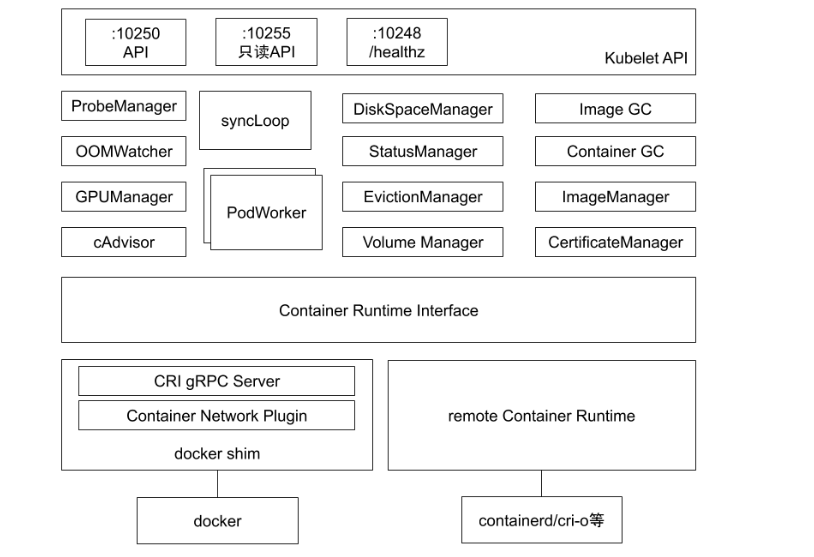
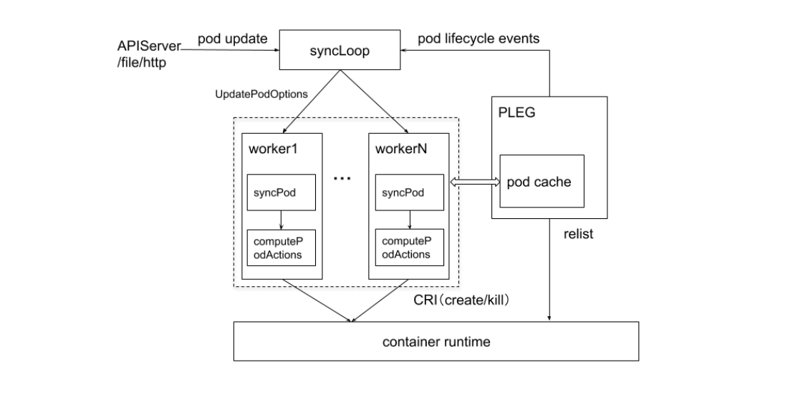
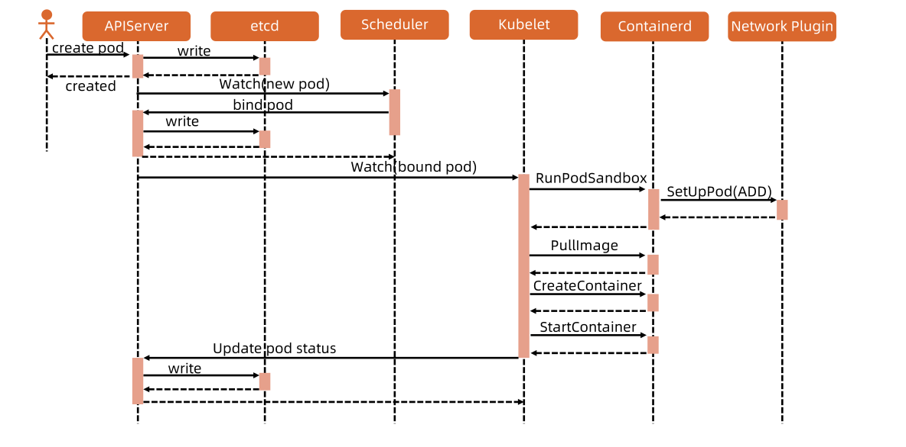
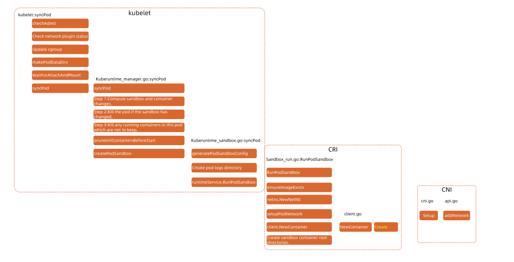

## 什么是kubelet？

kubelet 是 kubernetes 集群中真正维护容器状态，具体"干活"的组件。每个节点上都运行一个 kubelet 服务进程，默认监听 10250 端口，接收并执行 master 发来的指令，管理 Pod 及 Pod 中的容器。

### 工作端口

除了默认工作相关的10250端口外，还有一些辅助的端口，可以按需要使用参数启动，它们共同支撑了 kubelet 的工作：

- 10250（kubelet API）：kubelet server 与 apiserver 通信的端口，定期请求 apiserver 获取自己所应当处理的任务，通过该端口可以访问获取 node 资源以及状态。
- 10248（健康检查端口)： kubelet 是否正常工作, 通过 kubelet 的启动参数 –healthz-port 和 –healthz-bind-address 来指定监听的地址和端口。
- 4194（cAdvisor 监听）：kublet 通过该端口可以获取到该节点的环境信息以及 node 上运行的容器状态等内容，访问 [http://localhost:4194](http://localhost:4194) 可以看到 cAdvisor 的管理界面, 通过 kubelet 的启动参数 –cadvisor-port 可以指定 启动的端口。
- 10255（readonly API）：提供了 pod 和 node 的信息，接口以只读形式暴露出去，访问该端口不需要认证和鉴权。

### 功能

- 接收并执行 master节点 发来的指令
- 根据 PodSpec 工作， 管理 pod 及 pod 中的容器。PodSpec 是描述 pod 的 YAML 或 JSON 对象。kubelet 采用一组通过各种机制（主要通过 apiserver）提供的 PodSpec，并确保这些 PodSpec 中描述的容器运行且健康
- 每个 kubelet 进程都会在 API Server 上注册节点自身信息，定期向 master 节点汇报节点的资源使用情况，并通过 cAdvisor 监控节点和容器的资源

## kubelet组件模块

下图展示了 kubelet 组件中的模块以及模块间的划分：
  

1. `PLEG`(Pod Lifecycle Event Generator） PLEG 是 kubelet 的核心模块,PLEG 会一直调用 container runtime 获取本节点 containers/sandboxes 的信息，并与自身维护的 pods cache 信息进行对比，生成对应的 PodLifecycleEvent，然后输出到 eventChannel 中，通过 eventChannel 发送到 kubelet syncLoop 进行消费，然后由 kubelet syncPod 来触发 pod 同步处理过程，最终达到用户的期望状态。
2. `cAdvisor` cAdvisor（[https://github.com/google/cadvisor](https://github.com/google/cadvisor)]）是 google 开发的容器监控工具，集成在 kubelet 中，起到收集本节点和容器的监控信息，大部分公司对容器的监控数据都是从 cAdvisor 中获取的 ，cAvisor 模块对外提供了 interface 接口，该接口也被 imageManager，OOMWatcher，containerManager 等所使用。
3. `OOMWatcher` 系统 OOM 的监听器，会与 cadvisor 模块之间建立 SystemOOM,通过 Watch方式从 cadvisor 那里收到的 OOM 信号，并产生相关事件。
4. `probeManager` probeManager 依赖于 statusManager,livenessManager,containerRefManager，会定时去监控 pod 中容器的健康状况，当前支持两种类型的探针：livenessProbe 和readinessProbe。readinessProbe 和 livenessProbe 有三种实现方式：http、tcp 以及 cmd。
   - livenessProbe：用于判断容器是否存活，如果探测失败，kubelet 会 kill 掉该容器，并根据容器的重启策略做相应的处理。
   - readinessProbe：用于判断容器是否启动完成，将探测成功的容器加入到该 pod 所在 service 的 endpoints 中，反之则移除。
5. `statusManager` statusManager 负责维护状态信息，并把 pod 状态更新到 apiserver，但是它并不负责监控 pod 状态的变化，而是提供对应的接口供其他组件调用，比如 probeManager。
6. `containerRefManager` 容器引用的管理，相对简单的Manager，用来报告容器的创建，失败等事件，通过定义 map 来实现了 containerID 与 v1.ObjectReferece 容器引用的映射。
7. `evictionManager` 当节点的内存、磁盘或 inode 等资源不足时，达到了配置的 evict 策略， node 会变为 pressure 状态，此时 kubelet 会按照 qosClass 顺序来驱赶 pod，以此来保证节点的稳定性。可以通过配置 kubelet 启动参数 --eviction-hard= 来决定 evict 的策略值。
8. `imageGC` imageGC 负责 node 节点的镜像回收，当本地的存放镜像的本地磁盘空间达到某阈值的时候，会触发镜像的回收，删除掉不被 pod 所使用的镜像，回收镜像的阈值可以通过 kubelet 的启动参数 --image-gc-high-threshold 和 --image-gc-low-threshold 来设置。
9. `containerGC` containerGC 负责清理 node 节点上已消亡的 container，具体的 GC 操作由runtime 来实现。
10. `imageManager` 调用 kubecontainer 提供的PullImage/GetImageRef/ListImages/RemoveImage/ImageStates 方法来保证pod 运行所需要的镜像。
11. `volumeManager` 负责 node 节点上 pod 所使用 volume 的管理，volume 与 pod 的生命周期关联，负责 pod 创建删除过程中 volume 的 mount/umount/attach/detach 流程，kubernetes 采用 volume Plugins 的方式，实现存储卷的挂载等操作，内置几十种存储插件。
12. `containerManager` 负责 node 节点上运行的容器的 cgroup 配置信息，kubelet 启动参数如果指定 --cgroups-per-qos 的时候，kubelet 会启动 goroutine 来周期性的更新 pod 的 cgroup 信息，维护其正确性，该参数默认为 true，实现了 pod 的Guaranteed/BestEffort/Burstable 三种级别的 Qos。
13. `runtimeManager` containerRuntime 负责 kubelet 与不同的 runtime 实现进行对接，实现对于底层 container 的操作，初始化之后得到的 runtime 实例将会被之前描述的组件所使用。可以通过 kubelet 的启动参数 --container-runtime 来定义是使用docker 还是 rkt，默认是 docker。
14. `podManager` podManager 提供了接口来存储和访问 pod 的信息，维持 static pod 和 mirror pods 的关系，podManager 会被statusManager/volumeManager/runtimeManager 所调用，podManager 的接口处理流程里面会调用 secretManager 以及 configMapManager。

## kubelet管理pod的核心流程



1. kubelet 从三个不同的源头关注pod的更新事件，分别是`apiserver`,`file`和`http`

   - apiserver 通过配置apiserver地址，直接拉取pod清单
   - file 通过扫描`manifests`目录，静态加载pod
   - http 通过http接口接受pod清单

2. kubelet使用生产者消费者模型，生产者通过上面三种方式看到pod的状态，就会把它们加到队列里面去，syncLoop就是消费者了
3. syncLoop作为消费者，就会一直查看pod的更新事件，然后通过不同的podworker去执行syncPod动作，这里面有个重要的动作就是computePodActions，它会把pod清单和本地已经运行的容器信息进行比对，来计算这次需要对pod执行什么操作，如果是新建，那么会执行create操作，如果是delete事件，那么会删除。
4. PLEG操作，PLEG 是 kubelet 的核心模块,PLEG 会一直调用 container runtime 获取本节点 containers/sandboxes 的信息，并与自身维护的 pods cache 信息进行对比，生成对应的 PodLifecycleEvent，然后输出到 eventChannel 中，通过 eventChannel 发送到 kubelet syncLoop 进行消费，然后由 kubelet syncPod 来触发 pod 同步处理过程，最终达到用户的期望状态。

## 节点管理

向 API 服务器添加节点的方式主要有两种：

- `节点自注册` 节点上的 kubelet 向控制面执行自注册，kubelet可以通过设置启动参数--register-node来确定是否向apiserver注册自己，这是首选模式。[https://kubernetes.io/docs/concepts/architecture/nodes/#self-registration-of-nodes](https://kubernetes.io/docs/concepts/architecture/nodes/#self-registration-of-nodes)
- `手动节点管理` 用户手动添加一个 Node 对象。[https://kubernetes.io/docs/concepts/architecture/nodes/#manual-node-administration](https://kubernetes.io/docs/concepts/architecture/nodes/#manual-node-administration)

## pod管理

可以通过以下几种方式将容器清单同步提供给kubelet

1. apiserver：通过apiserver监听etcd，同步Pod清单
2. 文件（File）：利用命令行参数传递路径。kubelet 周期性地监视此路径下的文件是否有更新。 监视周期默认为 20s，且可通过参数进行配置。
3. HTTP 端点（HTTP endpoint）：利用命令行参数指定 HTTP 端点。 此端点的监视周期默认为 20 秒，也可以使用参数进行配置。
4. HTTP 服务器（HTTP server）：kubelet 还可以侦听 HTTP 并响应简单的 API （目前没有完整规范）来提交新的清单。

## pod创建流程



### 初始部分

1. 通常，我们首先会编写一个pod manifest yaml文件：`vim nginx-deployment.yaml`

   ```yaml
   apiVersion: apps/v1
   kind: Deployment
   metadata:
     name: nginx-deployment
   spec:
     replicas: 3
     selector:
       matchLabels:
         app: nginx
     template:
       metadata:
         labels:
           app: nginx
       spec:
         containers:
           - name: nginx
             image: nginx
   ```

2. 调用`kubectl`客户端工具创建这个pod，在终端中输入：`kubectl apply -f nginx-deployment.yaml`，然后敲下回车

### 第一部分： kubectl

1. 验证和生成器

   当敲下回车键以后，kubectl 首先会执行一些客户端验证操作，以确保不合法的请求（例如，创建不支持的资源或使用格式错误的镜像名称将会快速失败，也不会发送给 kube-apiserver。通过减少不必要的负载来提高系统性能。

   验证通过之后， kubectl 开始将发送给 kube-apiserver 的 HTTP 请求进行封装。kube-apiserver 与 etcd 进行通信，所有尝试访问或更改 Kubernetes 系统状态的请求都会通过 kube-apiserver 进行，kubectl 也不例外。kubectl 使用生成器（generators）来构造 HTTP 请求。生成器是一个用来处理序列化的抽象概念。

   kubectl根据Kind字段判断出要创建的资源类型为deployment，那么将会使用对应的的生成器从我们提供的参数中生成一个运行时对象。
2. API 版本协商与 API 组

   为了更容易地消除字段或者重新组织资源结构，Kubernetes 支持多个 API 版本，每个版本都在不同的 API 路径下，例如 /api/v1 或者 /apis/extensions/v1beta1。不同的 API 版本表明不同的稳定性和支持级别。

   API 组旨在对类似资源进行分类，以便使得 Kubernetes API 更容易扩展。API 的组名在 REST 路径或者序列化对象的 apiVersion 字段中指定。例如，Deployment 的 API 组名是 apps，最新的 API 版本是 v1，这就是为什么你要在 Deployment manifests 顶部输入 apiVersion: apps/v1。

   kubectl 在生成运行时对象后，开始为它找到适当的 API 组和 API 版本，然后组装成一个版本化客户端，该客户端知道资源的各种 REST 语义。该阶段被称为版本协商，kubectl 会扫描 remote API 上的 /apis 路径来检索所有可能的 API 组。由于 kube-apiserver 在 /apis 路径上公开了 OpenAPI 格式的规范文档， 因此客户端很容易找到合适的 API。

   为了提高性能，kubectl 将 OpenAPI 规范缓存到了 ~/.kube/cache 目录。如果你想了解 API 发现的过程，请尝试删除该目录并在运行 kubectl 命令时将 -v 参数的值设为最大值，然后你将会看到所有试图找到这些 API 版本的HTTP 请求。

   最后一步才是真正地发送 HTTP 请求。一旦请求发送之后获得成功的响应，kubectl 将会根据所需的输出格式打印 success message。

3. 客户端身份认证

   在发送 HTTP 请求之前还要进行客户端认证。为了能够成功发送请求，kubectl 需要先进行身份认证。用户凭证保存在 kubeconfig 文件中，kubectl 通过以下顺序来找到 kubeconfig 文件：

   - 如果提供了 --kubeconfig 参数， kubectl 就使用 -–kubeconfig 参数提供的 kubeconfig 文件
   - 如果没有提供 –kubeconfig 参数，但设置了环境变量 $KUBECONFIG，则使用该环境变量提供的 kubeconfig 文件
   - 如果 -–kubeconfig 参数和环境变量 $KUBECONFIG 都没有提供，kubectl 就使用默认的 kubeconfig 文件 $HOME/.kube/config

   解析完 kubeconfig 文件后，kubectl 会确定当前要使用的上下文、当前指向的群集以及与当前用户关联的任何认证信息。如果用户提供了额外的参数（例如 –-username），则优先使用这些参数覆盖 kubeconfig 中指定的值。一旦拿到这些信息之后， kubectl 就会把这些信息填充到将要发送的 HTTP 请求头中：

   - x509 证书使用 tls.TLSConfig 发送（包括 CA 证书）
   - bearer tokens 在 HTTP 请求头 Authorization 中发送
   - 用户名和密码通过 HTTP 基本认证发送
   - OpenID 认证过程是由用户事先手动处理的，产生一个像 bearer token 一样被发送的 token

### 第二部分： kube-apiserver

这时候，请求已经由kubectl发送到kube-apiserver,那么接下来的步骤是什么？

1. 认证

   kube-apiserver 是客户端和系统组件用来保存和检索集群状态的主要接口。为了执行相应的功能，kube-apiserver 需要能够验证请求者是合法的，这个过程被称为认证。

   那么 apiserver 如何对请求进行认证呢？当 kube-apiserver 第一次启动时，它会查看用户提供的所有 CLI 参数，并组合成一个合适的令牌列表。

   举个例子 : 如果提供了 --client-ca-file 参数，则会将 x509 客户端证书认证添加到令牌列表中；如果提供了 --token-auth-file 参数，则会将 breaer token 添加到令牌列表中。

   每次收到请求时，apiserver 都会通过令牌链进行认证，直到某一个认证成功为止：

   - x509 处理程序将验证 HTTP 请求是否是由 CA 根证书签名的 TLS 密钥进行编码的。
   - bearer token 处理程序将验证 --token-auth-file 参数提供的 token 文件是否存在。
   - 基本认证处理程序确保 HTTP 请求的基本认证凭证与本地的状态匹配。

   如果认证失败，则请求失败并返回相应的错误信息；如果验证成功，则将请求中的 Authorization 请求头删除，并将用户信息添加到其上下文中。这给后续的授权和准入控制器提供了访问之前建立的用户身份的能力。

2. 限流

   为了防止突发流量影响apiserver的可用性，需要对apiserver进行限流保护。k8s支持多种限流配置：

   - MaxInFlightLimit，server级别整体限流
   - Client限流
   - EventRateLimit, 限制event
   - APF，更细力度的限制配置

3. 鉴权

   如果成功的进行了认证和限流操作，那么现在kube-apiserver 已经成功验证我们是谁，证明我们是合法的用户，但是我们是否有权限进行此操作？毕竟身份和权限不是一回事。为了进行后续的操作，kube-apiserver 还要对用户进行鉴权。

   授权主要是用于对集群资源的访问控制，通过检查请求包含的相关属性值，与相对应的访问策略相比较，API请求必须满足某些策略才能被处理。跟认证类似，Kubernetes也支持多种授权机制，并支持同时开启多个授权插件（只要有一个验证通过即可）。如果授权成功，则用户的请求会发送到准入控制模块做进一步的请求验证；对于授权失败的请求则返回HTTP 403。

   Kubernetes授权仅处理以下的请求属性：

   - user, group, extra
   - API、请求方法（如get、post、update、patch和delete）和请求路径（如/api)
   - 请求资源和子资源
   - Namespace
   - API Group

   目前，Kubernetes支持以下授权插件：

   - ABAC：它执行静态文件中定义的策略
   - RBAC：它使用 rbac.authorization.k8s.io API Group实现授权决策，允许管理员通过 Kubernetes API 动态配置策略
   - Webhook：它与集群外的 HTTP(S) 服务交互
   - Node：它确保 kubelet 只能访问自己节点上的资源

4. 准入控制

   完成了认证和鉴权之后，客户端的调用请求就能得到api server的真正相应了吗？答案是：不能。

   从 kube-apiserver 的角度来看，它已经验证了我们的身份并且赋予了相应的权限允许我们继续，但对于 Kubernetes 而言，其他组件对于应不应该允许发生的事情还是很有意见的。所以这个请求还需要通过 Admission Controller 所控制的一个 准入控制链 的层层考验，官方标准的 "关卡" 有近十个之多，而且还能自定义扩展！

   虽然授权的重点是回答用户是否有权限，但准入控制器会拦截请求以确保它符合集群的更广泛的期望和规则。它们是资源对象保存到 etcd 之前的最后一个堡垒，封装了一系列额外的检查以确保操作不会产生意外或负面结果。不同于授权和认证只关心请求的用户和操作，准入控制还处理请求的内容，并且仅对创建、更新、删除或连接（如代理）等有效，而对读操作无效。

   准入控制器设计的重点在于提高可扩展性，某个控制器都作为一个插件存储在 plugin/pkg/admission 目录中，并且与某一个接口相匹配，最后被编译到 kube-apiserver 二进制文件中。

### 第三部分： etcd

到现在为止，Kubernetes 已经对该客户端的调用请求进行了全面彻底地审查，并且已经验证通过，运行它进入下一个环节。下一步 kube-apiserver 将对 HTTP 请求进行反序列化，然后利用得到的结果构建运行时对象（有点像 kubectl 生成器的逆过程），并保存到 etcd 中。下面我们将这个过程分解一下。

当收到请求时，kube-apiserver 是如何知道它该怎么做的呢？事实上，在客户端发送调用请求之前就已经产生了一系列非常复杂的流程。我们就从 kube-apiserver 二进制文件首次运行开始分析吧：

   1. 当运行 kube-apiserver 二进制文件时，它会创建一个允许 apiserver 聚合的服务链。这是一种对 Kubernetes API 进行扩展的方式。
   2. 同时会创建一个 generic apiserver 作为默认的 apiserver。
   3. 然后利用生成的 OpenAPI 规范来填充 apiserver 的配置。
   4. 然后 kube-apiserver 遍历数据结构中指定的所有 API 组，并将每一个 API 组作为通用的存储抽象保存到 etcd 中。当你访问或变更资源状态时，kube-apiserver 就会调用这些 API 组。
   5. 每个 API 组都会遍历它的所有组版本，并且将每个 HTTP 路由映射到 REST 路径中。
   6. 当请求的 METHOD 是 POST 时，kube-apiserver 就会将请求转交给 资源创建处理器。

现在 kube-apiserver 已经知道了所有的路由及其对应的 REST 路径，以便在请求匹配时知道调用哪些处理器和键值存储。多么机智的设计！现在假设客户端的 HTTP 请求已经被 kube-apiserver 收到了：

   1. 如果处理链可以将请求与已经注册的路由进行匹配，就会将该请求交给注册到该路由的专用处理器来处理；如果没有任何一个路由可以匹配该请求，就会将请求转交给基于路径的处理器（比如当调用 /apis 时）；如果没有任何一个基于路径的处理器注册到该路径，请求就会被转交给 not found 处理器，最后返回 404。
   2. 幸运的是，我们有一个名为 createHandler 的注册路由！它有什么作用呢？首先它会解码 HTTP 请求并进行基本的验证，例如确保请求提供的 json 与 API 资源的版本相匹配。
   3. 接下来进入审计和准入控制阶段。
   4. 然后资源将会通过 storage provider 保存到 etcd 中。默认情况下保存到 etcd 中的键的格式为 /，你也可以自定义。
   5. 资源创建过程中出现的任何错误都会被捕获，最后 storage provider 会执行 get 调用来确认该资源是否被成功创建。如果需要额外的清理工作，就会调用后期创建的处理器和装饰器。
   6. 最后构造 HTTP 响应并返回给客户端。

原来 apiserver 做了这么多的工作，以前竟然没有发现呢！到目前为止，我们创建的 Deployment 资源已经保存到了 etcd 中，但 apiserver 仍然看不到它。

### 第四部分： 初始化

在一个资源对象被持久化到数据存储之后，apiserver 还无法完全看到或调度它，在此之前还要执行一系列Initializers。Initializers 是一种与资源类型相关联的控制器，它会在资源对外可用之前执行某些逻辑。如果某个资源类型没有 Initializers，就会跳过此初始化步骤立即使资源对外可见。Initializers是一个强大的功能，因为它允许我们执行通用引导操作。例如：

- 将代理边车容器注入到暴露 80 端口的 Pod 中，或者加上特定的 `annotation`。
- 将保存着测试证书的 volume 注入到特定命名空间的所有 Pod 中。
- 如果 Secret 中的密码小于 20 个字符，就阻止其创建。

`initializerConfiguration` 资源对象允许你声明某些资源类型应该运行哪些Initializers。如果你想每创建一个 Pod 时就运行一个自定义Initializers，你可以这样做：

   ```yaml
   apiVersion: admissionregistration.k8s.io/v1alpha1
   kind: InitializerConfiguration
   metadata:
     name: custom-pod-initializer
   initializers:
     - name: podimage.example.com
       rules:
         - apiGroups:
             - ""
           apiVersions:
             - v1
           resources:
             - pods
   ```

通过该配置创建资源对象 `InitializerConfiguration` 之后，就会在每个 Pod 的 `metadata.initializers.pending` 字段中添加 `custom-pod-initializer` 字段。该初始化控制器会定期扫描新的 Pod，一旦在 Pod 的 `pending` 字段中检测到自己的名称，就会执行其逻辑，执行完逻辑之后就会将 `pending` 字段下的自己的名称删除。

只有在 pending 字段下的列表中的第一个 Initializers 可以对资源进行操作，当所有的 Initializers 执行完成，并且 pending 字段为空时，该对象就会被认为初始化成功。

你可能会注意到一个问题：如果 kube-apiserver 不能显示这些资源，那么用户级控制器是如何处理资源的呢？

为了解决这个问题，kube-apiserver 暴露了一个 `?includeUninitialized` 查询参数，它会返回所有的资源对象（包括未初始化的）。

### 第五部分： 控制循环

1. Deployments controller

   到了这个阶段，我们的 Deployment 记录已经保存在 etcd 中，并且所有的初始化逻辑都执行完成，接下来的阶段将会涉及到该资源所依赖的拓扑结构。在 Kubernetes 中，Deployment 实际上只是一系列 Replicaset 的集合，而 Replicaset 是一系列 Pod 的集合。那么 Kubernetes 是如何从一个 HTTP 请求按照层级结构依次创建这些资源的呢？其实这些工作都是由 Kubernetes 内置的 Controller(控制器) 来完成的。

   Kubernetes 在整个系统中使用了大量的 Controller，Controller 是一个用于将系统状态从“当前状态”修正到“期望状态”的异步脚本。所有 Controller 都通过 kube-controller-manager 组件并行运行，每种 Controller 都负责一种具体的控制流程。首先介绍一下 Deployment Controller

   将 Deployment 记录存储到 etcd 并初始化后，就可以通过 kube-apiserver 使其可见，然后 Deployment Controller 就会检测到它（它的工作就是负责监听 Deployment 记录的更改）。在我们的例子中，控制器通过一个 Informer 注册一个创建事件的特定回调函数（更多信息参加下文）。

   当 Deployment 第一次对外可见时，该 Controller 就会将该资源对象添加到内部工作队列，然后开始处理这个资源对象：

   通过使用标签选择器查询 kube-apiserver 来检查该 Deployment 是否有与其关联的 ReplicaSet 或 Pod 记录。

   有趣的是，这个同步过程是状态不可知的，它核对新记录与核对已经存在的记录采用的是相同的方式。

   在意识到没有与其关联的 ReplicaSet 或 Pod 记录后，Deployment Controller 就会开始执行弹性伸缩流程：

   创建 ReplicaSet 资源，为其分配一个标签选择器并将其版本号设置为 1。

   ReplicaSet 的 PodSpec 字段从 Deployment 的 manifest 以及其他相关元数据中复制而来。有时 Deployment 记录在此之后也需要更新（例如，如果设置了 process deadline）。

   当完成以上步骤之后，该 Deployment 的 status 就会被更新，然后重新进入与之前相同的循环，等待 Deployment 与期望的状态相匹配。由于 Deployment Controller 只关心 ReplicaSet，因此需要通过 ReplicaSet Controller 来继续协调。

2. ReplicaSets controller

   在前面的步骤中，Deployment Controller 创建了第一个 ReplicaSet，但仍然还是没有 Pod，这时候就该 ReplicaSet Controller 登场了。ReplicaSet Controller 的工作是监视 ReplicaSets 及其相关资源（Pod）的生命周期。和大多数其他 Controller 一样，它通过触发某些事件的处理器来实现此目的。

   当创建 ReplicaSet 时（由 Deployment Controller 创建），RS Controller 检查新 ReplicaSet 的状态，并检查当前状态与期望状态之间存在的偏差，然后通过调整 Pod 的副本数来达到期望的状态。

   Pod 的创建也是批量进行的，从 SlowStartInitialBatchSize 开始，然后在每次成功的迭代中以一种 slow start 操作加倍。这样做的目的是在大量 Pod 启动失败时（例如，由于资源配额），可以减轻 kube-apiserver 被大量不必要的 HTTP 请求吞没的风险。如果创建失败，最好能够优雅地失败，并且对其他的系统组件造成的影响最小！

   Kubernetes 通过 Owner References（在子级资源的某个字段中引用其父级资源的 ID） 来构造严格的资源对象层级结构。这确保了一旦 Controller 管理的资源被删除（级联删除），子资源就会被垃圾收集器删除，同时还为父级资源提供了一种有效的方式来避免他们竞争同一个子级资源（想象两对父母都认为他们拥有同一个孩子的场景）。

   Owner References 的另一个好处是：它是有状态的。如果有任何 Controller 重启了，那么由于资源对象的拓扑关系与 Controller 无关，该操作不会影响到系统的稳定运行。这种对资源隔离的重视也体现在 Controller 本身的设计中：Controller 不能对自己没有明确拥有的资源进行操作，它们应该选择对资源的所有权，互不干涉，互不共享。

   有时系统中也会出现孤儿（orphaned）资源，通常由以下两种途径产生：

   - 父级资源被删除，但子级资源没有被删除
   - 垃圾收集策略禁止删除子级资源

   当发生这种情况时，Controller 将会确保孤儿资源拥有新的 Owner。多个父级资源可以相互竞争同一个孤儿资源，但只有一个会成功（其他父级资源会收到验证错误）。

3. Informers

   你可能已经注意到，某些 Controller（例如 RBAC 授权器或 Deployment Controller）需要先检索集群状态然后才能正常运行。拿 RBAC 授权器举例，当请求进入时，授权器会将用户的初始状态缓存下来，然后用它来检索与 etcd 中的用户关联的所有 角色（Role）和 角色绑定（RoleBinding）。那么问题来了，Controller 是如何访问和修改这些资源对象的呢？事实上 Kubernetes 是通过 Informer 机制来解决这个问题的。

   Infomer 是一种模式，它允许 Controller 查找缓存在本地内存中的数据(这份数据由 Informer 自己维护)并列出它们感兴趣的资源。

   虽然 Informer 的设计很抽象，但它在内部实现了大量的对细节的处理逻辑（例如缓存），缓存很重要，因为它不但可以减少对 Kubenetes API 的直接调用，同时也能减少 Server 和 Controller 的大量重复性工作。通过使用 Informer，不同的 Controller 之间以线程安全（Thread safety）的方式进行交互，而不必担心多个线程访问相同的资源时会产生冲突。

   有关 Informer 的更多详细解析，请参考这篇文章：[Kubernetes: Controllers, Informers, Reflectors and Stores](https://borismattijssen.github.io/articles/kubernetes-informers-controllers-reflectors-stores)

当所有的 Controller 正常运行后，etcd 中就会保存一个 Deployment、一个 ReplicaSet 和 三个 Pod 资源记录，并且可以通过 kube-apiserver 查看。然而，这些 Pod 资源现在还处于 Pending 状态，因为它们还没有被调度到集群中合适的 Node 上运行。这个问题最终要靠调度器（Scheduler）来解决。

### 第六部分： 调度器

Scheduler 作为一个独立的组件运行在集群控制平面上，工作方式与其他 Controller 相同：监听实际并将系统状态调整到期望的状态。具体来说，Scheduler 的作用是将待调度的 Pod 按照特定的算法和调度策略绑定（Binding）到集群中某个合适的 Node 上，并将绑定信息写入 etcd 中（它会过滤其 PodSpec 中 NodeName 字段为空的 Pod），默认的调度算法的工作方式如下：

1. 当 Scheduler 启动时，会注册一个默认的预选策略链，这些 预选策略 会对备选节点进行评估，判断备选节点是否满足备选 Pod 的需求。例如，如果 PodSpec 字段限制了 CPU 和内存资源，那么当备选节点的资源容量不满足备选 Pod 的需求时，备选 Pod 就不会被调度到该节点上（资源容量=备选节点资源总量-节点中已存在 Pod 的所有容器的需求资源（CPU 和内存）的总和）
2. 一旦筛选出符合要求的候选节点，就会采用 优选策略 计算出每个候选节点的积分，然后对这些候选节点进行排序，积分最高者胜出。例如，为了在整个系统中分摊工作负载，这些优选策略会从备选节点列表中选出资源消耗最小的节点。每个节点通过优选策略时都会算出一个得分，计算各项得分，最终选出分值大的节点作为优选的结果。

一旦找到了合适的节点，Scheduler 就会创建一个 Binding 对象，该对象的 Name 和 Uid 与 Pod 相匹配，并且其 ObjectReference 字段包含所选节点的名称，然后通过 POST 请求发送给 apiserver。

当 kube-apiserver 接收到此 Binding 对象时，注册吧会将该对象反序列化并更新 Pod 资源中的以下字段：

- 将 `NodeName` 的值设置为 `ObjectReference` 中的 `NodeName`
- 添加相关的注释
- 将 `PodScheduled` 的 status 值设置为 True。可以通过 kubectl 指令来查看：

```bash
# 获取PodScheduled状态
$ kubectl get pod <PODNAME> -o go-template='{{range .status.conditions}}{{if eq .type "PodScheduled"}}{{.status}}{{end}}{{end}}'
```

一旦 Scheduler 将 Pod 调度到某个节点上，该节点的 Kubelet 就会接管该 Pod 并开始部署。

预选策略和优选策略都可以通过 -–policy-config-file 参数来扩展，如果默认的调度器不满足要求，还可以部署自定义的调度器。如果 podSpec.schedulerName 的值设置为其他的调度器，则 Kubernetes 会将该 Pod 的调度转交给那个调度器。

### 第七部分： kubelet

#### pod同步

现在，所有的 Controller 都完成了工作，我们来总结一下：

- HTTP 请求通过了认证、授权和准入控制阶段
- 一个 Deployment、ReplicaSet 和三个 Pod 资源被持久化到 etcd 存储中
- 然后运行了一系列Initializers
- 最后每个 Pod 都被调度到合适的节点

然而到目前为止，所有的状态变化仅仅只是针对保存在 etcd 中的资源记录，接下来的步骤涉及到运行在工作节点之间的 Pod 的分布状况，这是分布式系统（比如 Kubernetes）的关键因素。这些任务都是由 Kubelet 组件完成的，让我们开始吧！

在 Kubernetes 集群中，每个 Node 节点上都会启动一个 Kubelet 服务进程，该进程用于处理 Scheduler 下发到本节点的任务，管理 Pod 的生命周期，包括挂载卷、容器日志记录、垃圾回收以及其他与 Pod 相关的事件。

如果换一种思维模式，你可以把 Kubelet 当成一种特殊的 Controller，它每隔 20 秒（可以自定义）向 kube-apiserver 通过 NodeName 获取自身 Node 上所要运行的 Pod 清单。一旦获取到了这个清单，它就会通过与自己的内部缓存进行比较来检测新增加的 Pod，如果有差异，就开始同步 Pod 列表。我们来详细分析一下同步过程：

1. 如果 Pod 正在创建， Kubelet 就会记录一些在 Prometheus 中用于追踪 Pod 启动延时的指标。
2. 然后生成一个 PodStatus 对象，它表示 Pod 当前阶段的状态。Pod 的状态(Phase) 是 Pod 在其生命周期中的最精简的概要，包括 `Pending`，`Running`，`Succeeded`，`Failed` 和 `Unkown` 这几个值。状态的产生过程非常过程，所以很有必要深入了解一下背后的原理：
   - 首先串行执行一系列 Pod 同步处理器（PodSyncHandlers），每个处理器检查检查 Pod 是否应该运行在该节点上。当所有的处理器都认为该 Pod 不应该运行在该节点上，则 Pod 的 Phase 值就会变成 PodFailed，并且将该 Pod 从该节点上驱逐出去。例如当你创建一个 Job 时，如果 Pod 失败重试的时间超过了 spec.activeDeadlineSeconds 设置的值，就会将 Pod 从该节点驱逐出去。
   - 接下来，Pod 的 Phase 值由 init 容器 和应用容器的状态共同来决定。因为目前容器还没有启动，容器被视为处于等待阶段，如果 Pod 中至少有一个容器处于等待阶段，则其 Phase 值为 Pending。
   - 最后，Pod 的 Condition 字段由 Pod 内所有容器的状态决定。现在我们的容器还没有被容器运行时创建，所以 PodReady 的状态被设置为 False。可以通过 kubectl 查看：`kubectl get pod <PODNAME> -o go-template='{{range .status.conditions}}{{if eq .type "Ready"}}{{.status}}{{end}}{{end}}'`
3. 生成 PodStatus 之后（Pod 中的 status 字段），Kubelet 就会将它发送到 Pod 的状态管理器，该管理器的任务是通过 apiserver 异步更新 etcd 中的记录。
4. 接下来运行一系列准入处理器来确保该 Pod 是否具有相应的权限（包括强制执行 AppArmor 配置文件和 NO_NEW_PRIVS），被准入控制器拒绝的 Pod 将一直保持 Pending 状态。
5. 如果 Kubelet 启动时指定了 cgroups-per-qos 参数，Kubelet 就会为该 Pod 创建 cgroup 并进行相应的资源限制。这是为了更方便地对 Pod 进行服务质量（QoS）管理。
6. 然后为 Pod 创建相应的目录，包括 Pod 的目录（/var/run/kubelet/pods/），该 Pod 的卷目录（/volumes）和该 Pod 的插件目录（/plugins）。
7. 卷管理器会挂载 Spec.Volumes 中定义的相关数据卷，然后等待是否挂载成功。根据挂载卷类型的不同，某些 Pod 可能需要等待更长的时间（比如 NFS 卷）。
8. 从 apiserver 中检索 Spec.ImagePullSecrets 中定义的所有 Secret，然后将其注入到容器中。
9. 最后通过容器运行时接口（Container Runtime Interface（CRI））开始启动容器（下面会详细描述）。

#### CRI 与 pause 容器

到了这个阶段，大量的初始化工作都已经完成，容器已经准备好开始启动了，而容器是由容器运行时（例如 Docker 和 Rkt）启动的。

为了更容易扩展，Kubelet 从 1.5.0 开始通过容器运行时接口与容器运行时（Container Runtime）交互。简而言之，CRI 提供了 Kubelet 和特定的运行时之间的抽象接口，它们之间通过协议缓冲区（它像一个更快的 JSON）和 gRPC API（一种非常适合执行 Kubernetes 操作的 API）。这是一个非常酷的想法，通过使用 Kubelet 和运行时之间定义的契约关系，容器如何编排的具体实现细节已经变得无关紧要。由于不需要修改 Kubernetes 的核心代码，开发者可以以最小的开销添加新的运行时。

让我们继续看容器启动的阶段。第一次启动 Pod 时，Kubelet 会通过 Remote Procedure Command(RPC) 协议调用 RunPodSandbox。sandbox 用于描述一组容器，例如在 Kubernetes 中它表示的是 Pod。sandbox 是一个很宽泛的概念，所以对于其他没有使用容器的运行时仍然是有意义的（比如在一个基于 hypervisor 的运行时中，sandbox 可能指的就是虚拟机）。

我们的例子中使用的容器运行时是 Docker，创建 sandbox 时首先创建的是 pause 容器。pause 容器作为同一个 Pod 中所有其他容器的基础容器，它为 Pod 中的每个业务容器提供了大量的 Pod 级别资源，这些资源都是 Linux 命名空间（包括网络命名空间，IPC 命名空间和 PID 命名空间）。

pause 容器提供了一种方法来管理所有这些命名空间并允许业务容器共享它们，在同一个网络命名空间中的好处是：

- 同一个 Pod 中的容器可以使用 localhost 来相互通信。
- pause 容器的第二个功能与 PID 命名空间的工作方式相关，在 PID 命名空间中，进程之间形成一个树状结构，一旦某个子进程由于父进程的错误而变成了 “孤儿进程”，其便会被 init 进程进行收养并最终回收资源。关于 pause 工作方式的详细信息可以参考：The Almighty Pause Container。

一旦创建好了 pause 容器，下面就会开始检查磁盘状态然后开始启动业务容器。

#### CNI 和 Pod 网络

现在我们的 Pod 已经有了基本的骨架：一个共享所有命名空间以允许业务容器在同一个 Pod 里进行通信的 pause 容器。但现在还有一个问题，那就是容器的网络是如何建立的？

当 Kubelet 为 Pod 创建网络时，它会将创建网络的任务交给 CNI 插件。CNI 表示容器网络接口（Container Network Interface），和容器运行时的运行方式类似，它也是一种抽象，允许不同的网络提供商为容器提供不同的网络实现。通过将 json 配置文件（默认在 /etc/cni/net.d 路径下）中的数据传送到相关的 CNI 二进制文件（默认在 /opt/cni/bin 路径下）中，cni 插件可以给 pause 容器配置相关的网络，然后 Pod 中其他的容器都使用 pause 容器的网络。下面是一个简单的示例配置文件：

```json
{
    "cniVersion": "0.3.1",
    "name": "bridge",
    "type": "bridge",
    "bridge": "cnio0",
    "isGateway": true,
    "ipMasq": true,
    "ipam": {
        "type": "host-local",
        "ranges": [
          [{"subnet": "${POD_CIDR}"}]
        ],
        "routes": [{"dst": "0.0.0.0/0"}]
    }
}
```

CNI 插件还会通过 `CNI_ARGS` 环境变量为 Pod 指定其他的元数据，包括 Pod 名称和命名空间。

下面的步骤因 CNI 插件而异，我们以 bridge 插件举例：

1. 该插件首先会在根网络命名空间（也就是宿主机的网络命名空间）中设置本地 Linux 网桥，以便为该主机上的所有容器提供网络服务。
2. 然后它会将一个网络接口（veth 设备对的一端）插入到 pause 容器的网络命名空间中，并将另一端连接到网桥上。你可以这样来理解 veth 设备对：它就像一根很长的管道，一端连接到容器，一端连接到根网络命名空间中，数据包就在管道中进行传播。
3. 接下来 json 文件中指定的 IPAM Plugin 会为 pause 容器的网络接口分配一个 IP 并设置相应的路由，现在 Pod 就有了自己的 IP。
IPAM Plugin 的工作方式和 CNI Plugin 类似：通过二进制文件调用并具有标准化的接口，每一个 IPAM Plugin 都必须要确定容器网络接口的 IP、子网以及网关和路由，并将信息返回给 CNI 插件。最常见的 IPAM Plugin 是 host-local，它从预定义的一组地址池中为容器分配 IP 地址。它将地址池的信息以及分配信息保存在主机的文件系统中，从而确保了同一主机上每个容器的 IP 地址的唯一性。
4. 最后 Kubelet 会将集群内部的 DNS 服务器的 Cluster IP 地址传给 CNI 插件，然后 CNI 插件将它们写到容器的 /etc/resolv.conf 文件中。

一旦完成了上面的步骤，CNI 插件就会将操作的结果以 json 的格式返回给 Kubelet。

#### 跨主机容器网络

到目前为止，我们已经描述了容器如何与宿主机进行通信，但跨主机之间的容器如何通信呢？

通常情况下使用 overlay 网络来进行跨主机容器通信，这是一种动态同步多个主机间路由的方法。 其中最常用的 overlay 网络插件是 flannel。

#### 容器启动

所有网络都配置完成后，接下来就开始真正启动业务容器了。

一旦 sanbox 完成初始化并处于 active 状态，Kubelet 就可以开始为其创建容器了。首先启动 PodSpec 中定义的 init 容器，然后再启动业务容器。具体过程如下：

1. 首先拉取容器的镜像。如果是私有仓库的镜像，就会利用 PodSpec 中指定的 Secret 来拉取该镜像。
2. 然后通过 CRI 接口创建容器。Kubelet 向 PodSpec 中填充了一个 ContainerConfig 数据结构（在其中定义了命令，镜像，标签，挂载卷，设备，环境变量等待），然后通过 protobufs 发送给 CRI 接口。对于 Docker 来说，它会将这些信息反序列化并填充到自己的配置信息中，然后再发送给 Dockerd 守护进程。在这个过程中，它会将一些元数据标签（例如容器类型，日志路径，dandbox ID 等待）添加到容器中。
3. 接下来会使用 CPU 管理器来约束容器，这是 Kubelet 1.8 中新添加的 alpha 特性，它使用 UpdateContainerResources CRI 方法将容器分配给本节点上的 CPU 资源池。
4. 最后容器开始真正启动。
5. 如果 Pod 中配置了容器生命周期钩子（Hook），容器启动之后就会运行这些 Hook。Hook 的类型包括两种：Exec（执行一段命令） 和 HTTP（发送HTTP请求）。如果 PostStart Hook 启动的时间过长、挂起或者失败，容器将永远不会变成 running 状态。

### 第八部分： 就绪

最后的最后，现在我们的集群上应该会运行三个容器，分布在一个或多个工作节点上。所有的网络，数据卷和秘钥都由 Kubelet 填充，并通过 CRI 接口添加到容器中并配置成功！


参考：[https://github.com/tpinellia/what-happens-when-k8s](https://github.com/tpinellia/what-happens-when-k8s)

## kubelet启动Pod的流程



1. 可以在checkadmit步骤继续做自定义准入插件，ebay就是这么做的，即便是scheduler已经把pod调度到node上，也可以在这个步骤延迟某些不满足条件的pod的启动。
2. 检查网络插件的状态
3. 更新cgroup
4. 创建pod需要的临时data目录，存放跟pod生命周期紧绑定的数据，例如console日志，临时数据对象
5. 等待volume创建
6. syncpod
   - 计算sandbox和container的变化
   - 如果sandbox有变化，那么会杀掉旧pod
   - 清除pod里面的container
   - 清除pod里面的initcontainer
   - 重建sandbox
       - 生成sandbox配置
       - 创建pod的log dir
       - 调用CRI

CRI步骤

1. 启动sandbox
2. 判断镜像是否存在，不在的话会调用cri里面的imageservice接口去拉镜像
3. 创建网络的namespace
4. 通过调用CNI网络的接口设置pod的网络
5. 然后创建容器
6. 创建容器的root的目录
