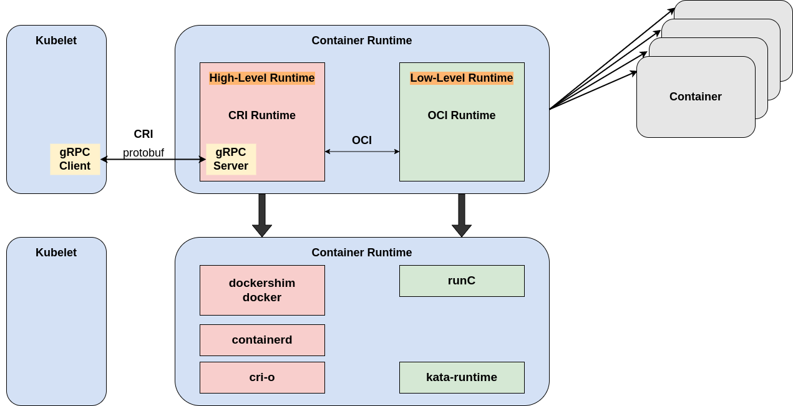
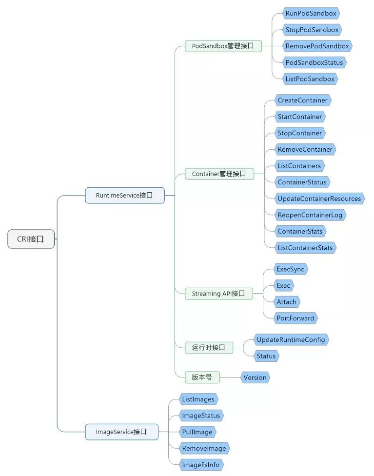
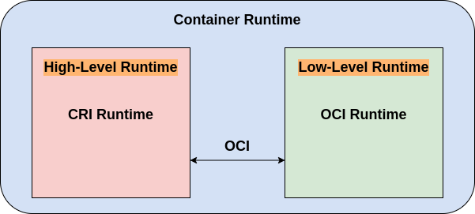
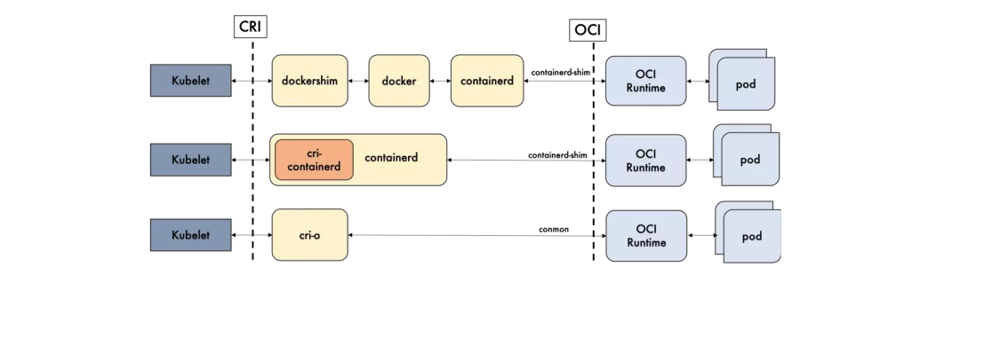
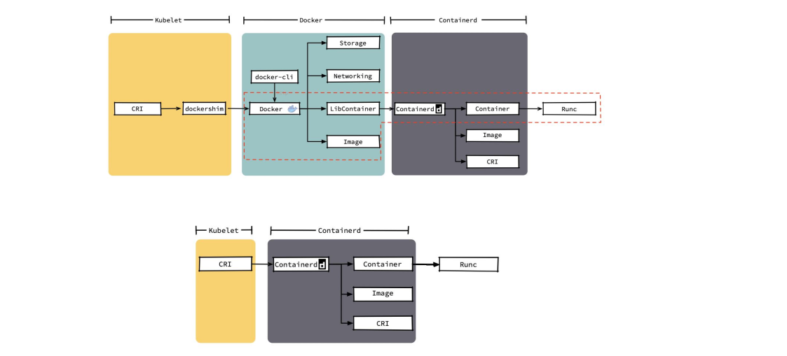
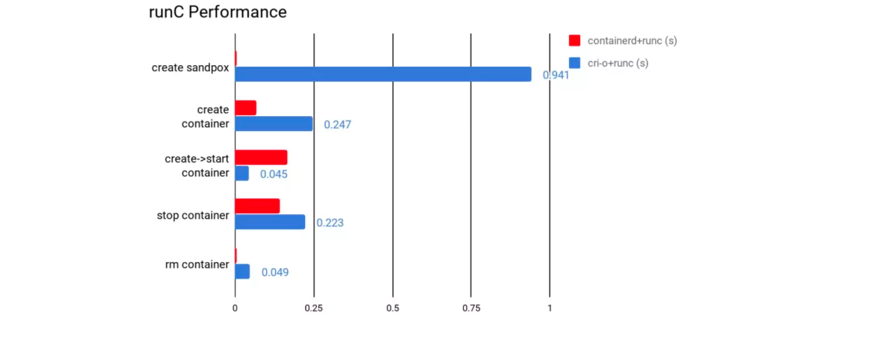

## 基本概念

### 什么是容器运行时

容器运行时（Container Runtime），运行于 Kubernetes（k8s）集群的每个节点中，负责容器的整个生命周期。Pod及其容器就是运行在容器运行时上面的。

### 什么是CRI

随着容器云的发展，越来越多的容器运行时出现，为了解决这些容器运行时和 k8s 的集成问题，在 k8s 1.5版本中，社区推出了 CRI（Container Runtime Interface，容器运行时接口）以支持更多的容器运行时。

CRI 是一个插件接口，它使 kubelet 能够使用各种容器运行时，无需重新编译集群组件。你需要在集群中的每个节点上都有一个可以正常工作的 [容器运行时](#什么是容器运行时)， 这样 kubelet 能启动 Pod 及其容器。

容器运行时接口（CRI）定义了主要 gRPC 协议，用于集群组件 kubelet 和 容器运行时，是 kubelet 和容器运行时之间通信的主要协议。kubelet 作为客户端，基于gRPC 框架，通过 Socket 和 容器运行时 通信。它包括两类服务：

- 镜像服务（Image Service）提供下载，检查和删除镜像的远程程序调用
- 运行时服务（Runtime Service）包含用于管理容器生命周期，以及与容器交互的调用（exec / attach / port-forward）的远程程序调用

### 什么是OCI

OCI（Open Container Initiative）开放容器计划，定义了创建容器的格式和运行时的开源行业标准，包括 `镜像规范（Image Specification）` 和 `运行时规范（Runtime Specification）`

- 镜像规范（Image Specification）通常我们根据Dockerfile定义的内容制作镜像，目的是构建一个符合OCI标准的镜像文件，那么OCI标准镜像文件的内容都有哪些呢？在OCI规范里的image spec对容器镜像格式做了定义，它主要包括几块内容：
  - 文件系统：描述了如何以layer的方式叠加成一个完整的文件系统，以及如何用layer去表示对文件作出的改动（增加、删除、修改）
  - config文件：保存了文件系统的层级信息（每个层级的 hash 值、历史信息），以及容器运行时需要的一些信息（比如环境变量、工作目录、命令参数、mount 列表等）。
  - manifest文件：记录镜像元信息，包括Image Config和Image Layers。
  - index文件：可选的文件，指向不同平台的manifest文件，相当于整个镜像的入口，从这个文件可以获取整个镜像依赖的所有文件信息。
- 运行时规范（Runtime Specification）描述了如何从OCI运行时文件系统包（filesystem bundle）运行容器程序，并且定义它的配置、运行环境和生命周期。例如像如何为新容器设置命名空间（namespaces）和控制组（cgroups），以及挂载根文件系统等等操作，都是在这里定义的。主要包含配置文件、运行环境、生命周期三部分内容：
  - 配置文件：config.json，包含容器的配置信息（mounts、process、hostname、hooks等）。
  - 运行环境：定义运行环境，是为了确保应用程序在多个运行时之间，能具有一致的环境 。
  - 容器生命周期：定义了运行时的相关指令及其行为：state、create、start、kill、delete、prestart hooks、poststart hooks、poststop hooks。

## 运行时层级

运行时层级分为：

- [`低层级运行时`](#低层级运行时)  Low-level Runtime
- [`高层级运行时`](#高层级运行时)  High-level Runtime

出于实际目的，为容器设置命名空间和 cgroup、专注于运行容器的实际容器运行时通常称为"`低级容器运行时`"；支持更多高级功能的运行时，如图像管理和 gRPC/Web API，专注于格式、解包、管理和图像共享，通常称为称为"`高级容器运行时`"。需要注意的是，低级运行时和高级运行时是根本不同的东西，它们解决了不同的问题。

容器是使用Linux 命名空间和cgroups实现的。命名空间让您可以为每个容器虚拟化系统资源，例如文件系统或网络。Cgroups 提供了一种方法来限制每个容器可以使用的 CPU 和内存等资源量。在最低级别，容器运行时负责为容器设置这些命名空间和 cgroup，然后在这些命名空间和 cgroup 中运行命令。低级运行时支持使用这些操作系统功能。

通常，想要在容器中运行应用程序的开发人员需要的不仅仅是低级运行时提供的功能。他们需要围绕图像格式、图像管理和共享图像的 API 和功能。这些功能由高级运行时提供。低级运行时无法为日常使用提供足够的功能。出于这个原因，真正使用低级运行时的唯一人将是实现更高级别运行时和容器工具的开发人员。

### 低层级运行时

低级容器运行时 (Low level Container Runtime)，一般指按照 OCI 规范实现的、能够接收可运行文件系统（rootfs） 和 配置文件（config.json）并运行隔离进程的实现。

低级运行时的特点是底层、轻量、灵活，限制也很明显：

- 只认识 rootfs 和 config.json，不认识镜像 (下文简称 image)，不具备镜像存储功能，也不能执行镜像的构建、推送、拉取等（我们无法使用 runC, kata-runtime 处理镜像）
- 不提供网络实现，所以真正使用时，往往需要利用 CNI 之类的实现为容器添加网络
- 不提供持久实现，如果容器是有状态应用需要使用文件系统持久状态，单机环境可以挂载宿主机目录，分布式环境可以自搭 NFS，但多数会选择云平台提供的 CSI 存储实现
- 与特定操作系统绑定无法跨平台，比如 runC 只能在 Linux 上使用；runhcs 只能在 Windows 上使用

解决了这些限制中一项或者多项的容器运行时，就叫做高级容器运行时 (High level Container Runtime)。

### 高层级运行时

高级容器运行时首先要做的是打通 [OCI标准](#什么是oci) 的 镜像规范（Image Specification）和 运行时规范（Runtime Specification），直白来说就是高效处理 image 到 rootfs 和 config.json 的转换。config.json 的生成比较简单，运行时可以结合 image config 和请求方需求直接生成；较为复杂的部分是 image 到 rootfs 的转换，这涉及镜像拉取、镜像存储、镜像 layer 解压、解压 layer 文件系统（fs layer) 的存储、合并 fs layer 为 rootfs。

最后，高级运行时需要充当隔离进程管理者角色，而一个低级运行时（如 runC ）可能同时被多个高级运行时使用。同时试想，如果隔离进程退出，如何以最快的方式恢复运行？高级运行时实现一般都会引入 container 抽象（或者说 container meta），meta 存储了 ID、 image 信息、低级运行时描述、OCI spec (json config）、 work layer id 以及 K-V 结构的 label 信息。因此只要创建出 container meta，后续所有与隔离进程相关操作，如进程运行、进程信息获取、进程 attach、进程日志获取，均可通过 container ID 进行。

## 开源运行时

### 开源运行时比较

### docker 与 containerd的差异细节

### 多种运行时性能比较

### 运行时优劣对比

功能性来讲，containerd和CRI-O都符合CRI和OCI的标准；
稳定性上，containerd略胜一筹；
性能上讲，containerd胜出

||containerd|CRI-O|备注|
|-|-|-|-|
|性能|更优|优||
|功能|优|优|CRI与OCI兼容|
|稳定性|稳定|未知||

结论：使用containerd即可
