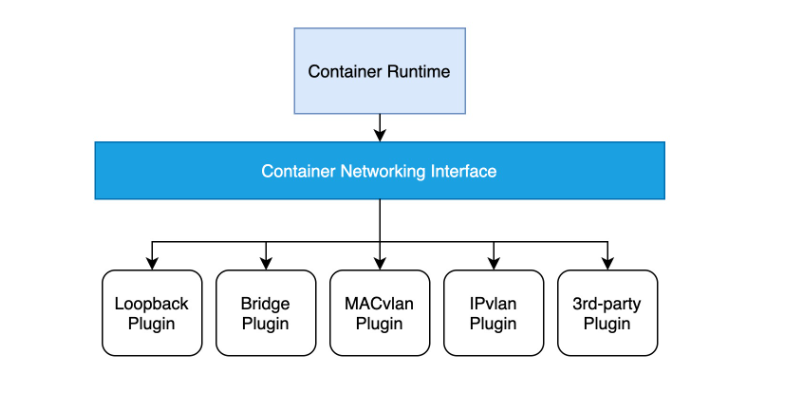
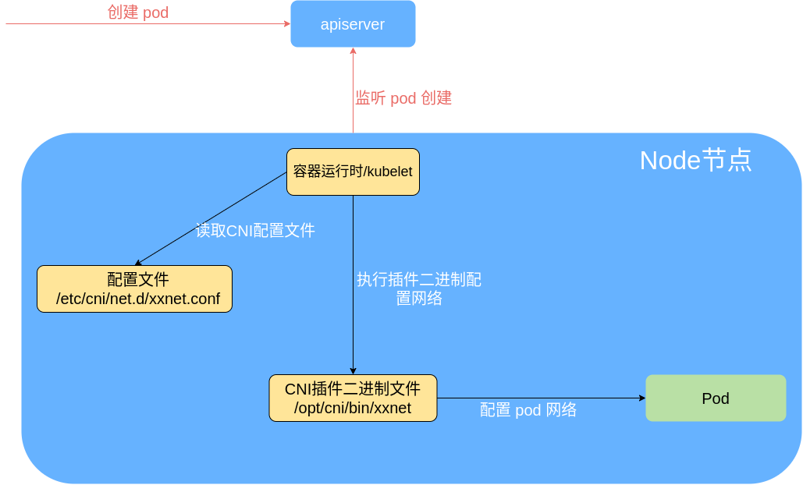
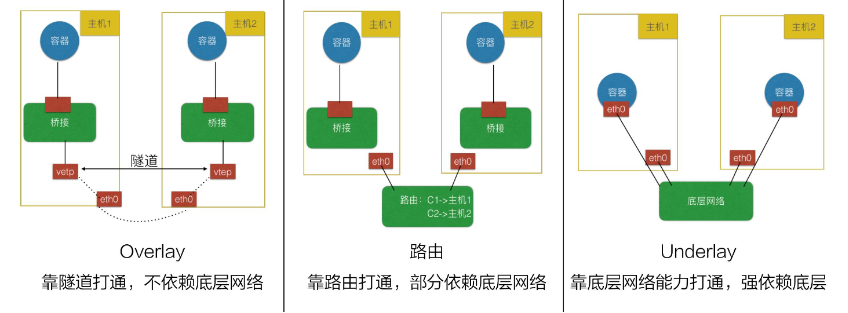
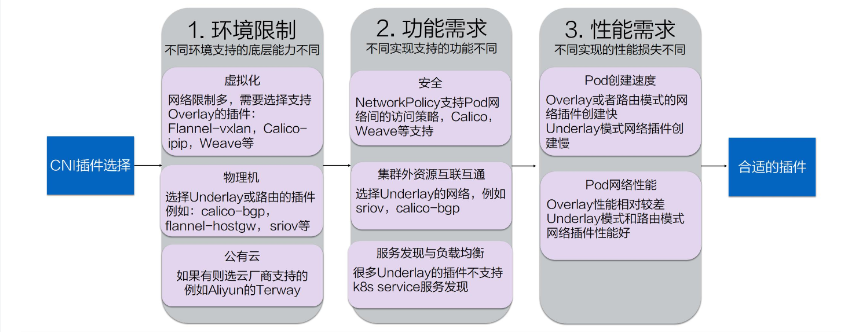
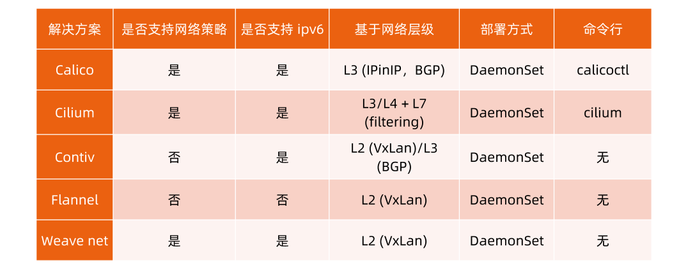

## kubernetes 网络模型

k8s 对容器技术做了很多抽象，其中最重要的一点是提出 pod 的概念，pod 是 kubernetes 资源调度的基本单元。从网络的角度来看，pod 必须满足以下条件：

1. 每一个 pod 都有独特的 IP 地址，所有 pod 都在一个可以直接连通的、扁平的网络空间中；
2. 同一个 pod 内部的所有容器共享同一个网络命名空间。

基于这样的基本要求，我们可以知道：

1. 由于每个 pod 有单独的 IP，所以不需要考虑容器端口与主机端口映射以及端口冲突问题；
2. 同一个 pod 内的所有容器共享一个网络堆栈（相当于 Linux 中的 网络命名空间，其 IP 地址、网络设备、配置等都是共享的），因此这些属于同一个 pod 内的所有容器都可直接通过 localhost + port 来访问；

基于上述的网络抽象原则，kubernetes 对构建网络模型有如下要求：

- 任意两个 pod 之间其实是可以直接通信的，无需显式地使用 NAT 进行地址的转换；
- 任意集群节点与任意 pod 之间是可以直接通信的，无需使用明显的地址转换，反之亦然；
- 任意 pod 看到自己的 IP 跟别人看见它所用的 IP 是一样的，中间不能经过地址转换；

从底层网络来看，kubernetes 的网络通信可以分为三层去看待：

- pod 内部容器通信；
- 同主机 pod 间容器通信；
- 跨主机 pod 间容器通信；

对于前两点，其网络通信原理其实不难理解。

1. 对于 pod 内部容器通信，由于 pod 内部的容器处于同一个 Network Namespace 下（通过 Pause 容器实现），即共享同一网卡，因此可以直接通信。
2. 对于同主机 pod 间容器通信，docker 会在每个主机上创建一个 docker0 网桥，主机上面所有 pod 内的容器全部接到网桥上，因此可以互通。

而对于第三点，跨主机 pod 间容器通信，docker 并没有给出很好的解决方案，而对于 kubernetes 而言，跨主机 pod 间容器通信是非常重要的一项工作，但是有意思的是，kubernetes 并没有自己去解决这个问题，而是专注于容器编排问题，对于跨主机的容器通信则是交给了第三方实现，这就是 [CNI 机制](#什么是cni)。

## CNI

### 什么是CNI

CNI的全称是 Container Network Interface（容器网络接口），它为容器提供了一种基于插件结构的标准化网络解决方案，仅关心容器创建时的网络分配、以及当容器被删除时释放网络资源。以往，容器的网络层是和具体的底层网络环境高度相关的，不同的网络服务提供商有不同的实现。CNI 从网络服务里抽象出了一套标准接口，从而屏蔽了上层网络和底层网络提供商的网络实现之间的差异，并且，通过插件结构，它让容器在网络层的具体实现变得可插拔了，所以非常灵活。



### CNI规范定义

基于标准spec-v1.0.0：

1. [管理员定义网络配置的格式](https://github.com/containernetworking/cni/blob/spec-v1.0.0/SPEC.md#section-1-network-configuration-format)。
2. [容器运行时向网络插件发出请求的协议](https://github.com/containernetworking/cni/blob/spec-v1.0.0/SPEC.md#section-2-execution-protocol)。
3. [基于提供的配置执行插件的过程](https://github.com/containernetworking/cni/blob/spec-v1.0.0/SPEC.md#section-3-execution-of-network-configurations)。
4. [插件将功能委托给其他插件的过程](https://github.com/containernetworking/cni/blob/spec-v1.0.0/SPEC.md#section-4-plugin-delegation)。
5. [插件将其结果返回给运行时的数据类型](https://github.com/containernetworking/cni/blob/spec-v1.0.0/SPEC.md#section-5-result-types)。

### CNI项目构成

CNI 隶属于 [CNCF](https://www.cncf.io/)（Cloud Native Computing Foundation），在GitHub上有两个项目，其中：

- [CNI项目](https://github.com/containernetworking/cni)：包含了一组用于配置 Linux 容器的网络接口的规范和一个用Go语言编写的库，我们可以利用这个库编写自己的CNI插件对容器网络进行配置。
- [Plugins项目](https://github.com/containernetworking/plugins)：包含了一系列作为参考实现的标准CNI网络插件。

### CNI设计原则

- 容器运行时必须在调用任何插件之前为容器创建一个新的网络命名空间。
- 容器运行时必须确定这个容器应属于哪些网络，并为每个网络确定哪些插件必须被执行。
- 网络配置采用 JSON 格式，可以很容易地存储在文件中。网络配置包括必填字段，如 name 和 type 以及插件（类型）。网络配置允许字段在调用之间改变值。为此，有一个可选的字段 args，必须包含不同的信息。
- 容器运行时必须通过依次为每个网络执行相应的插件来将容器添加到每个网络。
- 在完成容器生命周期后，容器运行时必须按照与执行容器相反的顺序执行插件，以便将容器与网络断开连接。
- 容器运行时被同一容器调用时不能并行操作，但被不同的容器调用时，允许并行操作。
- 容器运行时针对一个容器必须按顺序执行ADD和DEL操作，ADD后面总是跟着相应的DEL。DEL可能跟着额外的DEL,插件应允许处理多个DEL。
- 容器必须由 ContainerID 唯一标识，需要存储状态的插件应该使用网络名称、容器 ID和网络接口(network name, CNI_CONTAINERID, CNI_IFNAME)组成的主键来用于索引。
- 容器运行时针对同一个网络、同一个容器、同一个网络接口，不能连续调用两次ADD命令。换句话说，给定的容器 ID 必须只能添加到特定的网络一次。
- CNI 结构中的字段（如Network Configuration和CNI Plugin Result）是必需的，除非特别标记为可选。

## CNI工作过程



Kubernetes 使用 CNI 网络插件的基本工作流程：

1. kubelet 先给 pause 容器创建对应的网络命名空间；
2. 容器运行时根据[CNI 网络配置文件](#cni网络配置文件)调用具体的 [CNI 插件](#cni插件)，可以配置成 CNI 插件链来进行链式调用；
   {}
   容器运行时启动时会读取配置参数(--cni-bin-dir和--cni-conf-dir)，从CNI配置文件中加载获取其中指定的CNI插件名称和配置参数。

   这里有一种特殊情况，就是kubelet内置的docker作为容器运行时时，是由kubelet来查找CNI插件的，运行插件来为容器设置网络，这两个参数应该配置在kubelet处。
   {}
3. 当 CNI 插件被调用时，它根据环境变量以及命令行参数来获得网络命名空间、容器的网络设备等必要信息（具体流程参考：[CNI插件参数](#cni插件参数)），然后执行相应操作。
4. CNI 插件给 pause 容器配置正确的网络，pod 中其他的容器都是复用 pause 容器的网络；

## CNI网络配置文件

CNI 为管理员定义了一种网络配置格式。它包含容器运行时以及要使用的插件的指令。在插件执行时，此配置格式由运行时解释并转换为要传递给插件的格式。

CNI 网络配置文件需要在每个 Node 节点上进行配置，格式为 JSON，默认路径为：`/etc/cni/net.d/xxx.conf`，可使用`--cni-conf-dir`参数设置；文件后缀为".conf"、".conflist"、".json"。如果配置目录中包含多个文件，一般情况下，会以名字排序选用第一个配置文件作为默认网络配置。

CNI 网络配置格式遵循CNI 标准：[https://github.com/containernetworking/cni/blob/spec-v1.0.0/SPEC.md#section-1-network-configuration-format](https://github.com/containernetworking/cni/blob/spec-v1.0.0/SPEC.md#section-1-network-configuration-format)

例如，calico 的 CNI 配置文件：`sudo cat /etc/cni/net.d/10-calico.conflist`，里面定义了插件 IPAM,主插件 及 Meta 的实现。
其中，主插件是 `calico`，ipam 是 `calico-ipam`，meta插件是 `bandwidth`

```json
{
  "name": "k8s-pod-network",
  "cniVersion": "0.3.1",
  "plugins": [
    {
      "type": "calico",
      "datastore_type": "kubernetes",
      "mtu": 0,
      "nodename_file_optional": false,
      "log_level": "Info",
      "log_file_path": "/var/log/calico/cni/cni.log",
      "ipam": { "type": "calico-ipam", "assign_ipv4" : "true", "assign_ipv6" : "false"},
      "container_settings": {
          "allow_ip_forwarding": false
      },
      "policy": {
          "type": "k8s"
      },
      "kubernetes": {
          "k8s_api_root":"https://10.96.0.1:443",
          "kubeconfig": "/etc/cni/net.d/calico-kubeconfig"
      }
    },
    {
      "type": "bandwidth",
      "capabilities": {"bandwidth": true}
    },
    {"type": "portmap", "snat": true, "capabilities": {"portMappings": true}}
  ]
}
```

## CNI插件

CNI 插件是容器网络的具体实现，以二进制文件的形式存在，由容器运行时负责调用执行。默认路径为：`/opt/cni/bin/`，可使用`--cni-bin-dir`参数设置。

例如，calico的CNI插件：

```bash
$ ls /opt/cni/bin/
bandwidth  calico       dhcp      flannel      host-local  ipvlan    macvlan  ptp  static  vlan
bridge     calico-ipam  firewall  host-device  install     loopback  portmap  sbr  tuning
```

CNI 插件负责将网络接口插入容器网络命名空间（例如 veth 对的一端），并在主机上进行任何必要的更改（例如将 veth 的另一端连接到桥接器中）；然后它应该将 IP 分配给接口，并通过调用适当的 IPAM 插件来设置与 IP 地址管理部分一致的路由。

CNI插件必须支持的操作有：

- ADD：将容器添加到网络
- DEL：从网络中删除容器
- CHECK：检查容器的网络是否符合预期
- VERSION：报告版本

### CNI插件参数

CNI 插件被调用时，参数由两部分构成：环境变量和配置

容器运行时通过 环境变量 和 配置 将参数传递给插件。它通过标准输入提供配置。如果操作失败，插件会在标准输出上返回结果，或者在标准错误上返回错误。配置和结果以 JSON 编码。支持的环境变量如下：

- CNI_COMMAND：表示所需的操作；ADD, DEL,CHECK或VERSION.
- CNI_CONTAINERID: 容器 ID。容器的唯一明文标识符，由运行时分配。不得为空。
- CNI_NETNS：对容器的"隔离域"的引用。如果使用网络命名空间，则为网络命名空间的路径（例如/run/netns/[nsname]）
- CNI_IFNAME：要在容器内创建的接口的名称，例如 eth0；如果插件无法使用这个接口名称，它必须返回一个错误。
- CNI_ARGS：用户在调用时传入的额外参数。用分号分隔的字母数字键值对；例如，“FOO=BAR；ABC=123”
- CNI_PATH：CNI 插件可执行文件的路径列表。路径由特定于操作系统的列表分隔符分隔；例如 Linux 上用 `:` 分隔，windows 上用 `;` 分隔。

以`bridge`插件为例，调用命令类似于：`CNI_COMMAND=ADD /opt/cni/bin/bridge < config.json`，其中，config.json为配置，`CNI_COMMAND`为环境变量。

### CNI插件分类及常见插件

1. 主插件：网卡设置，网络接口创建
   - bridge：创建一个网桥，并把主机端口和容器端口插入网桥。
   - ipvlan: 在容器中添加一个ipvlan接口。
   - loopback：设置loopback接口的状态为up。
   - macvlan：创建一个新的 MAC 地址，将所有到该地址的流量转发到容器。
   - ptp: 创建一个 veth 对。
   - vlan：分配一个vlan设备。
   - host-device：将已经存在的设备移动到容器中。
2. Windows：特定于 Windows 系统
   - win-bridge：创建一个网桥，并把主机端口和容器端口插入网桥。
   - win-overlay：创建容器的覆盖接口。
3. IPAM：IP地址分配
   - dhcp: 在主机上运行一个守护进程，代表容器发出 DHCP 请求
   - host-local：维护已分配 IP 的本地数据库
   - static：为容器分配一个静态 IPv4/IPv6 地址。它在调试目的中很有用。
4. Meta：其他插件，附加功能
   - tuning: 调整现有接口的 sysctl 参数
   - portmap: 一个基于 iptables 的端口映射插件。将主机地址空间中的端口映射到容器。
   - bandwidth：允许通过使用流量控制 tbf（入口/出口）来限制带宽。
   - sbr：一个插件，为接口配置基于源的路由（从它被链接）。
   - firewall：一个防火墙插件，它使用 iptables 或 firewalld 添加规则以允许进出容器的流量。

### CNI插件实现模式

CNI 插件通常有三种实现模式：



- Overlay 模式的典型特征是容器独立于主机的 IP 段，这个 IP 段进行跨主机网络通信时是通过在主机之间创建隧道的方式，将整个容器网段的包全都封装成底层的物理网络中主机之间的包。该方式的好处在于它不依赖于底层网络。
- 路由模式中主机和容器也分属不同的网段，它与 Overlay 模式的主要区别在于它的跨主机通信是通过路由打通，无需在不同主机之间做一个隧道封包。但路由打通就需要部分依赖于底层网络，比如说要求底层网络有二层可达的一个能力。
- Underlay 模式中容器和宿主机位于同一层网络，两者拥有相同的地位。容器之间网络的打通主要依靠于底层网络。因此该模式是强依赖于底层能力的。

在选择 CNI 插件时是要根据自己实际的需求进行考量，比如考虑 NetworkPolicy 是否要支持 Pod 网络间的访问策略，可以考虑 Calico、Weave；Pod 的创建速度，Overlay 或路由模式的 CNI 插件在创建 Pod 时比较快，Underlay 较慢；网络性能，Overlay 性能相对较差，Underlay 及路由模式相对较快。

如何选择合适的插件？



1. 环境限制

不同环境中所支持的底层能力是不同的。

虚拟化环境（例如 OpenStack）中的网络限制较多，比如不允许机器之间直接通过二层协议访问，必须要带有 IP 地址这种三层的才能去做转发，限制某一个机器只能使用某些 IP 等。在这种被做了强限制的底层网络中，只能去选择 Overlay 的插件，常见的有 Flannel-vxlan、Calico-ipip、Weave 等等。
物理机环境中底层网络的限制较少，比如说我们在同一个交换机下面直接做一个二层的通信。对于这种集群环境，我们可以选择 Underlay 或者路由模式的插件。Underlay 意味着我们可以直接在一个物理机上插多个网卡或者是在一些网卡上做硬件虚拟化；路由模式就是依赖于 Linux 的路由协议做一个打通。这样就避免了像 vxlan 的封包方式导致的性能降低。这种环境下我们可选的插件包括 clico-bgp、flannel-hostgw、sriov 等等。
公有云环境也是虚拟化，因此底层限制也会较多。但每个公有云都会考虑适配容器，提升容器的性能，因此每家公有云可能都提供了一些 API 去配置一些额外的网卡或者路由这种能力。在公有云上，我们要尽量选择公有云厂商提供的 CNI 插件以达到兼容性和性能上的最优。比如 Aliyun 就提供了一个高性能的 Terway 插件。
环境限制考虑完之后，我们心中应该都有一些选择了，知道哪些能用、哪些不能用。在这个基础上，我们再去考虑功能上的需求。
2. 功能需求
首先是安全需求：

K8s 支持 NetworkPolicy，就是说我们可以通过 NetworkPolicy 的一些规则去支持“Pod 之间是否可以访问”这类策略。但不是每个 CNI 插件都支持 NetworkPolicy 的声明，如果大家有这个需求，可以选择支持 NetworkPolicy 的一些插件，比如 Calico、Weave 等等。

第二个是是否需要集群外的资源与集群内的资源互联互通：

大家的应用最初都是在虚拟机或者物理机上，容器化之后，应用无法一下就完成迁移，因此就需要传统的虚拟机或者物理机能跟容器的 IP 地址互通。为了实现这种互通，就需要两者之间有一些打通的方式或者直接位于同一层。此时可以选择 Underlay 的网络，比如 sriov 这种就是 Pod 和以前的虚拟机或者物理机在同一层。我们也可以使用 calico-bgp，此时它们虽然不在同一网段，但可以通过它去跟原有的路由器做一些 BGP 路由的一个发布，这样也可以打通虚拟机与容器。

最后考虑的就是 K8s 的服务发现与负载均衡的能力。

K8s 的服务发现与负载均衡就是我们前面所介绍的 K8s 的 Service，但并不是所有的 CNI 插件都能实现这两种能力。比如很多 Underlay 模式的插件，在 Pod 中的网卡是直接用的 Underlay 的硬件，或者通过硬件虚拟化插到容器中的，这个时候它的流量无法走到宿主机所在的命名空间，因此也无法应用 kube-proxy 在宿主机配置的规则。

这种情况下，插件就无法访问到 K8s 的服务发现。因此大家如果需要服务发现与负载均衡，在选择 Underlay 的插件时就需要注意它们是否支持这两种能力。

经过功能需求的过滤之后，能选的插件就很少了。经过环境限制和功能需求的过滤之后，如果还剩下 3、4 种插件，可以再来考虑性能需求。
3. 性能需求
我们可以从 Pod 的创建速度和 Pod 的网络性能来衡量不同插件的性能。

Pod 的创建速度

当我们创建一组 Pod 时，比如业务高峰来了，需要紧急扩容，这时比如说我们扩容了 1000 个 Pod，就需要 CNI 插件创建并配置 1000 个网络资源。Overlay 和路由模式在这种情况下的创建速度是很快的，因为它是在机器里面又做了虚拟化，所以只需要调用内核接口就可以完成这些操作。但对于 Underlay 模式，由于需要创建一些底层的网络资源，所以整个 Pod 的创建速度相对会慢一些。因此对于经常需要紧急扩容或者创建大批量的 Pod 这些场景，我们应该尽量选择 Overlay 或者路由模式的网络插件。

Pod 的网络性能

主要表现在两个 Pod 之间的网络转发、网络带宽、PPS 延迟等这些性能指标上。Overlay 模式的性能较差，因为它在节点上又做了一层虚拟化，还需要去封包，封包又会带来一些包头的损失、CPU 的消耗等，如果大家对网络性能的要求比较高，比如说机器学习、大数据这些场景就不适合使用 Overlay 模式。这种情形下我们通常选择 Underlay 或者路由模式的 CNI 插件。

相信大家通过这三步的挑选之后都能找到适合自己的网络插件。

### CNI插件对比



结论：

1. 长远看好cilium
2. flannel 加包解包，需要大约10%额外的网络资源开销

## calico

### ip分配的细节

1. 获取ippool：定义了一个16位的cidr（cidr: 192.168.0.0/16）；ipipMode是never，是未开启的；nodeSelector: all()；blockSize:26表示在一个node上会分配多大的ip段。所以这个`ippools.crd.projectcalico.org`是整个集群的ip池。

   ```bash
   tspace@ubuntu:~$ kubectl get ippools.crd.projectcalico.org -oyaml
   apiVersion: v1
   items:
   - apiVersion: crd.projectcalico.org/v1
     kind: IPPool
     metadata:
       annotations:
         projectcalico.org/metadata: '{"uid":"2da04639-e1cf-4c91-8e10-446d48a8a17b","creationTimestamp":"2022-05-16T02:50:50Z"}'
       creationTimestamp: "2022-05-16T02:50:50Z"
       generation: 1
       name: default-ipv4-ippool
       resourceVersion: "1339"
       uid: 3fd7a120-4acb-4a7b-bf53-cfc466591d34
     spec:
       allowedUses:
       - Workload
       - Tunnel
       blockSize: 26
       cidr: 192.168.0.0/16
       ipipMode: Never
       natOutgoing: true
       nodeSelector: all()
       vxlanMode: CrossSubnet
   kind: List
   metadata:
     resourceVersion: ""
     selfLink: ""
   ```

2. 每个节点注册的时候都会分配一个对象叫`ipamblocks.crd.projectcalico.org`，这里面记录了一个节点的ip段和还没有被分配的ip列表。如果这时候一个新的pod启动了，那么就会有一个ip被分配出去。记录了ipamhandles和对应的哪个节点的哪个pod

   ``` bash
   tspace@ubuntu:~$ kubectl get ipamblocks.crd.projectcalico.org
   NAME                 AGE
   192-168-154-192-26   23d
   192-168-243-192-26   23d
   ```

3. 这个新启动的pod，又会新建一个对象叫`ipamhandles.crd.projectcalico.org`，这个对象记录哪个ip分出去了，被哪个pod使用了。每个pod都有自己对应的ipamhandles。记录了ip分配的细节。

```bash
tspace@ubuntu:~$ kubectl get ipamhandles.crd.projectcalico.org
NAME                                                                               AGE
k8s-pod-network.0eeafd71b3c66eadb88474de32889b80ce54c130a84e33bfd20c23098950ed62   130m
k8s-pod-network.1c6d0a6b484374ea491d46679c3e94236900e9a8033a4475705235e7f2cee2df   130m
k8s-pod-network.7fc9ff7d75076c9c63b933171e5c93a710dd40a212f6397369331e441a736c41   130m
k8s-pod-network.9cfe1cc28e40d4b2979a84070de529eafb413fd366fc536cf8dbc61bf32adf9b   130m
k8s-pod-network.a6d49007ce39976229fbae49111ee5a5813109bead1ce08304b7853684924bd9   130m
k8s-pod-network.d9837ac198584c354a26046ab9ee2d48b72c9f0a4ea293834e090ace4ccd66e0   31m
vxlan-tunnel-addr-k8s-node-01                                                      23d
vxlan-tunnel-addr-ubuntu                                                           23d
```

### ip分配之后，链路是怎么通的？

1. 首先查看cni plugin运行在什么模式下： `kubectl get pod calico-node-pwk8h -n calico-system -oyaml`，里面有个

   ```yaml
       - name: CALICO_NETWORKING_BACKEND
         value: bird
   ```

表示运行在 bird 模式（bird是个开源的 BGP 的 daemon 程序）。还有个`readinessProbe`字段，用来检查bird是否ready,如果不ready,就表示该节点的CNI异常：

   ```yaml
       readinessProbe:
         exec:
           command:
           - /bin/calico-node
           - -bird-ready
           - -felix-ready
         failureThreshold: 3
         periodSeconds: 10
         successThreshold: 1
         timeoutSeconds: 5
   
   ```

2. 验证