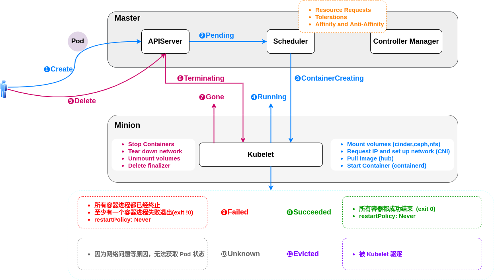
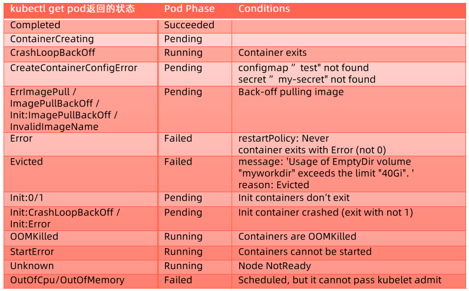
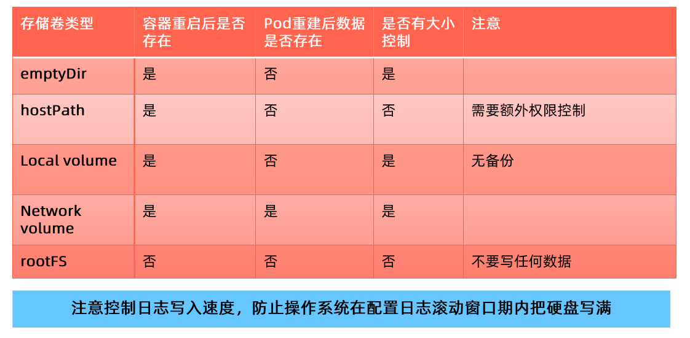
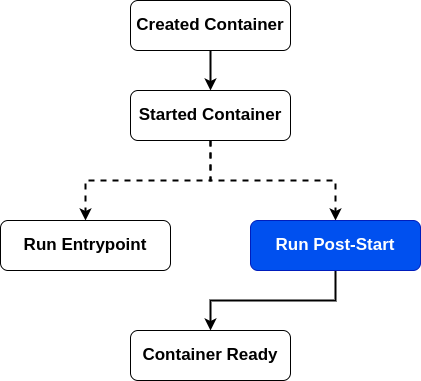
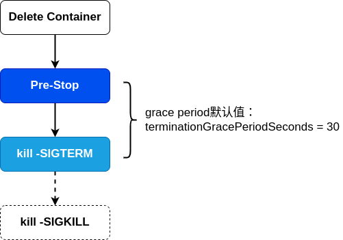
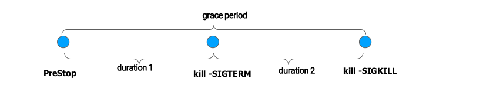
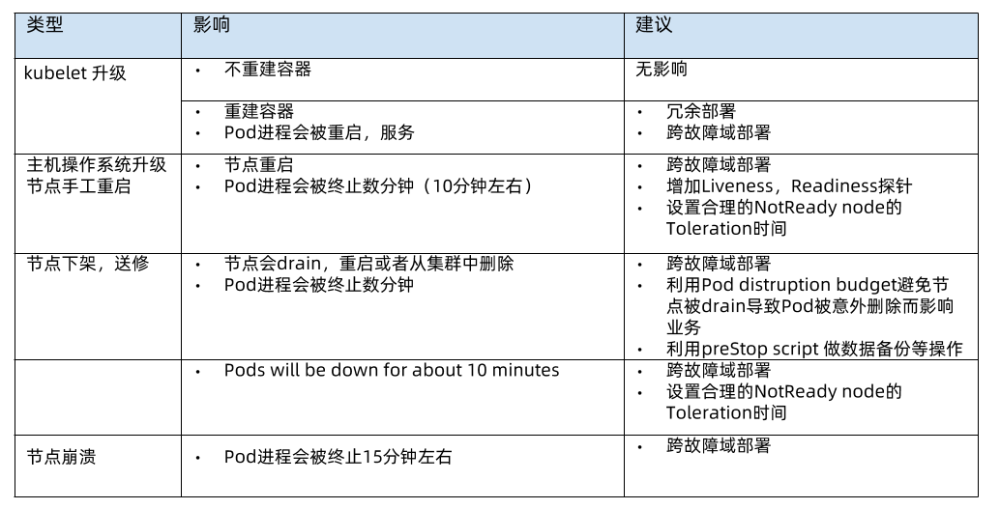

## pod 生命周期



### 创建

用户创建(`①Create`) pod 的请求发送到 apiserver，还未调度的时候 pod 处于 `②Pending`状态。调度时候主要会考虑资源请求，容忍度，亲和性和反亲和性。

调度的成功之后会处于 `③ContainerCreating` 状态，对应节点的 kubelet 就会看到说这个 pod 是属于我这个 node 的，所以我需要去启动它，这时候会变成 `④Running` 状态。

如果是短时任务，像 job 这种会结束的 pod ，在成功结束后会处于 `⑧Succeeded` 状态；如果执行失败，那么就会处于`⑨Failed`状态。

如果 pod 所在节点出现故障，那么其上的部分 pod 就会被驱逐，被驱逐的 pod 会处于 `⑪evicted` 状态；如果因为一些其他原因，例如网络或插件的原因，会处于 `⑩unknown` 状态。

### 删除

如果其他用户发起了 `⑤Delete` 操作，那么这时候 pod 会处于 `⑥Terminating` 状态，Terminating 状态之后 pod 就会 `⑦Gone`。

## pod phase

pod 的 status 字段是一个 [PodStatus](https://kubernetes.io/docs/reference/generated/kubernetes-api/v1.24/#podstatus-v1-core) 对象，其中包含一个 `phase` 字段。

pod 的 phase(阶段) 是 pod 在其生命周期中所处位置的简单描述。其数量和含义是严格定义的。

|取值|描述|
|-|-|
|Pending（悬决）|Pod 已被 Kubernetes 系统接受，但有一个或者多个容器尚未创建亦未运行。此阶段包括等待 Pod 被调度的时间和通过网络下载镜像的时间。|
|Running（运行中）|Pod 已经绑定到了某个节点，Pod 中所有的容器都已被创建。至少有一个容器仍在运行，或者正处于启动或重启状态。|
|Succeeded（成功）|Pod 中的所有容器都已成功终止，并且不会再重启。|
|Failed（失败）|Pod 中的所有容器都已终止，并且至少有一个容器是因为失败终止。也就是说，容器以非 0 状态退出或者被系统终止。另外，如果某节点死掉或者与集群中其他节点失联，Kubernetes 会实施一种策略，将失去的节点上运行的所有 Pod 的 phase 设置为 Failed。|
|Unknown（未知）|因为某些原因无法取得 Pod 的状态。这种情况通常是因为与 Pod 所在主机通信失败。|

### pod 状态计算细节



## 如何确保 pod 的高可用

### 应用自身

1. 设置合适的 Qos
2. 基于 taint 的 Evictions
3. 健康检查探针

### 资源规划

1. 每个实例需要多少计算资源：cpu/gpu，mem
2. 是否有超售需求
3. 每个实例需要多少存储资源：大小，本地/网盘，读写性能，磁盘IO
4. 网络需求：整个应用总体QPS和带宽

### 存储挑战

多容器之间共享存储，最简方案是emptyDir。emptyDir需要考虑以下挑战：
  
- emptyDir需要控制 size limit，否则无限扩张的应用会撑爆主机磁盘导致主机不可用，进而导致大规模集群故障
- size limit达到以后，pod 会被驱逐，存储在 emptyDir里的内容会消失



emptyDir是最优解，不建议使用hostPath，如果需要持久化建议使用local volume或者network volume。上图认为hostPath在pod重建后数据不存在，原因在于：可能出现 pod 调度到其他节点；node节点故障。

### 应用配置

传入方式

- Enviroment Variables
- Volume Mount
  
数据来源

- ConfigMap
- Secret
- Downward API

### 容器应用自身的高可用

## pod 的 服务质量(Qos)分类

Kubernetes 创建 Pod 时就给它指定了下列一种 QoS 类：

- Guaranteed
- Burstable
- BestEffort

当计算节点检测到内存压力时，kubernetes 会按 BestEffort -> Burstable -> Guaranteed 的顺序依次驱逐 pod

### Guaranteed

对于 QoS 类为 Guaranteed 的 Pod：

- Pod 中的每个容器都必须指定内存限制和内存请求。
- 对于 Pod 中的每个容器，内存限制必须等于内存请求。
- Pod 中的每个容器都必须指定 CPU 限制和 CPU 请求。
- 对于 Pod 中的每个容器，CPU 限制必须等于 CPU 请求。

```yaml
spec:
  containers:
    ...
    resources:
      limits:
        memory: "200Mi"
        cpu: "700m"
      requests:
        memory: "200Mi"
        cpu: "700m"
    ...
```

### Burstable

如果满足下面条件，将会指定 Pod 的 QoS 类为 Burstable：

- Pod 不符合 Guaranteed QoS 类的标准。
- Pod 中至少一个容器具有内存或 CPU 的请求或限制。

```yaml
spec:
  containers:
    ...
    resources:
      limits:
        memory: "200Mi"
      requests:
        memory: "100Mi"
    ...
```

### BestEffort

对于 QoS 类为 BestEffort 的 Pod：

- Pod 中的容器必须没有设置内存和 CPU 限制或请求。

### 最佳实践

1. 如果你的 pod 十分重要，那么定义 Guaranteed 类型的资源请求来保护你的重要 pod。
2. 认真考虑 pod 需要的真实需求并设置 limit 和 resource，这有利于将集群资源利用率控制在合理范围并减少 pod 被驱逐的现象。一般可以通过压测来判断资源需求，根据业务的应用场景，预估大概的 QPS,按照这个预估的 QPS 去压测并做资源监控，按照资源监控的结果，看它使用了多少的 cpu 和 内存，在此基础上预留一定的 buffer，来作为最终的指标来进行设置。
3. 在生产系统，尽量避免将 pod 设置为 BestEffort；但是对测试环境来讲，BestEffort Pod 能确保大多数应用不会因为资源不足而处于 Pending 状态。
4. Burstable 适用于大多数场景。

### 基于 taint 的 Evictions

增加 tolerationSeconds 以避免 pod 被驱逐，可以设置为 15分钟

### 健康检查探针

健康探针类型分为：

- livenessProbe：探活，当检查失败时，意味着该应用进程已经无法正常提供服务，kubelet 会终止该容器进程并按照 restartPolicy 决定是否重启。当这类 Probe 未执行的时候，认为这个pod 是 live 的，即默认值为 live。当livenessProbe探测失败时，它不会重建 pod ，只会把用户的容器进程杀死（kill掉），然后重新启动（是否重新启动是看容器的restartpolicy的配置）。
- readinessProbe：就绪状态检查，当检查失败时，意味着该应用进程正在运行，但因为某些原因不能提供服务，pod 状态会被标记为 NotReady。当这类 Probe 未执行的时候，认为这个 pod 是 NotReady的，即默认值为 NotReady，只有当 Probe 执行并且通过之后，才会变为 Ready。当readinessProbe探测失败时，它不会杀死容器进程，只会显示NotReady。
- startupProbe：在初始化阶段(Ready之前)进行的健康检查，通常用来避免过于频繁的监测而影响应用的启动。

探测方法包括：

- ExecAction：在容器内部运行指定命令，当返回码为0时，探测结果为成功。
- TCPSocketAction：由kubelet发起，通过TCP协议检查容器IP和端口，当端口可达时，探测结果为成功。
- HTTPGetAction：由 kubelet 发起，对 pod 的 ip 和指定端口以及路径进行HTTPGet操作，当返回码为200-400之间时，探测结果为成功。

探针属性：

|parameters|description|说明|
|-|-|-|
|initialDelaySeconds|默认值是0,最小值是0|推迟多久做探活|
|periodSeconds|默认值是10,最小值是1|探活间隔，间隔多久做一次探活|
|timeoutSeconds|默认值是1,最小值是1|每次探活的请求发起之后的超时时间，超时的话就认为探活失败|
|successThreshold|默认值是1,最小值是1,对于livenessProbe这个值必须是1|连续几次成功认为是成功的|
|failureThreshold|默认值是3,最小值是1|连续几次失败就认为是失败的|

#### ReadinessGates

有时候除了 k8s 内部来决定 pod 是否 Ready 外，还希望由一些外部的控制器来控制它是否 Ready ，这时候就可以使用 ReadinessGates。

- Readiness允许在k8s自带的 Pod Conditions 之外引入自定义的就绪条件
- 新引入的readinessGates conditions需要为True状态后，加上内置的Conditions,pod才可以变为就绪状态
- 该readinessGates conditions 应该由某控制器修改

示例： `vim readiness-gate.yaml`

```yaml
apiVersion: v1
kind: Pod
metadata:
  labels:
    app: readiness-gate
  name: readiness-gate
spec:
  readinessGates:
    - conditionType: "www.example.com/feature-1"
  containers:
    - name: readiness-gate
      image: nginx
---
apiVersion: v1
kind: Service
metadata:
  name: readiness-gate
spec:
  ports:
    - port: 80
      protocol: TCP
      targetPort: 80
  selector:
    app: readiness-gate
```

```bash
# 创建
kubectl create -f readiness-gate.yaml
# 检查状态
$ kubectl get pods | grep readiness-gate
NAME             READY   STATUS    RESTARTS   AGE
readiness-gate   1/1     Running   0          21m
```

这里我们可以看到，状态是Ready的，但是，它实际上是不Ready的，具体表现出来的行为就是这个 pod 不会接收流量。原因在于，我们查看pod状态，它里面的`status`里有个conditions是"False"状态的。

```bash
# 查看pod状态
$ kubectl get pod readiness-gate -oyaml

...
status:
  conditions:
  - lastProbeTime: null
    lastTransitionTime: "2022-08-06T12:19:02Z"
    status: "True"
    type: Initialized
  - lastProbeTime: null
    lastTransitionTime: "2022-08-06T12:19:02Z"
    message: corresponding condition of pod readiness gate "www.example.com/feature-1"
      does not exist.
    reason: ReadinessGatesNotReady
    status: "False"
    type: Ready
...
```

使用场景：有时候需要通过额外的控制器做一些额外的检查，当检查通过才让 pod Ready,这时候就可以使用 ReadinessGates。使用时，在 pod 的 spec里定义一个叫readinessGates，然后里面写一个conditionType，当额外的检查做完之后，只需要由一个另外的控制器将这个readinessGates conditions的状态由"False"改为"True"即可，这样子这个 pod 就可以接收流量了。例如，对于web站点的pod，需要配置DNS之后，才能让这个 pod 变为可访问，这时候就可以使用readinessGates。

## 优雅启动和终止

优雅启动使用Post-Start和探活探针来实现

{}

1. 使用Post-Start时，无法保证Post-Start脚本和容器的Entrypoint哪个先执行
2. Post-Start结束之前，容器不会被标记为 Running 状态

{}



优雅终止使用Pre-Stop和kill -SIGTERM来实现

{}
只有当 pod 被终止时，k8s才会执行Pre-Stop脚本，这意味着当 pod 完成或容器退出时，PreStop脚本不会被执行。
{}



terminationGracePeriodSeconds的分解：



{}
bash/sh 会忽略SIGTERM信号量，因此kill -SIGTERM会永远超时，因此，如果应用使用 bash/sh 作为 Entrypoint，则应避免设置过长的terminationGracePeriodSeconds时间。
{}

优雅终止pod的经验分享：

1. terminationGracePeriodSeconds 默认时长30秒
2. 如果不担心 pod 的终止时长，那么不需要采取特殊措施
3. 如果希望快速终止应用进程，那么可采取如下方案：
   - 在 Pre-Stop 脚本中主动退出进程
   - 在主容器进程中使用优雅的初始化进程，它满足：能够正确的处理系统信号量，将信号量转发给子进程；在主进程退出之前，需要先等待并确保所有子进程退出；监控并清理孤儿子进程。如果一个容器跑了多个进程，可以使用tini管理，它会透传系统signal，防止产生僵尸进程，项目地址：[http://github.com/krallin/tini](http://github.com/krallin/tini)

## 容器应用高可用

### 容器应用在哪些场景可能会被中断



1. kubelet升级：大部分不会重建容器，无影响；但有时候的版本升级会重建容器，例如有几个kubelet版本会动pod ID的hash计算方式，解决办法就是冗余部署和跨故障域部署。每次kubernetes版本变更时，要一条条研究changelog对业务会有什么影响。
2. 节点重启：最佳的解决办法是跨故障域部署；增加liveness和readiness探针，让重启节点上的容器在重启的时候不要接收新的请求；设置合理的NotReady node的Toleration时间。
3. 节点下架：pod distruption budget约定一次最多可以驱逐几个应用pod。例如，你的业务有三个pod，然后基础架构管理员一次要驱逐三个node,恰好都有你的pod，如果你的budget设置为1，那么管理员一次drain三个节点就会失败，他只能drain一个节点，等你的pod在其他节点重建之后，然后才能drain下一个节点。
4. 节点崩溃：跨故障域部署。

### 高可用部署方式

1. 确定跑多少实例
2. 确定更新策略：
   - maxSurge（需要考虑ResourceQuota的限制，如果你的namespace的ResourceQuota限制的比较死，那么maxSurge可能会因为资源配额不足而启动失败）
   - maxUnavailable

深入理解PodTemplateHash导致的应用的易变性
