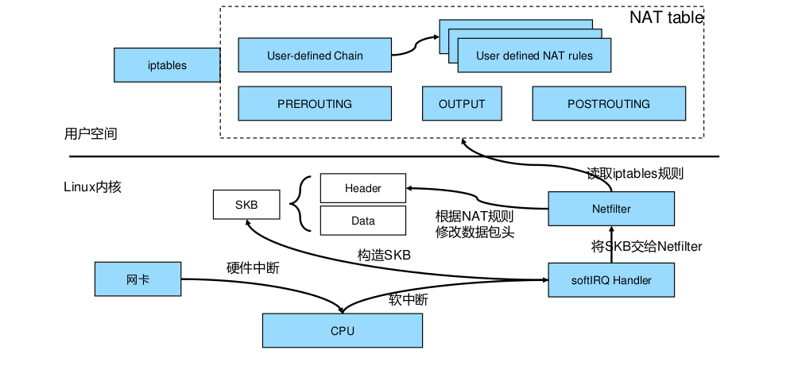
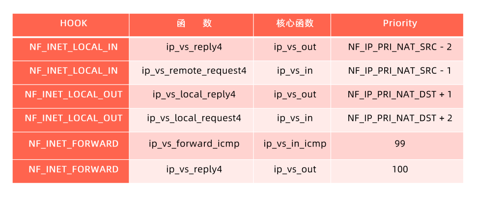

## 服务发布需要考虑的问题

1. 选择使用哪种服务类型

    需要把服务发布至集群内部或者外部，服务有以下类型：

    - ClusterIP (Headless)
    - NodePort
    - LoadBalancer
    - ExternalName

2. 证书管理和七层负载均衡的需求
3. 需要gRPC负载均衡如何做？
4. DNS需求
5. 与上下游服务的关系

## 服务发布的挑战

1. kube-dns：DNS TTL问题
2. Service：
   - ClusterIP只能对内
   - kube-proxy支持的iptables/ipvs规模有限
   - IPVS的性能和生产化问题
   - kube-proxy的drift问题
   - 频繁的pod变动(spec change,failover,crashloop)导致LB频繁变更
   - 对外发布的service需要与企业ELB集成
   - 不支持gRPC
   - 不支持自定义DNS和高级路由功能
3. Ingress：spec的成熟度
4. 其他可选方案？
5. 跨地域部署：
   - 需要多少实例
   - 如何控制失败域，部署在几个地区，AZ，集群？
   - 如何进行精细的流量控制
   - 如何按地域做顺序更新
   - 如何回滚

## 微服务架构下的高可用挑战

## service对象

- service selector：kubernetes 允许将pod对象通过标签进行标记，并通过service selector定义基于pod标签的过滤规则，以便选择服务的上游应用实例
- ports：ports属性中定义了服务的端口、协议目标端口等信息

```yaml
apiVersion: v1
kind: Service
metadata:
  name: nginx-service
spec:
  selector:
    app: nginx
  ports:
    - port: 80
      protocol: TCP
      targetPort: 80
```

## endpoint对象

当service的selector不为空时，kubernetes endpoint controller会侦听服务创建事件，创建与service同名的endpoint对象

selector能够选取的所有podIP都会被配置到endpoint对象的addresses属性中

- 如果此时selector所对应的filter查询不到对应的pod,则addresses列表为空
- 默认配置下，如果此时对应的pod为not ready状态，则对应的podIP只会出现在subsets的notReadyAddresses属性中，这意味着对应的pod还没准备好提供服务，不能作为流量转发的目标
- 如果service设置了PublishNotReadyAddress属性为true，则无论pod是否就绪都会被加入readyAddress list

## endpointSlice对象

- 当某个service对应的backend pod较多时，endpoint对象就会因为保存的地址信息过多而变的异常庞大
- pod状态的变更会引起endpoint的变更，endpoint的变更会被推送至所有节点，从而导致持续占用大量网络带宽
- endpointSlice对象，用于对pod较多的endpoint进行切片，切片大小可以自定义

## 不定义selector的service

- 用户创建了service但不定义selector
  - endpoint controller不会为该service自动创建endpoint
  - 用户可以手动创建endpoint对象，并设置任意ip地址到address属性
  - 访问该服务的请求会被转发至目标地址
- 通过该类型服务，可以为集群外的一组endpoint创建服务


## sercice类型

1. clusterIP
   - service的默认类型，服务被发布至仅集群内部可见的虚拟IP地址上
   - 在API Server启动时，需要通过service-cluster-ip-range参数配置虚拟IP地址段，API Server中有用于分配IP地址和端口的组件，当该组件捕获Service对象并创建事件时，会从配置的虚拟IP地址段中取一个有效的IP地址，分配给该Service对象
2. nodePort
   - 在API Server启动时，需要通过node-port-range参数配置nodePort的范围，同样的，API Server组件会捕获Service对象并创建事件，即从配置好的nodePort范围取一个有效端口，分配给该Service
   - 每个节点的kube-proxy会尝试在服务分配的nodePort上建立侦听器接收请求，并转发给服务对应的后端Pod实例。
3. LoadBalancer
   - 企业数据中心一般会采购一些负载均衡器，作为外网请求进入数据中心内部的统一流量入口
   - 针对不同的基础架构云平台，kubernetes cloud manager提供支持不同供应商API的Service Controller。如果需要在Openstack平台上搭建kubernetes集群，那么只需提供一份openstack.rc,Openstack Service Controller即可通过调用LBaas API完成负载均衡配置。
4. Headless Service
   Headless服务是用户将ClusterIP显式定义为None的服务。headless service意味着k8s不会为该服务分配统一入口，包括clusterIP,nodePort等
5. ExternalName Service：为一个服务创建别名

clusterIP，nodePort，LoadBalancer不是或的关系，如果service定义为clusterIP类型，那么service就只会被分配cluster ip；如果配置为nodePort类型，那么service会被同时分配cluster ip和node port；如果定义为loadbalancer类型，那么同时会配置loadbalancer IP,node port和cluster ip。

## service topology

- 一个网络调用的延迟受客户端和服务期所处位置的影响，两者是否在同一节点，同一机架，同一可用区，同一数据中心，都会影响参与数据传输的设备数量
- 在分布式系统中，为保证系统的高可用，往往需要控制应用的错误域，比如通过反亲和性设置，将一个应用的多个副本部署在不同机架，甚至不同的数据中心。
- k8s提供通用标签来标记节点所处的物理位置

service引入了topologyKeys属性，可以通过如下设置来控制流量：

如果 topologyKeys 没有指定或者为空，就没有启用这个拓扑功能。

一个集群中，其 Node 的标签被打为其主机名，区域名和地区名。那么就可以设置 Service 的 topologyKeys 的值，像下面的做法一样定向流量了。

- 只定向到同一个 Node 上的端点，Node 上没有端点存在时就失败：配置 ["kubernetes.io/hostname"]。
- 偏向定向到同一个 Node 上的端点，回退同一区域的端点上，然后是同一地区，其它情况下就失败：配置 ["kubernetes.io/hostname", "topology.kubernetes.io/zone", "topology.kubernetes.io/region"]。这或许很有用，例如，数据局部性很重要的情况下。
- 偏向于同一区域，但如果此区域中没有可用的终结点，则回退到任何可用的终结点：配置 ["topology.kubernetes.io/zone", "*"]。

## kube-proxy原理

每台机器上都运行一个kube-proxy服务，它监听API server中service和endpoint的变化情况，并通过iptables等来为服务配置负载均衡（仅支持TCP和UDP）

kube-proxy可以直接运行在物理机上，也可以以static pod或者DaemonSet的方式运行。

kube-proxy当前支持以下几种实现：

- userspace：最早的负载均衡方案，它在用户空间监听一个端口，所有服务通过iptables转发到这个端口，然后在其内部负载均衡到实际的pod。该方式最主要的问题是效率低，有明显的性能瓶颈。牵扯到用户态到内核态的转换。
- iptables：目前推荐的方案，完全以iptables规则的方式来实现service负载均衡。该方式最主要的问题是在服务多的时候产生太多的iptables规则，非增量式更新会引入一定的时延，大规模情况下有明显的性能问题
- ipvs：为解决iptables模式的性能为题，v1.8新增了ipvs模式，采用增量式更新，并可以保证service更新期间连接保证不断开
- winuserapce：同userspace,但仅工作在windows上

## netfilter框架

netfilter是linux内核处理数据包的框架


netfilter和iptables



网卡接收到网络包之后，向cpu发出硬中断请求唤醒cpu，cpu会发出一个软中断请求，告诉cpu核心上的一个进程softIRQ（每个cpu核心都有一个这样的进程，可以用ps aux| grep ksoftirqd看到）说有数据包来了，这时候softIRQ就会在kernel里构造SKB（socket buffer），SKB里会包含真实的数据和包头(包头包含源IP,目的IP,源端口，目的端口以及协议)，并将SKB交给netfilter，如果是nat规则，那么它就会去查配置的nat表，如果匹配了就会去做nat，做完nat之后会继续交给内核处理数据包，如果IP是本机的，那么就会交给本机的进程去处理，如果不是，那么就会走forward规则转到其他机器上。

iptables（四表五链）

五链：也就是五个hook点，PREROUTING/FORWARD/POSTROUTING/LOCAL_IN/LOCAL_OUT
四个表：raw/mangle/nat/filter，也可以叫五表，nat表包含snat和dnat


iptables支持的锚点


实验：

`vim nginx-deployment.yaml`

```yaml
apiVersion: apps/v1
kind: Deployment
metadata:
  name: nginx-deployment
spec:
  replicas: 3
  selector:
    matchLabels:
      app: nginx
  template:
    metadata:
      labels:
        app: nginx
    spec:
      containers:
        - name: nginx
          image: nginx
```

`vim nginx-service.yaml`

```yaml
apiVersion: v1
kind: Service
metadata:
  name: nginx-basic
spec:
  type: ClusterIP
  ports:
    - port: 80
      protocol: TCP
      name: http
  selector:
    app: nginx
```

`kubectl create -f nginx-deployment.yaml`

`kubectl create -f nginx-service.yaml`

```bash
$ kubectl get svc nginx-basic
NAME          TYPE        CLUSTER-IP       EXTERNAL-IP   PORT(S)   AGE
nginx-basic   ClusterIP   10.102.249.128   <none>        80/TCP    3m17s

$ kubectl get pod --selector=app=nginx -o wide
NAME                               READY   STATUS    RESTARTS   AGE     IP               NODE          NOMINATED NODE   READINESS GATES
nginx-deployment-8f458dc5b-jshh2   1/1     Running   0          7m16s   10.244.235.208   k8s-master    <none>           <none>
nginx-deployment-8f458dc5b-ksrp6   1/1     Running   0          7m16s   10.244.154.195   k8s-node-01   <none>           <none>
nginx-deployment-8f458dc5b-xpf7n   1/1     Running   0          7m16s   10.244.154.196   k8s-node-01   <none>           <none>
```

那么service到pod的访问就是，用户访问10.102.249.128:80,然后请求会转发到后面任意一个nginx pod（10.244.235.208:80,10.244.154.195:80,10.244.154.196:80），这个是怎么实现的呢？答案是通过iptables实现的。kube-proxy会监听到创建service的请求，然后创建对应的iptables规则。

```shell
$ sudo iptables-save -t nat
# Generated by iptables-save v1.8.7 on Sun Aug  7 13:53:53 2022
*nat
# kube-proxy启动时，创建的默认的链
:KUBE-SERVICES - [0:0]
:KUBE-SVC-WWRFY3PZ7W3FGMQW - [0:0]
# 所有进网卡的包都会走prerouting规则，这一条的意思就是往prerouting里加一条规则，让所有的包在处理prerouting规则的时候都跳转到名为KUBE-SERVICE的chain里看一看，KUBE-SERVICE里的规则都要被执行
-A PREROUTING -m comment --comment "kubernetes service portals" -j KUBE-SERVICES
# 所有出网卡的包都要跳转到KUBE-SERVICE里看一看
-A OUTPUT -m comment --comment "kubernetes service portals" -j KUBE-SERVICES
# 往KUBE-SERVICES链里加一条规则，目的是10.102.249.128/32，协议是tcp的，目的端口是80的，跳转到KUBE-SVC-WWRFY3PZ7W3FGMQW链
-A KUBE-SERVICES -d 10.102.249.128/32 -p tcp -m comment --comment "default/nginx-basic:http cluster IP" -m tcp --dport 80 -j KUBE-SVC-WWRFY3PZ7W3FGMQW
#
-A KUBE-SVC-WWRFY3PZ7W3FGMQW ! -s 10.244.0.0/16 -d 10.102.249.128/32 -p tcp -m comment --comment "default/nginx-basic:http cluster IP" -m tcp --dport 80 -j KUBE-MARK-MASQ

# 因为iptables是顺序匹配的，所以规则是顺序执行的，匹配到一个之后就不会继续向下匹配了
# 往KUBE-SVC-WWRFY3PZ7W3FGMQW链里加一条规则，表示这个数据包有0.33的几率被KUBE-SEP-TPL3DXVO5A7FMTEY链处理
-A KUBE-SVC-WWRFY3PZ7W3FGMQW -m comment --comment "default/nginx-basic:http -> 10.244.154.195:80" -m statistic --mode random --probability 0.33333333349 -j KUBE-SEP-TPL3DXVO5A7FMTEY
# 往KUBE-SVC-WWRFY3PZ7W3FGMQW链里加一条规则，表示这个数据包有0.5的几率被KUBE-SEP-WC7WUVTVEWVSPTYM链处理
-A KUBE-SVC-WWRFY3PZ7W3FGMQW -m comment --comment "default/nginx-basic:http -> 10.244.154.196:80" -m statistic --mode random --probability 0.50000000000 -j KUBE-SEP-WC7WUVTVEWVSPTYM
# 往KUBE-SVC-WWRFY3PZ7W3FGMQW链里加一条规则，表示这个数据包有100%的几率被KUBE-SEP-5WXBOBXHEYR4QL4Y链处理
-A KUBE-SVC-WWRFY3PZ7W3FGMQW -m comment --comment "default/nginx-basic:http -> 10.244.235.208:80" -j KUBE-SEP-5WXBOBXHEYR4QL4Y

# 继续看上面的三条chain是做什么的,三条chain的规则是类似的，如果协议是tcp,那么就转发到真实的后端的pod里面去。
-A KUBE-SEP-TPL3DXVO5A7FMTEY -p tcp -m comment --comment "default/nginx-basic:http" -m tcp -j DNAT --to-destination 10.244.154.195:80
-A KUBE-SEP-WC7WUVTVEWVSPTYM -p tcp -m comment --comment "default/nginx-basic:http" -m tcp -j DNAT --to-destination 10.244.154.196:80
-A KUBE-SEP-5WXBOBXHEYR4QL4Y -p tcp -m comment --comment "default/nginx-basic:http" -m tcp -j DNAT --to-destination 10.244.235.208:80

```

```shell
为什么pod的probability越来越大
第一个1/3概率 如果匹配上了说明命中了1/3, 没匹配上剩下2/3到下一条

第二条1/2概率 如果匹配上了说明命中了 2/3 * 1/2 = 1/3，没匹配上 1/2到下一条

第三条1的概率 匹配上了是2/3 * 1/2 * 1 = 1/3

最后一个chain KUBE-SEP-BVMKBOC4GGNJ3567为什么没有probability
顺序匹配,他吃剩下的，所以不再需要计算权重了
```

[https://www.zeusro.com/2019/05/17/kubernetes-iptables/](https://www.zeusro.com/2019/05/17/kubernetes-iptables/)

结论：

1. kubernetes 0.8版本的flannel是对iptables的大规模运用。
2. KUBE-SERVICES这个又臭又长的chain链注定了服务匹配是O(n)的，随着svc越来越多，增删改查会越来越卡。
3. svc数量大于1000时，卡顿会相当明显
4. kube-proxy应基于IPVS模式，走iptables只会重蹈覆辙
5. svcIP是一个中转的虚拟IP
6. k8s不承担增量更新的职责，当任何endpoint发生变化的时候，它会重新生成整个iptables表，把之前的全量清除，全量替换。

```shell
# 编辑service,将它的type从ClusterIP变为NodePort
$ kubectl edit svc nginx-basic
service/nginx-basic edited
$ kubectl get svc nginx-basic
NAME          TYPE       CLUSTER-IP       EXTERNAL-IP   PORT(S)        AGE
nginx-basic   NodePort   10.102.249.128   <none>        80:30898/TCP   50m

$ sudo iptables-save -t nat | grep 30898
-A KUBE-NODEPORTS -p tcp -m comment --comment "default/nginx-basic:http" -m tcp --dport 30898 -j KUBE-EXT-WWRFY3PZ7W3FGMQW
$ sudo iptables-save -t nat | grep KUBE-EXT-WWRFY3PZ7W3FGMQW
-A KUBE-EXT-WWRFY3PZ7W3FGMQW -j KUBE-SVC-WWRFY3PZ7W3FGMQW
```

nodePort和clusterIP对于iptables来说是一视同仁的，只不过添加了一个通过dport访问的入口而已，后面转发的链是一样的。

当把一个service定为nodePort之后，就是在当前集群的所有node节点都会起这个端口，所有节点上面都会配一样的规则。对于service来说，当前集群所有节点的kube-proxy看到的东西是一样的，它会全量的把当前集群的所有service转发规则都刷出来，从服务发现的角度来说，每个节点的配置都是一样的，整个集群连起来就是分布式的负载均衡。会把在配置service的时候，会把所有节点上的iptables规则配成一样的，那么这些

还需要注意一点的是，service的ip是ping不通的，它是直接配到iptables上的，不绑定任何的网卡设备。但是这个ip是可以访问的，从上面的iptables规则可以看到，对于这个serviceip我们在iptables配置的针对tcp协议的，所以可以被处理。

kube-proxy工作原理


kube-apiserver会接收所有请求，创建pod的，创建endpoint的，创建service的请求，然后kube-proxy，endpoint controller,service controller等会watch到对应的事件，kube-proxy会查看这个节点配置了什么模式，如果是iptables模式的话，那么就会使用iptables。kube-proxy会把这些规则通过iptables下发，

社区负载均衡的实现：
外部访问内部，要么通过nodeport直接访问，要么通过负载均衡，使用负载均衡的话，社区负载均衡的实现，会先在负载均衡里转发（例如做了nat），nat会转到集群某个节点的nodeport上去，然后nodeport再通过自身的规则（例如iptables规则），转到后面的pod上去。但这样的问题在于负载均衡链路会很长，所以云厂商一般会对负载均衡做改造，例如pod使用公有ip,即可以全局路由的ip,这样就可以直接把pod ip配置到负载均衡器上，然后通过负载均衡器就可以直接访问pod，但这样有个问题，即pod的量会很大，如果pod的地址直接配置在负载均衡上，按照k8s的特性，pod可能会alwayrestart,这样pod ip就会变化，如果集群有10w pod,那么如果有1%的pod重启，pod ip变化，那么也会有源源不断的pod ip 配置变更的请求发到负载均衡器上。云厂商在生产化的时候，花费了大量经历写自己的service controller,写自己的负载均衡器，做大量的调优解决pod不停启停的问题。

kubernetes iptables规则


ipvs


ipvs因为没有在prerouting做hook点，因此，如果没有配置ipvs的时候，直接访问clusterip,这时候，因为clusterip不会绑定到任何网卡之上，因此数据包会直接到路由判决这里，发现这个数据包跟本机没有关系，就会丢掉这个数据包；那么ipvs开启了，数据包会怎么处理呢？ipvs会在本机开启一个kube-ipvs0的虚拟网卡，绑定所有的clusterIP,但是不接受arp的请求，这样的话你的clusterip依旧会ping不通，但是这样子之后，你的机器在处理这个数据包的时候，kernel会在路由判决的时候，发现这个ip是自己的，因此就可以继续处理了。

使用ipvs的时候，iptables也是同样会使用的，因为ipvs没法在PREROUTING和POSTROUTING这两个点做hook,我们在数据包转发的时候会做ip伪装，就是数据包我们要伪装成从node出来而不是从pod出来，否则这个包在对方处理完之后就回不来了，这个一般是在POSTROUTING做的，而这个是ipvs不支持的，因此在ip伪装的时候，还是需要iptables做支持的。可以在`sudo iptables-save -t nat | grep KUBE-MARK-MASQ`看到，KUBE-MARK-MASQ就是用来做ip伪装的规则，是使用ipset配置的。

坑：

ipvs因为是虚拟网卡绑定clusterip,如果集群中有大量的service,那么这个虚拟网卡就会绑定大量的clusterIP,然后go有一个for循环，每两分钟获取这些ip列表，做反序列化成struct，然后就会生成大量的临时的struct对象，造成大量碎片，然后就要gc,然后吃掉十几二十个cpu。

[https://www.google.com/search?q=rss+rps+rfs+xps%E6%98%AF%E4%BB%80%E4%B9%88&newwindow=1&ei=wd3vYs_sA8vYkPIPobGDqAs&ved=0ahUKEwiP0cyLibX5AhVLLEQIHaHYALUQ4dUDCA4&uact=5&oq=rss+rps+rfs+xps%E6%98%AF%E4%BB%80%E4%B9%88&gs_lcp=Cgdnd3Mtd2l6EAM6BwgAEEcQsAM6BQghEKABSgQIQRgASgQIRhgAUMEGWPQOYPcPaAFwAXgAgAG2A4gB7BOSAQcyLTYuMS4ymAEAoAEByAEIwAEB&sclient=gws-wiz](https://www.google.com/search?q=rss+rps+rfs+xps%E6%98%AF%E4%BB%80%E4%B9%88&newwindow=1&ei=wd3vYs_sA8vYkPIPobGDqAs&ved=0ahUKEwiP0cyLibX5AhVLLEQIHaHYALUQ4dUDCA4&uact=5&oq=rss+rps+rfs+xps%E6%98%AF%E4%BB%80%E4%B9%88&gs_lcp=Cgdnd3Mtd2l6EAM6BwgAEEcQsAM6BQghEKABSgQIQRgASgQIRhgAUMEGWPQOYPcPaAFwAXgAgAG2A4gB7BOSAQcyLTYuMS4ymAEAoAEByAEIwAEB&sclient=gws-wiz)

[https://www.cxymm.net/article/cloudvtech/80182074](https://www.cxymm.net/article/cloudvtech/80182074)

生产环境如果要做iptables和ipvs的切换，需要把node驱逐后做切换，一个一个切换。

ipvs支持的锚点和核心函数



## 域名服务

## k8s的负载均衡技术

1. 基于L4的服务
   - 基于iptables/ipvs的分布式四层负载均衡
   - 多种Load Balancer Provider提供与企业现有ELB的整合
   - kube-proxy基于iptables rules为kubernetes形成全局统一的distributed load balancer
   - kube-proxy是一种mesh,internal client无论通过podip,nodepord还是LB VIP都经由kube-proxy跳转至pod
   - 基于kubernetes core

2. 基于L7的Ingress

- 基于七层应用层，提供更多功能
- TLS termination
- L7 path forwarding
- URL/http header rewrite
- 与采用7层软件紧密相关

ingress推荐使用enovy，ebay在CI里使用了traefik作为ingress。
生产使用：ingress-nginx,
istio, service-api

## 传统应用网络拓扑


1. 使用deployment启三个副本(inst1,inst2,inst3)，使用亲和性和反亲和性，可以将三个副本部署到不同节点和不同机架。为什么高可用选择三副本，而不是两副本（主从模式）：原因在于现在应用发布速度快，一个副本做滚动发布，如果主从模式的话，剩下一个副本坏了的话那么应用就会出问题，而三副本可以剩下两个副本，可以继续实现高可用。
2. 上面部署app tier LB做负载均衡，这样就具备了基本的高可用功能。
3. GTW是智能DNS,如果我们没有上面的web层，直接使用GTW对接APP tier层做流量转发行不行？答案是需要看业务的容忍度，因为DNS是有缓存的，如果region1异常了，那么即便从GTW将Region1断掉，也会因为客户端缓存，将请求打到Region1上。
4. 那么如何解决上面3的问题呢？就是在app tier层上面加一层跨地域的接入网关，即web tier LB层。一般web tier LB会把99%的请求打到本地的app tier LB层，剩下的1%请求平均打到其他地域的app tier LB。因为本地的网络质量好。

对比到k8s,inst就是deployment启的pod,app tier LB就是load balance类型的service，对应L4负载均衡（因为要对外访问）。web tier LB就是ingress，对应L7负载均衡，而ingress前面还要一层L4的负载均衡，因为要对外访问。


堪待解决的问题：tor 是 tor switch。用于宣告VIP。HLB是硬件负载均衡器。


maglev google的论文。上述方案就是参考该方案实现的。