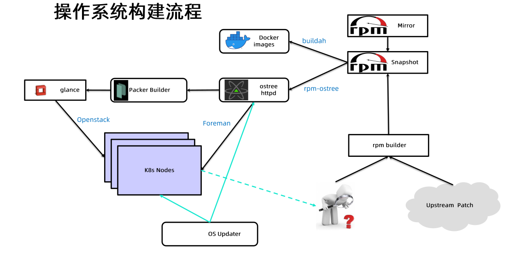
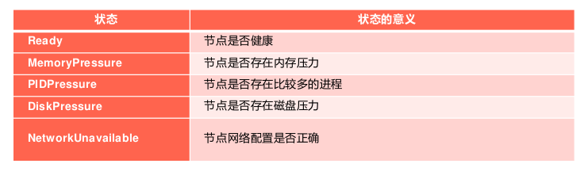

## 生产化集群的考量

计算节点：

- 如何批量安装和升级计算节点的操作系统？
- 如何管理配置计算节点的网络信息？
- 如何管理不同SKU(stock keeping unit)的计算节点？
- 如何快速下架故障的计算节点？
- 如何快速扩缩集群的规模？

控制平面：

- 如何在主节点上下载，安装和升级控制平面组件及所需要的配置文件？
- 如何确保集群所需的其他插件，例如coreDNS,监控系统等部署完成
- 如何准备控制平面组件的各种安全证书？
- 如何快速升级和回滚控制平面组件的版本？

### 操作系统的选择

1. 常用操作系统
   - 通用操作系统：ubuntu,centos,fedora
   - 专为容器优化的操作系统：coreos,redhat atomic,snappy ubuntu core,rancherOS
2. 操作系统的评估与选择的标准：
   - 是否有生态系统
   - 成熟度
   - 内核版本
   - 对运行时的支持
   - init system
   - 包管理和系统升级
   - 安全
3. 容器优化操作系统的优势：
   - 小
   - 原子级升级和回退
   - 更高的安全性

   经过选型，ebay选择了atomic

4. 云原生的原则：
   - 可变基础设施的风险
     - 在灾难发生的时候，难以重新构建服务。持续过多的手工操作，缺乏记录，会导致很难由标准初始化后的服务器来重新构建起等效的服务。
     - 在服务运行过程中，持续的修改服务器，就犹如程序中的可变变量的值发生变化而引入的状态不一致的并发风险。这些对于服务器的修改，同样会引入中间状态，从而导致不可预知的问题。
   - 不可变基础设施
     - 不可变的容器镜像
     - 不可变的主机操作系统

5. 

## 节点资源管理

1. 需要考虑的事情：
   - 状态汇报
   - 资源预留
   - 防止节点资源耗尽的防御机制驱逐
   - 容器和系统资源的配置

### 状态上报

kubelet周期性的向api server进行汇报，并更新节点的相关健康和资源使用信息

- 节点基础信息：包括ip地址，操作系统，内核，运行时，kubelet，kube-proxy版本信息
- 节点资源信息：包括cpu,内存，hugepage,临时存储，GPU等注册信息，以及这些资源中可以分配给容器使用的部分
- 调度器在为pod选择节点时会将机器的状态信息作为依据：
  

### lease对象

在早期版本kubelet的状态上报直接更新node对象，而上报的信息中包含状态信息和资源信息，因此需要传输的数据包较大，给apiserver和etcd造成的压力较大。

为了解决这个问题，因为资源信息变动不频繁，而状态信息变动会比较频繁，所以后面引入了lease对象用来保存健康信息，在默认40s的nodeLeaseDurationSeconds周期内，若Lease对象没有被更新，则对应节点可以被判定为不健康。

### 资源预留

计算节点除了用户容器外，还存在很多支撑系统运行的基础服务，例如systemd,journald,sshd,dockerd,containerd,kubelet等

为了使这些服务进程能够正常运行，要确保它们能在任何时候都可以获取足够的系统资源，所以我们要为这些系统进程预留资源

kubelet可以通过众多启动参数为系统预留cpu,内存，pid等资源，比如SystemReserved,KubeReserved等

容器资源（capacity）是指kubelet获取的计算节点当前的资源信息。

## 七 构建和管理高可用集群

abay：单集群规模可以达到5000节点，但会控制pod数量和重启的频率，数量在15-20万之间；pod内服务的更新，一般是通过pod内某个容器跑个agent去拉新代码并更新，达到更新容器内服务但不用重启pod的目的。

多地域集群管理：

1. 一个集群统一管理所有地域（北上广）的节点。给节点打上zone等annotation。好处是：单集群可以跑跨地域的高可用应用；坏处是应用的复杂度会提升，例如部署一个service,就需要考虑一个地域的服务尽量访问同地域的服务，就得考虑pod的topology；etcd到不同地域的网络延迟比较高，etcd的leader election和心跳会变慢，会导致控制面压力变大，集群规模会受影响。
2. 