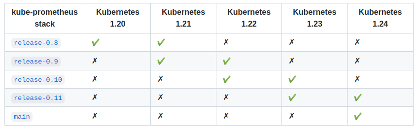
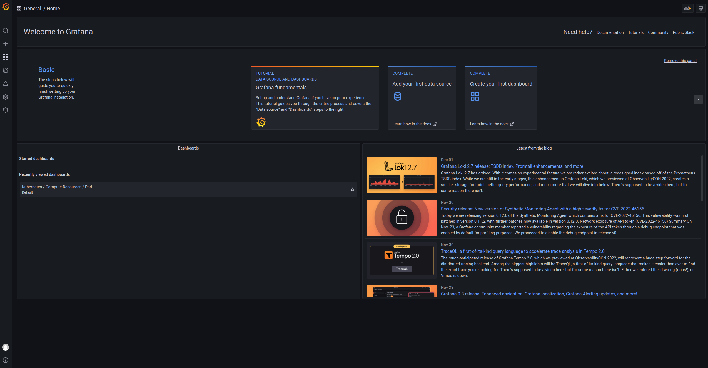
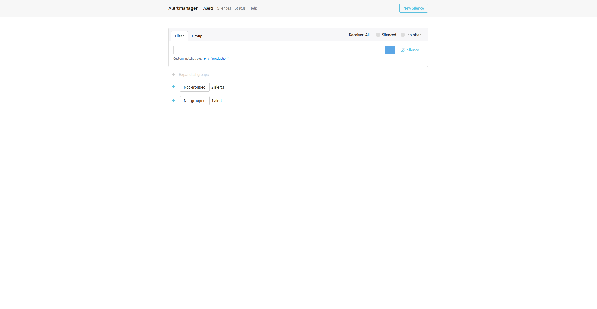
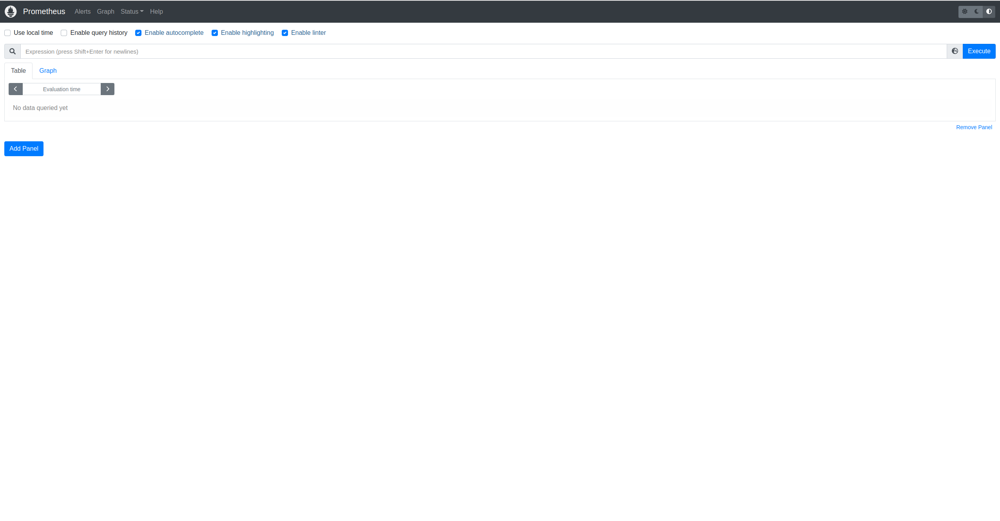

本文介绍k8s平台下，如何使用kube-prometheus部署prometheus+grafana

## 部署

项目地址： [https://github.com/prometheus-operator/kube-prometheus](https://github.com/prometheus-operator/kube-prometheus)



1. 选择版本： `git clone -b release-0.11 https://github.com/prometheus-operator/kube-prometheus.git`

2. 因为国内网络限制，部分镜像地址无法访问，需要修改镜像源，执行 `cd kube-prometheus/manifests/ && grep "image: " * -r` 查找所有的image，然后按网络环境修改镜像地址。 例如在我的网络环境中 `quay.io` 和 `k8s.gcr.io` 地址无法访问，因此需要修改相关镜像地址。

   ```shell
   sed -i 's/quay.io/quay.mirrors.ustc.edu.cn/g' alertmanager-alertmanager.yaml
   sed -i 's/quay.io/quay.mirrors.ustc.edu.cn/g' blackboxExporter-deployment.yaml
   sed -i 's/quay.io/quay.mirrors.ustc.edu.cn/g' nodeExporter-daemonset.yaml
   sed -i 's/quay.io/quay.mirrors.ustc.edu.cn/g' prometheus-prometheus.yaml
   sed -i 's/quay.io/quay.mirrors.ustc.edu.cn/g' prometheusOperator-deployment.yaml
   sed -i 's/quay.io/quay.mirrors.ustc.edu.cn/g' kubeStateMetrics-deployment.yaml
   sed -i 's/k8s.gcr.io/lank8s.cn/g' kubeStateMetrics-deployment.yaml
   sed -i 's/k8s.gcr.io/lank8s.cn/g' prometheusAdapter-deployment.yaml
   ```

    {}

   `lank8s.cn`有时候也可能出现无法访问的问题，可以尝试更换为下面的地址：

   - `kubeStateMetrics-deployment.yaml` 使用 `image: cnych/kube-state-metrics:v2.4.2`
   - `prometheusAdapter-deployment.yaml` 使用 `image: cnych/prometheus-adapter:v0.9.1`
   {}

3. 修改类型为NodePort，为了方便从外部访问：

   prometheus： `vi prometheus-service.yaml`

   ```shell
   ...
   spec:
     type: NodePort       # 新增
     ports:
     - name: web
       port: 9090
       nodePort: 30090    # 新增
       targetPort: web
   ...
   ```

   alertmanager： `vi alertmanager-service.yaml`

   ```shell
   ...
   spec:
     type: NodePort       # 新增
     ports:
     - name: web
       port: 9093
       nodePort: 30093    # 新增
       targetPort: web
   ...
   ```

   grafana： `vi grafana-service.yaml`

   ```shell
   ...
   spec:
     type: NodePort       # 新增
     ports:
     - name: http
       port: 3000
       nodePort: 31000    # 新增
       targetPort: http
   ...
   ```

4. 为了方便管理，可以将 `yaml` 文件分类：

    ```shell
    mkdir -p adapter  alertmanager  blackbox  grafana  kube-state-metrics  node-exporter  operator  prometheus
    mv prometheusAdapter-* adapter/
    mv alertmanager-* alertmanager
    mv blackboxExporter-* blackbox
    mv grafana-* grafana
    mv kubePrometheus-prometheusRule.yaml kubernetesControlPlane-* kubeStateMetrics-* kube-state-metrics/
    mv nodeExporter-* node-exporter/
    mv prometheusOperator-* operator/
    mv prometheus-* prometheus
    ```

5. 创建：

    ```shell
    kubectl create -f setup/
    kubectl create  -f adapter/ -f alertmanager/ -f blackbox/ -f grafana/ -f kube-state-metrics/ -f node-exporter/ -f operator/ -f prometheus/
    ```

6. 检查 pod 状态：

    ```shell
    tspace@k8s-master:~/kube-prometheus/manifests$ kubectl get pods -n monitoring
    NAME                                   READY   STATUS    RESTARTS      AGE
    alertmanager-main-0                    2/2     Running   2 (27m ago)   11h
    alertmanager-main-1                    2/2     Running   2 (27m ago)   11h
    alertmanager-main-2                    2/2     Running   2 (27m ago)   11h
    blackbox-exporter-f4bdbd747-hlt7p      3/3     Running   3 (27m ago)   11h
    grafana-865c7dcc97-wvxw8               1/1     Running   1 (27m ago)   11h
    kube-state-metrics-64947c6b5b-5j94m    3/3     Running   3 (27m ago)   11h
    node-exporter-lnzf8                    2/2     Running   2 (27m ago)   11h
    node-exporter-qz4tv                    2/2     Running   2 (27m ago)   11h
    prometheus-adapter-555f6f5d48-ldr7x    1/1     Running   1 (27m ago)   11h
    prometheus-adapter-555f6f5d48-nmx8m    1/1     Running   1 (27m ago)   11h
    prometheus-k8s-0                       2/2     Running   2 (27m ago)   11h
    prometheus-k8s-1                       2/2     Running   2 (27m ago)   11h
    prometheus-operator-6bbc6c6759-5dwhj   2/2     Running   2 (27m ago)   11h
    ```

7. 检查 service 状态：

    ```shell
    tspace@k8s-master:~/kube-prometheus/manifests$ kubectl get svc -n monitoring
    NAME                    TYPE        CLUSTER-IP       EXTERNAL-IP   PORT(S)                         AGE
    alertmanager-main       NodePort    10.107.159.115   <none>        9093:30093/TCP,8080:30675/TCP   11h
    alertmanager-operated   ClusterIP   None             <none>        9093/TCP,9094/TCP,9094/UDP      11h
    blackbox-exporter       ClusterIP   10.107.218.200   <none>        9115/TCP,19115/TCP              11h
    grafana                 NodePort    10.99.199.121    <none>        3000:31000/TCP                  11h
    kube-state-metrics      ClusterIP   None             <none>        8443/TCP,9443/TCP               11h
    node-exporter           ClusterIP   None             <none>        9100/TCP                        11h
    prometheus-adapter      ClusterIP   10.105.121.168   <none>        443/TCP                         11h
    prometheus-k8s          NodePort    10.109.2.191     <none>        9090:30090/TCP,8080:30973/TCP   11h
    prometheus-operated     ClusterIP   None             <none>        9090/TCP                        11h
    prometheus-operator     ClusterIP   None             <none>        8443/TCP                        11h
    ```

## 访问

1. 获取服务端口： `kubectl get svc -n monitoring`

    ```shell
    alertmanager-main       NodePort    10.107.159.115   <none>        9093:30093/TCP,8080:30675/TCP   11h
    grafana                 NodePort    10.99.199.121    <none>        3000:31000/TCP                  11h
    prometheus-k8s          NodePort    10.109.2.191     <none>        9090:30090/TCP,8080:30973/TCP   11h
    ```

2. 因为部署时，设置了networkPolicy，因此如果需要从外部访问，可以暂时将相关服务的 `networkPolicy` 设置删除： `kubectl delete -f prometheus/prometheus-networkPolicy.yaml -f alertmanager/alertmanager-networkPolicy.yaml -f grafana/grafana-networkPolicy.yaml`

3. 访问地址，部署该服务时，nodeIP分别为 `192.168.34.2` 和 `192.168.34.3`，随便使用其中一个nodeIP访问即可

   grafana： [http://192.168.34.2:31000](http://192.168.34.2:31000)，帐号密码：admin:admin

   

   alertmanager： [http://192.168.34.2:30093](http://192.168.34.2:30093)
   

   prometheus： [http://192.168.34.2:30090](http://192.168.34.2:30090)
   

## 清理环境

`cd kube-prometheus/manifests && kubectl delete --ignore-not-found=true -f adapter/ -f alertmanager/ -f blackbox/ -f grafana/ -f kube-state-metrics/ -f node-exporter/ -f operator/ -f prometheus/ -f setup/`
