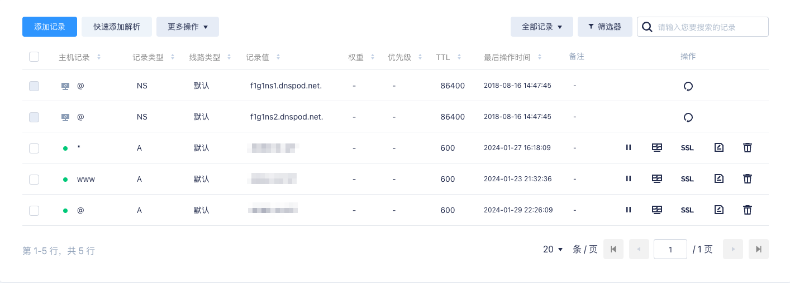
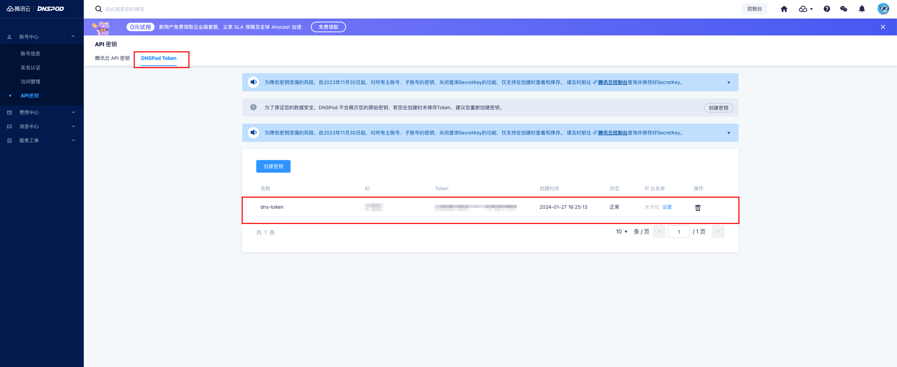

文档：[https://github.com/v2fly/fhs-install-v2ray](https://github.com/v2fly/fhs-install-v2ray)

## 签发通配符证书

1. 腾讯云设置（添加 `@` 和 `*` 的A记录, `www` 记录用来解析到web站点）
    
2. 下载证书配置工具：`curl https://get.acme.sh | sh`
3. 配置证书自动更新：

    ```bash
    $ vi test.cron
    1 12 1,15 * *  ${HOME}/.acme.sh/acme.sh --cron
    $ crontab -uroot test.cron
    # 检查是否添加成功
    $ crontab -uroot -l
    $ rm -rf test.cron
    ```

4. 设置环境变量：`source ~/.bashrc`
5. 创建token：[https://console.dnspod.cn/account/token/token](https://console.dnspod.cn/account/token/token)

6. 设置环境变量：
    ```bash
    # 设置你上面创建的ID和KEY
    export DP_Id="your_id"
    export DP_Key="your_key"
    ```
7. 签发证书：
    ```bash
    # 使用你的邮箱注册账号
    acme.sh --register-account -m ***@qq.com
    # 使用你的域名，这里使用 `@` 和 `*` 记录
    acme.sh --issue --dns dns_dp -d abc.com -d *.abc.com --force
    # 创建目录用于存放证书
    mkdir -p /data/abc.com
    # 签发证书
    acme.sh --installcert -d abc.com --fullchainpath /data/abc.com/fullchain.pem --keypath /data/abc.com/privkey.pem --cert-file /data/abc.com/cert.pem --ecc --force
    ```

### v2ray服务端部署

1. 安装： `bash <(curl -L https://raw.githubusercontent.com/v2fly/fhs-install-v2ray/master/install-release.sh)`
2. 生成UUID： `/usr/local/bin/v2ray uuid`
3. 编辑配置文件(使用上面生成的uuid)： `vi /usr/local/etc/v2ray/config.json`

    ```json
    {
      "log": {
        "loglevel": "info",
        "access": "/var/log/v2ray/access.log",
        "error": "/var/log/v2ray/error.log"
       },
      "inbounds": [{
        "port": 12345,
        "protocol": "vmess",
        "settings": {
          "clients": [
            {
              "id": "f0707700-0070-a000-4000-d5200f00a003",
              "level": 1,
    	  "alterId": 64
            }
          ]
        },
        "streamSettings": {
            "network": "ws",
            "wsSettings": {
              "path": "/awesomepath"
            }
          },
        "listen": "127.0.0.1"
      }],
      "outbounds": [{
        "protocol": "freedom",
        "settings": {}
      },{
        "protocol": "blackhole",
        "settings": {},
        "tag": "blocked"
      }],
      "routing": {
        "rules": [
          {
            "type": "field",
            "ip": ["geoip:private"],
            "outboundTag": "blocked"
          }
        ]
      }
    }
    ```

4. 检查配置文件：`/usr/local/bin/v2ray test -config /usr/local/etc/v2ray/config.json`
5. 开机启动：`systemctl enable v2ray; systemctl restart v2ray`
6. 安装nginx：`apt-get install nginx -y`
7. nginx配置(可以选择注释掉默认配置)：`vi /etc/nginx/sites-enabled/default `
    ```nginx
    server {
    	listen 11111 ssl http2;  # 使用你的端口
    	server_name abc.com;   # 使用你的域名
    	root /var/www/v2ray;
    	index index.html;
    	ssl_protocols TLSv1.2 TLSv1.3; # tls 1.3要求nginx 1.13.0及以上版本
            ssl_ciphers ECDHE-ECDSA-AES128-GCM-SHA256:ECDHE-RSA-AES128-GCM-SHA256:ECDHE-ECDSA-AES256-GCM-SHA384:ECDHE-RSA-AES256-GCM-SHA384:ECDHE-ECDSA-CHACHA20-POLY1305:ECDHE-RSA-CHACHA20-POLY1305:DHE-RSA-AES128-GCM-SHA256:DHE-RSA-AES256-GCM-SHA384;
            ssl_prefer_server_ciphers off;
            ssl_session_cache shared:SSL:10m;
            ssl_session_timeout 1d;
            ssl_session_tickets off;
            ssl_certificate "/data/abc.com/fullchain.crt";   # 改成你的证书地址
            ssl_certificate_key "/data/abc.com/privkey.key"; # 改成你的证书地址

            access_log  /var/log/nginx/xxxx.access.log;
            error_log /var/log/nginx/xxx.error.log;

    	location /awesomepath { # 与 V2Ray 配置中的 path 保持一致
      	      proxy_redirect off;
      	      proxy_pass http://127.0.0.1:12345; # 假设v2ray的监听地址是12345
      	      proxy_http_version 1.1;
      	      proxy_set_header Upgrade $http_upgrade;
      	      proxy_set_header Connection "upgrade";
      	      proxy_set_header Host $host;
      	      proxy_set_header X-Real-IP $remote_addr;
      	      proxy_set_header X-Forwarded-For $proxy_add_x_forwarded_for;
      	}
    }
    ```
7. 开启防火墙（上面nginx配置的是 `11111` 端口）：`iptables -I INPUT -p tcp -m tcp --dport 11111 -j ACCEPT`
8. 检测：输入域名和 V2Ray 的路径，如 [https://abc.com:11111/awesomepath](https://abc.com:11111/awesomepath)，当出现”Bad Request”，就说明 Nginx 将流量转发给了 V2Ray，且 V2Ray 已经收到了请求。
{}
如果客户端连接出现：`VMessAEAD is enforced and a non VMessAEAD connection is received.You can still disable this security feature with environment variable v2ray.vmess.aead.forced = false . You will not be able to enable legacy header workaround in the future.`

解决办法：
- `vi /etc/systemd/system/v2ray.service`，在 `[service]` 块下面新增 `Environment="V2RAY_VMESS_AEAD_FORCED=false"`
- `systemctl daemon-reload`
- `systemctl restart v2ray.service`
{}

#### 可选步骤

1. 建议放个正常站点进行伪装
    ```bash
    cp -r /var/www/html /var/www/v2ray
    chown -R www-data:www-data /var/www/v2ray
    mv /var/www/v2ray/index.nginx-debian.html /var/www/v2ray/index.html

    ```
2. 测试访问： [https://abc.com:11111/](https://abc.com:11111/)

### 客户端配置

1. 修改VMess块即可
    ```
    # VMess
    - name: "v2ray"
      type: vmess
      server: 10.103.1.13                               # 改为你的服务端地址
      port: 11111                                       # 改为服务端nginx配置里的端口
      uuid: f0707700-0070-a000-4000-d5200f00a003        # 要与服务端v2ray配置一致
      alterId: 64                                       # 要与服务端v2ray配置一致
      cipher: auto
      udp: true
      tls: true
      skip-cert-verify: true
      servername: abc.com                               # 改为服务端nginx配置里的域名
      network: ws
      ws-opts:
        path: /awesomepath
        headers:
          Host: abc.com                           # 改为服务端nginx配置里的域名
          max-early-data: 2048
          early-data-header-name: Sec-WebSocket-Protocol
    ```
2. 使用合适的客户端：clashx

