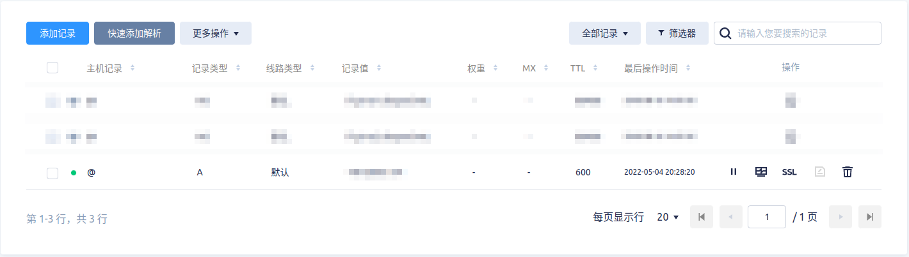
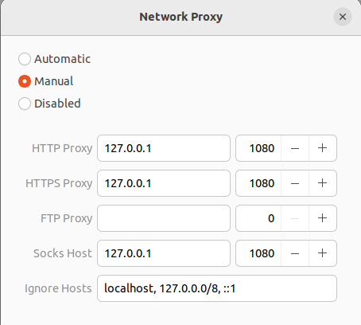

## trojan-go

文档：[https://p4gefau1t.github.io/trojan-go/](https://p4gefau1t.github.io/trojan-go/)

## 申请证书

1. 下载证书配置工具：`curl https://get.acme.sh | sh`
2. 配置证书自动更新：

    ```bash
    $ vi test.cron
    1 12 1,15 * *  ${HOME}/.acme.sh/acme.sh --cron
    $ crontab -uroot test.cron
    # 检查是否添加成功
    $ crontab -uroot -l
    ```

3. 设置环境变量：`source ~/.bashrc`
4. 安装nginx

    ```bash
    # 安装nginx
    $ apt-get install nginx

    # 配置防火墙
    $ iptables -I INPUT -p tcp -m tcp --dport 80 -j ACCEPT
    $ iptables -I INPUT -p tcp -m tcp --dport 443 -j ACCEPT
    
    # 测试访问：保证80端口可以访问，443不可以访问

    # 测试没问题后关闭nginx,因为签发证书的时候需要使用本地80端口
    systemctl stop nginx.service
    ```

5. 在云厂商设置域名解析，例如你的域名为： `abc.com` ，那么在腾讯云做如下配置：
6. 申请证书：

    ```bash
    # 安装socat
    $ apt-get install socat
    # 这里使用你的邮箱地址
    $ acme.sh --register-account -m 123456@qq.com
    # 这里使用你的域名，例如abc.com
    $ acme.sh --issue -d abc.com --standalone -k ec-256 --force
    # 创建目录存放证书，为方便区分，我们使用自己的域名做目录名
    $ mkdir -p /data/abc.com
    $ acme.sh --installcert -d abc.com --fullchainpath /data/abc.com/fullchain.crt --keypath /data/abc.com/privkey.key --ecc --force
    ```

## 安装trojan-go服务端

1. 下载安装包： `wget https://github.com/p4gefau1t/trojan-go/releases/download/v0.10.6/trojan-go-linux-amd64.zip`
2. 解压： `unar trojan-go-linux-amd64.zip`
3. 提取配置： `cd trojan-go-linux-amd64; mv example/server.json .`
4. 修改配置： `vi server.json`

    ```json
    {
        "run_type": "server",
        "local_addr": "0.0.0.0",
        "local_port": 443,
        "remote_addr": "127.0.0.1",
        "remote_port": 80,
        "password": [
            "你的密码",                                      # 配置密码
        ],
        "ssl": {                                           # 配置证书，路径为上面保存证书的路径
            "cert": "/data/abc.com/fullchain.crt",        
            "key": "/data/abc.com/privkey.key",
            "sni": "abc.com"                               # 配置为你的域名
        },
        "router": {
            "enabled": true,
            "block": [
                "geoip:private"
            ],
            "geoip": "/root/trojan/geoip.dat",
            "geosite": "/root/trojan/geosite.dat"
        }
    }
    ```

5. 配置启动文件： `mv example/trojan-go.service /etc/systemd/system/trojan.service && vi /etc/systemd/system/trojan.service`

    ```text
    # 修改ExecStart为正确的启动命令：/root/trojan/trojan-go -config /root/trojan/server.json
    # 修改User=root

    [Unit]
    Description=Trojan-Go - An unidentifiable mechanism that helps you bypass GFW
    Documentation=https://p4gefau1t.github.io/trojan-go/
    After=network.target nss-lookup.target

    [Service]
    User=root
    CapabilityBoundingSet=CAP_NET_ADMIN CAP_NET_BIND_SERVICE
    AmbientCapabilities=CAP_NET_ADMIN CAP_NET_BIND_SERVICE
    NoNewPrivileges=true
    ExecStart=/root/trojan/trojan-go -config /root/trojan/server.json
    Restart=on-failure
    RestartSec=10s
    LimitNOFILE=infinity

    [Install]
    WantedBy=multi-user.target
    ```

6. 启动： `systemctl daemon-reload && systemctl start nginx.service && systemctl start trojan.service`
7. 测试443端口访问，能正常访问那么配置就成功了： `https://abc.com`

## 安装trojan-go客户端

1. 下载安装包： `wget https://github.com/p4gefau1t/trojan-go/releases/download/v0.10.6/trojan-go-linux-amd64.zip`
2. 解压： `unar trojan-go-linux-amd64.zip`
3. 提取配置： `cd trojan-go-linux-amd64; mv example/client.json .`
4. 修改配置： `vi client.json`

    ```json
    {
        "run_type": "client",
        "local_addr": "127.0.0.1",
        "local_port": 1080,
        "remote_addr": "1.2.3.4",                   # 你的云主机地址
        "remote_port": 443,
        "password": [
            "你的密码"                               # 服务端配置的密码
        ],
        "ssl": {
            "sni": "abc.com"                       # 你的域名
        },
        "mux": {
            "enabled": true
        },
        "router": {
            "enabled": true,
            "bypass": [
                "geoip:cn",
                "geoip:private",
                "geosite:cn",
                "geosite:private"
            ],
            "block": [
                "geosite:category-ads"
            ],
            "proxy": [
                "geosite:geolocation-!cn"
            ],
            "default_policy": "proxy",
            "geoip": "/usr/local/src/trojan/geoip.dat",       # 注意路径配置
            "geosite": "/usr/local/src/trojan/geosite.dat"
        }
    }
    ```

5. 配置启动文件： `mv example/trojan-go.service /etc/systemd/system/trojan.service && vi /etc/systemd/system/trojan.service`

    ```text
    # 修改ExecStart为正确的启动命令：/usr/local/src/trojan/trojan-go -config /usr/local/src/trojan/client.json

    [Unit]
    Description=Trojan-Go - An unidentifiable mechanism that helps you bypass GFW
    Documentation=https://p4gefau1t.github.io/trojan-go/
    After=network.target nss-lookup.target

    [Service]
    User=nobody
    CapabilityBoundingSet=CAP_NET_ADMIN CAP_NET_BIND_SERVICE
    AmbientCapabilities=CAP_NET_ADMIN CAP_NET_BIND_SERVICE
    NoNewPrivileges=true
    ExecStart=/usr/local/src/trojan/trojan-go -config /usr/local/src/trojan/client.json
    Restart=on-failure
    RestartSec=10s
    LimitNOFILE=infinity

    [Install]
    WantedBy=multi-user.target
    ```

6. 启动： `systemctl daemon-reload && systemctl start trojan.service`
7. 修改网络配置：
8. 或者可以使用脚本启动trojan客户端并配置网络

   启动脚本： `vi /usr/bin/start-ss`

    ```bash
    #!/usr/bin/env bash

    ssPid=`ps -ef | grep trojan-go | grep -v grep | awk '{print $2}'`

    if [ ! -n "$ssPid" ]
    then
        sudo systemctl start trojan.service
    fi

    gsettings set org.gnome.system.proxy mode manual

    git config --global http.proxy socks5://127.0.0.1:1080
    git config --global https.proxy socks5://127.0.0.1:1080
    git config --global http.https://github.com.proxy http://127.0.0.1:1080
    git config --global https.https://github.com.proxy https://127.0.0.1:1080
    ```

   停止脚本： `vi /usr/bin/stop-ss`

    ```bash
    #!/usr/bin/env bash

    ssPid=`ps -ef | grep trojan-go | grep -v grep | awk '{print $2}'`

    if [ -n "$ssPid" ]
    then
        sudo systemctl stop trojan.service
    fi

    gsettings set org.gnome.system.proxy mode none

    git config --global --unset http.proxy
    git config --global --unset https.proxy
    git config --global --unset http.https://github.com.proxy
    git config --global --unset https.https://github.com.proxy
    ```

   重启脚本： `vi /usr/bin/restart-ss`

    ```bash
    #!/usr/bin/env bash

    stop-ss
    start-ss
    ```
